# 内容

# 1 目标

```python
# B站app心跳包完播率接口
	
# 看一下web版的心跳接口

# app版的完播率接口
```


```python
# 之前我们破过一个接口：
	https://api.bilibili.com/x/report/click/android2-->可以提高播放量
        -请求体加密
        -请求头
        
        
# 对于B站的视频，还有一个 完播率指标---》完播率接口
	-web版本
    	-https://api.bilibili.com/x/click-interface/web/heartbeat
        -每隔15s向后端发送一次请求，直到视频播放完成--》记录一次完播率
        -发送请求时，携带当前时间，和视频播放到的位置
        -登录用户--》看了某个视频---》看到一部分，关闭了，下次再打开---》继续播放
        -当视频播放到最后，记录一次完播率
    -app版本：
    	-https://api.bilibili.com/x/report/heartbeat/mobile
        -比web简单---》视频点开，发送一次请求---》app完成播完---》再发送一次请求---》记录一次完播率
        -不像web一样，每隔15s钟，发送一次请求，这个接口只需要发送两次，就有一个完播
        
        
        
# 目标：破解app的 完播率接口
https://api.bilibili.com/x/report/heartbeat/mobile
```

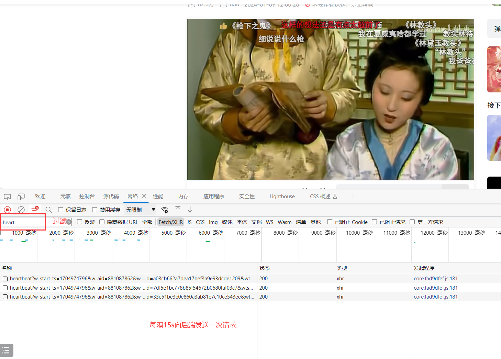


# 2 抓包分析

```python
# 请求数据包
	-请求地址：https://api.bilibili.com/x/report/heartbeat/mobile
    -请求方式：post
 
    -请求头：（之前都破过了）
    buvid	XX6282668121FF8B3256F67E76387E4253613
    device-id	fU52TixILBQlEicfLk93Tw9fNk4rR3UtYQ
    fp_local	2cbf1dbb4af112fafc0a754f02011305202401092245429bd3a5f2b2e69a2e4b
    fp_remote	2cbf1dbb4af112fafc0a754f020113052024010418361000050d2d1ada29d0c2
    session_id	3fa1e88d
    env	prod
    -请求体：
    # -----视频id号---之前破了
    aid	240032631
    cid	1376708952
    # --设备id号，一个设备一个号，可以随机生成
    appkey	1d8b6e7d45233436
    actual_played_time	0
    auto_play	0  # 是否自动播放
    build	6240300
    c_locale	zh-Hans_CN
    channel	xxl_gdt_wm_253
    
    epid	0
    epid_status	
    from	7
    from_spmid	tm.recommend.0.0
    last_play_progress_time	0
    list_play_time	0
    max_play_progress_time	0
    mid	0
    miniplayer_play_time	0
    mobi_app	android
    network_type	1
    paused_time	0    # 暂停多长时间
    platform	android # 平台
    play_status	0
    play_type	1
    played_time	0  # 播放了多长时间
    quality	32
    s_locale	zh-Hans_CN
    sid	0
    spmid	main.ugc-video-detail.0.0
    start_ts	0
    statistics	{"appId":1,"platform":3,"version":"6.24.0","abtest":""}
    sub_type	0
    total_time	0
    ts	1704975582
    type	3
    user_status	0
    video_duration	468 # 视频总时长
    # 上面是固定的---》下面两个是需要逆向的
    sign	c948edecce420bf2668f58525f7d1ca9
    session	7e13ca36f618c0f245f462c17c27fb165791f5c3
    
    
 # 目标：破解 
    session
    sign
```


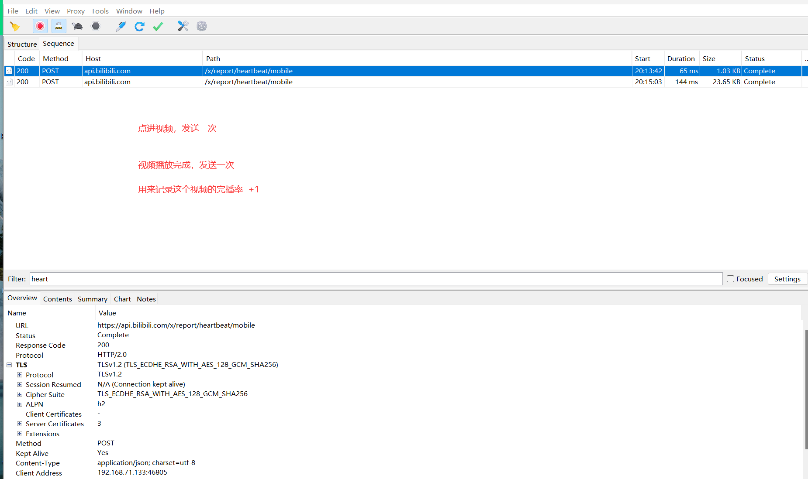

# 3 破解session

```python
# 1 反编译，搜索---》url 地址---》x/report/heartbeat/mobile
# 2 搜出两个，是第二个
# 3 查找用例---》找到三个位置--》查看第二个代码如下
private final void P7() {
    h hVar = this.f24360c;
    if (hVar != null) {
        if (hVar == null) {
            x.K();
        }
        if (hVar.v1() == 0) {
            return;
        }
        h hVar2 = this.f24360c;
        if (hVar2 == null) {
            x.K();
        }
        HeartbeatParams N7 = N7(hVar2, true); #N7是 HeartbeatParams的对象，执行N7函数得到
        h hVar3 = this.f24360c;
        if (hVar3 == null) {
            x.K();
        }
        ((tv.danmaku.biliplayerimpl.report.heartbeat.a) com.bilibili.okretro.c.a(tv.danmaku.biliplayerimpl.report.heartbeat.a.class)).reportV2(N7).y(new f(hVar3.r1()));
        BLog.i("HeartBeatTracker", "report heartbeat start, params:" + N7);
    }
}

# 4 找N7()  函数
   private final HeartbeatParams N7(h hVar, boolean z) {
        return new HeartbeatParams(...); # 返回了HeartbeatParams的对象
    }

# 5 查看 HeartbeatParams 这个类的构造方法中，传入了session
public final class HeartbeatParams extends ParamsMap {
    public HeartbeatParams(..) {
        putParams("session", str);
    }
# 6 查看str这个参数，就是我们要破解的session
    -类在实例化的时候，传入的第二个参数，hVar.r1() ，就是session
    
    
# 7 所以 session的本质就是：
    HeartbeatParams N7 = N7(hVar2, true);
    # hVar2.r1()--->hVar.r1()--》结果就是session
# 8 确定：hVar.r1() 返回了谁
     public final String r1() {
        return this.d; #返回了this.d
    }
# 9 确认谁给this.d 赋值了
    public final void t2(String str) {
        this.d = str;
    }
# 10 两种方案：
    	- 查找t2 的用例，看谁用了它 ：g.a.a() 执行结果就是 session
    	- 打印t2的调用栈信息，也能看到谁调用了它
    
# 11 hook 脚本，打印t2的调用栈信息
设置session a3eb84a148f5c3a630f3d6b483cb7bde98bd53e8
java.lang.Throwable
	at tv.danmaku.biliplayerimpl.report.heartbeat.h.t2(Native Method)
    # tv.danmaku.biliplayerimpl.report.heartbeat.h$a 类下的b方法调佣了t2
	at tv.danmaku.biliplayerimpl.report.heartbeat.h$a.b(BL:5)
	at tv.danmaku.biliplayerimpl.report.heartbeat.d.L7(BL:2)
	at tv.danmaku.biliplayerimpl.report.heartbeat.d.u7(BL:3)
	at tv.danmaku.biliplayerimpl.core.PlayerCoreServiceV2$l.onPrepared(BL:2)
	at t3.a.i.b.i$j.onPrepared(BL:6)
	at tv.danmaku.ijk.media.player.AbstractMediaPlayer.notifyOnPrepared(BL:2)
	at tv.danmaku.ijk.media.player.IjkMediaPlayer$EventHandler.handleMessage(BL:107)
	at android.os.Handler.dispatchMessage(Handler.java:106)
	at android.os.Looper.loop(Looper.java:223)
	at android.app.ActivityThread.main(ActivityThread.java:7656)
	at java.lang.reflect.Method.invoke(Native Method)
	at com.android.internal.os.RuntimeInit$MethodAndArgsCaller.run(RuntimeInit.java:592)
	at com.android.internal.os.ZygoteInit.main(ZygoteInit.java:947)
    
    
 # 12 找到hVar.t2(g.a.a());
    public final h b(Video.h commonParams, int i, int i2, int i3) {
        hVar.t2(g.a.a()); # g.a.a()的执行结果就是session
    }
# 13 查看 g.a.a() 源码
    public final String a() {
        # 1 拿到Random的对象，猜测肯定会用随机 数
        Random random = new Random();
        # 2 sb 用来拼接字符串
        StringBuilder sb = new StringBuilder();
        # 3 执行 a.E() 返回结果
        c2.f.b0.c.b.b.a.a E = c2.f.b0.c.b.b.a.a.E();
        x.h(E, "EnvironmentPrefHelper.getInstance()");
        # 4 把 执行 a.E() 返回结果 拼接到了字符串最开始（先不用管是什么）
        sb.append(E.t());
        # 5 拼接了时间戳
        sb.append(System.currentTimeMillis());
        # 6 随机生成一个 1百万之内的数字，拼接到了字符串中
        sb.append(random.nextInt(1000000));
        # 7 转成字符串
        String sb2 = sb.toString();
        # 8 把字符串进行sha1加密【就是】
        String sha1 = com.bilibili.commons.m.a.i(sb2); # 返回的就是 session
        if (TextUtils.isEmpty(sha1)) {
            return sb2;
        }
        x.h(sha1, "sha1");
        # 9 最终返回
        return sha1;
    }
# 14 session的生成方案是：
    	1 字符串一开始的位置拼接了：E.t()的执行结果
    	2 字符串拼接了 当前时间戳
     	3 生成了一个1百万内的数字，拼接了
    	4 使用sha1加密得到
    
# 15 确认：com.bilibili.commons.m.a.i 到底是不是sha1 加密
public static String i(String str) {
    return j(str.getBytes()); # 待加密字符串，变成了bytes格式，执行了j函数
}

public static String j(byte[] bArr) {
        try {
            return h(bArr, MessageDigest.getInstance("SHA1")); # 执行了h
        } catch (NoSuchAlgorithmException e) {
            e.printStackTrace();
            return null;
        }
    }
private static String h(byte[] bArr, MessageDigest messageDigest) {
        messageDigest.update(bArr);
        byte[] digest = messageDigest.digest();
        char[] cArr = new char[digest.length * 2];
        int i = 0;
        for (byte b : digest) {
            int i2 = i + 1;
            char[] cArr2 = a;
            cArr[i] = cArr2[(b >>> 4) & 15];
            i = i2 + 1;
            cArr[i2] = cArr2[b & cv.f24887m];
        }
        return new String(cArr).toLowerCase();
    }
# 总结：确实是sha1的摘要算法
   
    
# 16 E.t() 是什么，到底返回了什么？ 从xml中取buvid，之前破解，取不到就是空
    public String t() {
        return c().getString("buvid", "");
    }

# 17 hook--》com.bilibili.commons.m.a.i--》查看传入的待加密字符串是什么
    -拿到待加密字符串---》自己使用sha1摘要，跟session对比，看看是不是一样，如果一样，破解完成
```

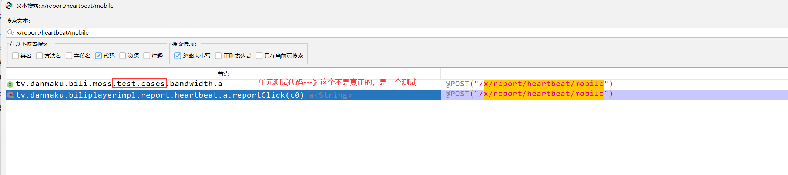

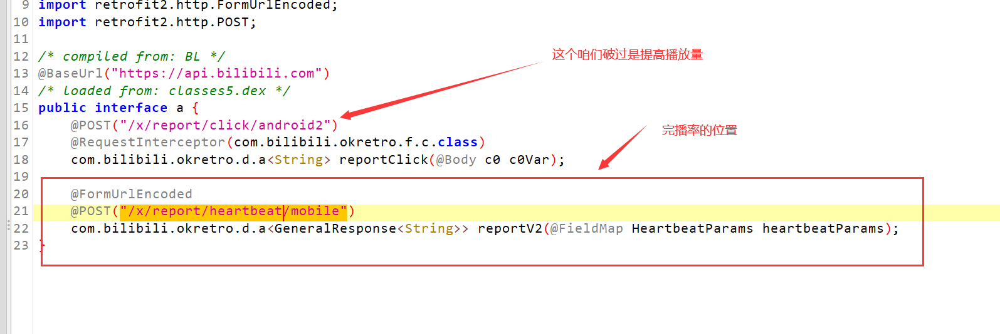

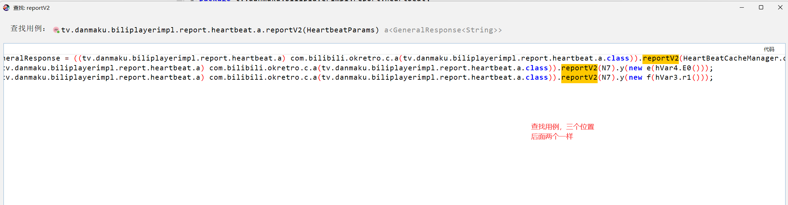

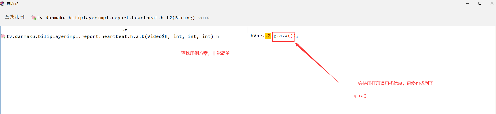


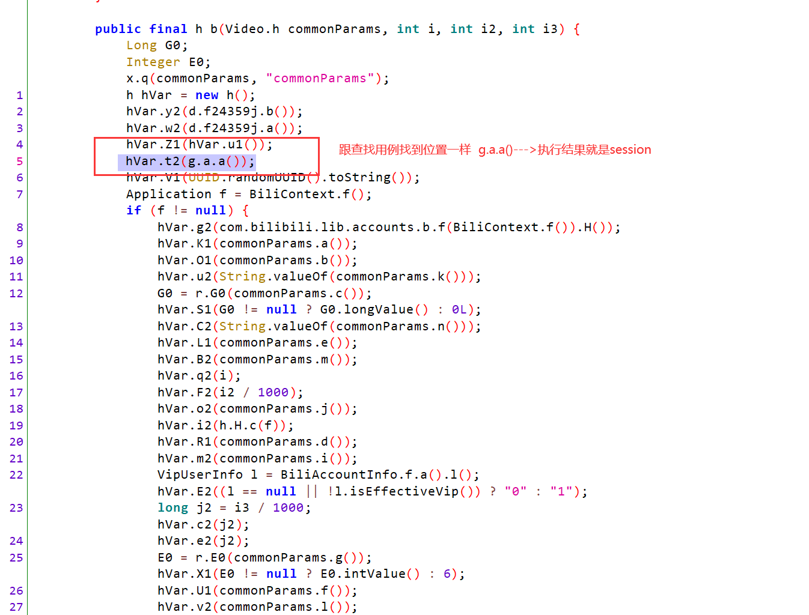

## 3.1 hook-打印t2调用栈信息

```python
import frida
import sys

rdev = frida.get_remote_device()
# session = rdev.attach("tv.danmaku.bili")
session = rdev.attach("哔哩哔哩")

scr = """
    Java.perform(function () {
    var h = Java.use("tv.danmaku.biliplayerimpl.report.heartbeat.h");
    h.t2.implementation = function(str){
        console.log("设置session",str);
        this.t2(str);
        //调用栈
      console.log(Java.use("android.util.Log").getStackTraceString(Java.use("java.lang.Throwable").$new()));
    
    };
    
    });
"""

script = session.create_script(scr)

script.load()
sys.stdin.read()


'''
设置session 69a5568e29c5f5bb120901435e2bd98281c1969d
java.lang.Throwable
	at tv.danmaku.biliplayerimpl.report.heartbeat.h.t2(Native Method)
	at tv.danmaku.biliplayerimpl.report.heartbeat.h$a.b(BL:5)
	at tv.danmaku.biliplayerimpl.report.heartbeat.d.L7(BL:2)
	at tv.danmaku.biliplayerimpl.report.heartbeat.d.u7(BL:3)
	at tv.danmaku.biliplayerimpl.core.PlayerCoreServiceV2$l.onPrepared(BL:2)
	at t3.a.i.b.i$j.onPrepared(BL:6)
	at tv.danmaku.ijk.media.player.AbstractMediaPlayer.notifyOnPrepared(BL:2)
	at tv.danmaku.ijk.media.player.IjkMediaPlayer$EventHandler.handleMessage(BL:107)
	at android.os.Handler.dispatchMessage(Handler.java:106)
	at android.os.Looper.loop(Looper.java:223)
	at android.app.ActivityThread.main(ActivityThread.java:7656)
	at java.lang.reflect.Method.invoke(Native Method)
	at com.android.internal.os.RuntimeInit$MethodAndArgsCaller.run(RuntimeInit.java:592)
	at com.android.internal.os.ZygoteInit.main(ZygoteInit.java:947)

'''
```

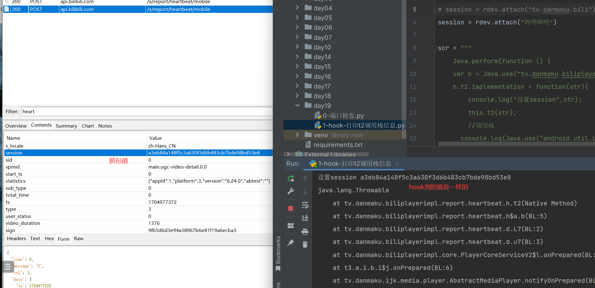


## 3.2 hook--com.bilibili.commons.m.a.i(sb2)--看参数和返回值

```python
import frida
import sys
from frida.core import Device
rdev = frida.get_remote_device()

# session = rdev.attach("tv.danmaku.bili")
session = rdev.attach("哔哩哔哩")

scr = """
Java.perform(function () {
    var a = Java.use("com.bilibili.commons.m.a");

    a.i.implementation = function(str){   
       console.log("参数=",str);
       var res = this.i(str);
       console.log("返回值=",res);
       return res;
    }

});
"""
script = session.create_script(scr)

script.load()
sys.stdin.read()


'''
参数= 1691659675405239781
返回值= c7aa4b7423a54f58b36be0a644899246e3095ff6
'''
```

## 3.3 python 实现session过程

```python

# 当前时间戳+1百万内随机数字---》使用sha1加密得到
import hashlib
import time
import random
arg0=str(int(time.time() * 1000)) + str(random.randint(1, 1000000))
hash_object = hashlib.sha1()
hash_object.update(arg0.encode('utf-8'))
arg7 = hash_object.hexdigest()
print(arg7)
```


# 4 破解sign

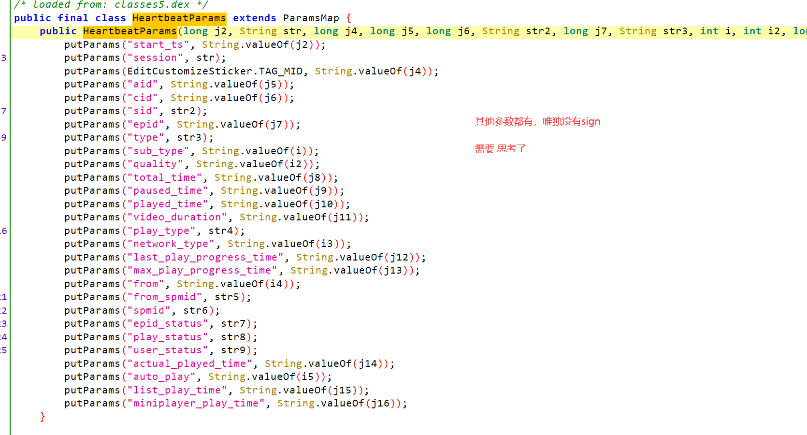

```python
# 1 按照之前找 session的思路，没有找到sign
	- 猜测：这个sign生成---》用签名一堆明文--》通过某个加密方式--》加密后得到了 sign--》拼接到了后面
    - 根据sign的格式：很像md5或sha1--》直接大胆把前面这堆明文直接用md5或sha1加密后跟sign比较看看一不一样，如果一样咱么就猜对了
    -无论使用md5还是sha1都是不一样的---》内部就是使用md5加密的，只是有盐

 # 2 sign 加密可能的情况
	- 1 拦截器中：对明文进行签名--》拼接到后面
    - 2 使用so文件加密--》拼接到后面
    
 # 3 无论用哪种方式：就会有 
	"&sign=   根据这个关键字搜索
    
 # 4 硬核破解--》hook 底层判断
```


## 4.1 搜索方案破解(了解--》找起来很麻烦)

```python
# 1 全局搜索："&sign= 
# 2 反复查找，找到了：this.b 的位置
# 3 找到代码--》toString---》看看谁调用了toString
public String toString() {
    String str = this.a;
    if (str == null) {
        return "";
    }
    if (this.b == null) {
        return str;
    }
    # this.a 就是那堆明文+&sign=this.b[就是加密后的字符串]
    return this.a + "&sign=" + this.b;
}
# 4 谁调用toString，两种思路
	-1 查找用例（发现很多）
	-2 通过hook打印调用栈信息（用这种方式）
    
# 5 hook脚本打印-谁调用了toString
import frida
import sys
from frida.core import Device
rdev = frida.get_remote_device()

# session = rdev.attach("tv.danmaku.bili")
session = rdev.attach("哔哩哔哩")

scr = """
Java.perform(function () {
    var SignedQuery = Java.use("com.bilibili.nativelibrary.SignedQuery");

    SignedQuery.toString.implementation = function(){   
       var res = this.toString();
       console.log(res);
       console.log(Java.use("android.util.Log").getStackTraceString(Java.use("java.lang.Throwable").$new()));
       return res;
    }

});
"""
script = session.create_script(scr)

script.load()
sys.stdin.read()

#6 调用栈信息如下
actual_played_time=0&aid=580114532&appkey=1d8b6e7d45233436&auto_play=0&build=6240300&c_locale=zh-Hans_CN&channel=xxl_gdt_wm_253&cid=1376676964&epid=789287&epid_status=2&from=21&from_spmid=tm.recommend.feed.bangumi&last_play_progress_time=0&list_play_time=0&max_play_progress_time=0&mid=0&miniplayer_play_time=0&mobi_app=android&network_type=1&paused_time=0&platform=android&play_status=1&play_type=2&played_time=0&quality=32&s_locale=zh-Hans_CN&session=5a011d3dda88f5f02fef426a6dfed6ca5780f590&sid=43340&spmid=pgc.pgc-video-detail.0.0&start_ts=0&statistics=%7B%22appId%22%3A1%2C%22platform%22%3A3%2C%22version%22%3A%226.24.0%22%2C%22abtest%22%3A%22%22%7D&sub_type=4&total_time=0&ts=1704979995&type=4&user_status=0&video_duration=1156&sign=11f9390d9a34afa69cb4c38bec641cdc


java.lang.Throwable
	at com.bilibili.nativelibrary.SignedQuery.toString(Native Method)
    # com.bilibili.okretro.f.a 类下的c调用了
	at com.bilibili.okretro.f.a.c(BL:16)
	at com.bilibili.okretro.f.a.a(BL:6)
	at com.bilibili.okretro.d.a.execute(BL:24)
	at com.bilibili.okretro.d.a$a.run(BL:2)
	at java.util.concurrent.ThreadPoolExecutor.runWorker(ThreadPoolExecutor.java:1167)
	at java.util.concurrent.ThreadPoolExecutor$Worker.run(ThreadPoolExecutor.java:641)
	at java.lang.Thread.run(Thread.java:923)
    
    
# 7 查找 com.bilibili.okretro.f.a 下的c方法
public void c(u uVar, c0 c0Var, b0.a aVar) {
	# .....
    b(hashMap);
    u h = uVar.s().A(null).h();
    aVar.s(h).l(c0.create(w.d("application/x-www-form-urlencoded; charset=utf-8"), h(hashMap).toString()));
} catch (IOException unused) {
}
}

# 8 核心代码：
	h(hashMap).toString()

# 9 需要知道 h 干了什么事，hashMap 是什么值：猜：上面抓包抓得到的明文的key=value的字符串、

# 10 h的代码如下
public SignedQuery h(Map<String, String> map) {
    return LibBili.g(map);
}

# 11  LibBili.g 代码如下
public static SignedQuery g(Map<String, String> map) {
    return s(map == null ? new TreeMap() : new TreeMap(map));
}

# 12 s是什么--JNI方法，传入了sortedMap 返回了字符串---》读so文件了
static native SignedQuery s(SortedMap<String, String> sortedMap);

# 13 so文件名字---libbili.so
static {
    com.getkeepsafe.relinker.c.c("bili");
}

```

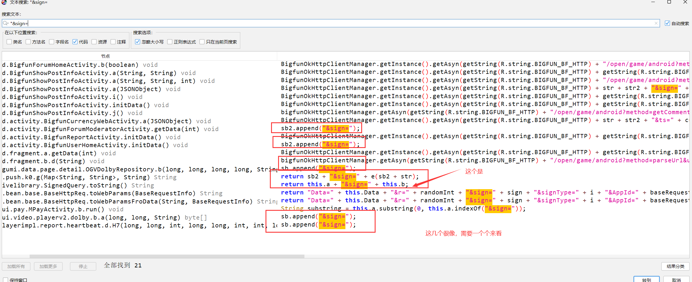

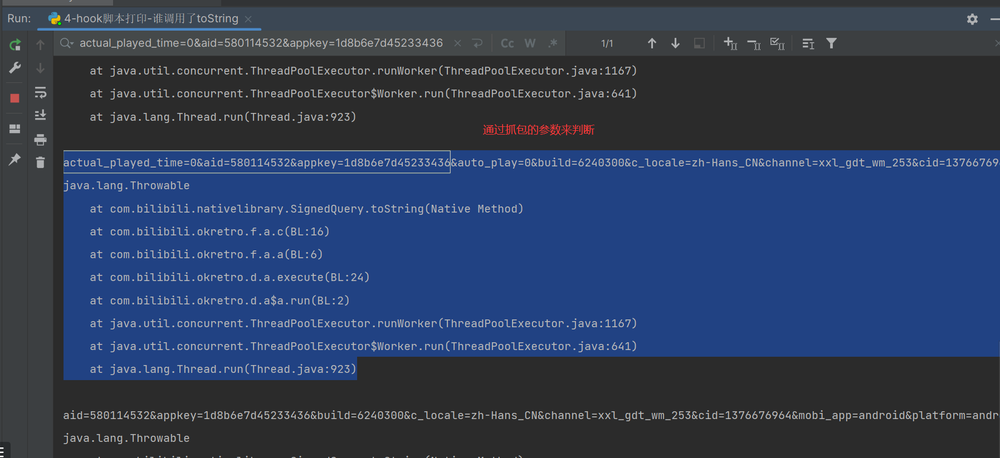


## 4.2 硬核破解

```python
#1 分析
	-HeartbeatParams 构造方法中没有sign
    -全局搜索 &sign=   搜出很多不好确认，如果没搜出来
    -猜测是使用so加密的---》返回加密后的字符串
    
    -jni开发
    【java业务代码】   【java+native方法】      JNI开发c代码
    	String            jstring            c语言字符串
    -JNI中的c往java返回，如果返回字符串，一定会调用：(*env)->NewStringUTF(env, res2)
# 2 写一个通用脚本---》hook 底层的	NewStringUTF 方法，读取第二个参数[c的字符串]
	-判断字符串中是否有sign 
    -判断字符串 是否包含某些固定的字符串
    -判断字符串长度是固定的 ---》长度固定的 32位
```

### 4.2.1通用hook--NewStringUTF

```js
// 以后任意app，都可以使用，可以hook 只要是so返回的字符串 都会hook到

//1 加载安卓手机底层包，系统自带的库，我们hook的NewStringUTF在这个包中--跟app无关
var symbols = Module.enumerateSymbolsSync("libart.so");  // 有非常多底层 函数：NewStringUTF，FindClass。。
//2 定义一个变量，用来接收一会找到的NewStringUTF的地址
var addrNewStringUTF = null;
//3 循环找出libart.so中所有成员，匹配是NewStringUTF的函数，取出地址，赋值给上面的变量
for (var i = 0; i < symbols.length; i++) {
    //3.1 取出libart.so的一个个方法对象
    var symbol = symbols[i];
    //3.2 判断方法对象的名字是不是包含 NewStringUTF和CheckJNI---》因为在真正底层，函数名不叫NewStringUTF，前后有别的字符串
    // 实际它真正的名字：asdfa_NewStringUTF_dadsfasfd
    if (symbol.name.indexOf("NewStringUTF") >= 0 && symbol.name.indexOf("CheckJNI") < 0) {
        // 3.3 找到后，把地址赋值个上面的变量
        addrNewStringUTF = symbol.address;
        // 3.4 控制台打印一下
        console.log("NewStringUTF is at ", symbol.address, symbol.name);
        break
    }
}
// 4 如果不为空，我们开始hook它(通过地址hook，有onEnter和onExit，所有的参数都给了args，通过位置取到每个参数)
if (addrNewStringUTF != null) {
    Interceptor.attach(addrNewStringUTF, {
        onEnter: function (args) {
            // 4.1 取出NewStringUTF传入的第一个参数（c语言的字符串），第0个参数env，对咱们没有意义
            var c_string = args[1];
            // 4.2 第一个参数是c的字符串，我们把它转一下，变成真正的字符串
            var dataString = c_string.readCString();
            // 4.3 改字符串不为空，且长度为32，我们输出一下，并且打印出它的调用栈
            if (dataString) {
                if (dataString.length === 32) {
                    console.log(dataString); // 跟抓包抓到的sign比较是否一样
                    // 4.4 读取当前在执行那个so文件,及so文件中的地址
                    console.log(Thread.backtrace(this.context, Backtracer.ACCURATE).map(DebugSymbol.fromAddress).join('\n') + '\n');
                    // 4.5 打印调用栈
                    console.log(Java.use("android.util.Log").getStackTraceString(Java.use("java.lang.Throwable").$new()));
                }
            }

        }
    });
}


// frida -UF  -l  5-hook-NewStringUTF通用脚本.js -o v1.txt


```


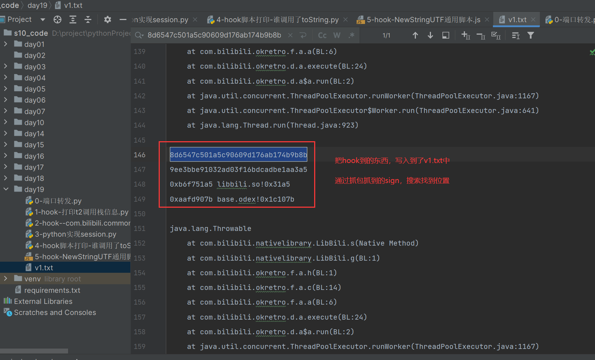


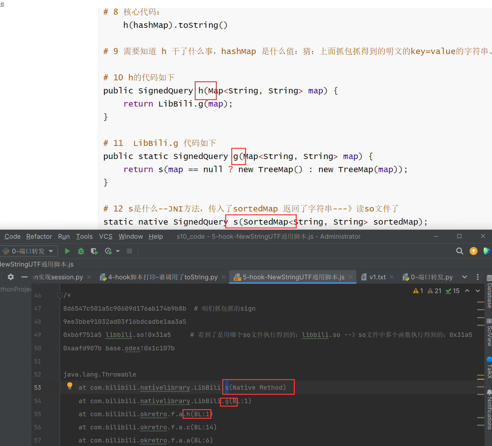

### 4.2.2 通过调用栈信息继续分析

```python
# 1 搜索：com.bilibili.nativelibrary.LibBili 类下的 s 方法
# 传入了sortedMap，返回了SignedQuery类型
static native SignedQuery s(SortedMap<String, String> sortedMap);


# 2 SignedQuery 类中有什么？
public final class SignedQuery {
	# 构造方法
    public SignedQuery(String str, String str2) {
        this.a = str;
        this.b = str2;
    }
    # toString 跟咱们搜的对应上了
    public String toString() {
        String str = this.a;
        if (str == null) {
            return "";
        }
        if (this.b == null) {
            return str;
        }
        return this.a + "&sign=" + this.b;
    }
}

# 3 hook-com.bilibili.nativelibrary.LibBili-s方法-查看入参和返回值
import frida
import sys

# 连接手机设备
rdev = frida.get_remote_device()

session = rdev.attach("哔哩哔哩")

scr = """
Java.perform(function () {
    var LibBili = Java.use("com.bilibili.nativelibrary.LibBili");
    var TreeMap = Java.use("java.util.TreeMap");

    LibBili.s.implementation = function(map){   
        console.log("--------------------------");
       console.log("map=",JSON.stringify(map));
       var obj = Java.cast(map,TreeMap);
       console.log("map=",obj.toString());

       var res = this.s(map);
       console.log("返回值=",res.toString());
       return res;
    }
});
"""

script = session.create_script(scr)


def on_message(message, data):
    print(message, data)


script.on("message", on_message)

script.load()
sys.stdin.read()

# 4 hook得到--》入参是不带sign的明文---》返回值是对明文加密，把加密的sign拼接到后面了
入参：map= {aid=721896302, appkey=1d8b6e7d45233436, build=6240300, c_locale=zh-Hans_CN, channel=xxl_gdt_wm_253, cid=447618041, mobi_app=android, platform=android, s_locale=zh-Hans_CN, statistics={"appId":1,"platform":3,"version":"6.24.0","abtest":""}}

返回值：actual_played_time=0&aid=721896302&appkey=1d8b6e7d45233436&auto_play=0&build=6240300&c_locale=zh-Hans_CN&channel=xxl_gdt_wm_253&cid=447618041&epid=0&epid_status=&from=2&from_spmid=main.ugc-video-detail.0.0&last_play_progress_time=0&list_play_time=0&max_play_progress_time=0&mid=0&miniplayer_play_time=0&mobi_app=android&network_type=1&paused_time=0&platform=android&play_status=0&play_type=1&played_time=0&quality=32&s_locale=zh-Hans_CN&session=22531fb928ddec0d0813bb78e47aa2aaca219193&sid=0&spmid=main.ugc-video-detail.0.0&start_ts=0&statistics=%7B%22appId%22%3A1%2C%22platform%22%3A3%2C%22version%22%3A%226.24.0%22%2C%22abtest%22%3A%22%22%7D&sub_type=0&total_time=0&ts=1704983029&type=3&user_status=0&video_duration=289&sign=61df7b9e0fe7a181d3461f63671c0d63


# 4 接下来的目标：破解so文件--——》libbili.so
    static native SignedQuery s(SortedMap<String, String> sortedMap);

	动态注册：JNIOnload
    静态注册：简单：java_包名_方法名
```


## 4.3 s实现过程

```python
# 1 可能是动态注册，可能是静态注册
	-32位的so
    
# 2 使用IDA打开--》发现是动态注册
	-JNIOnload--》RegisterNatives --对应关系
    
# 3 确认了，s方法的so具体实现是：sub_1C96
int __fastcall sub_1C96(int a1, int a2, int a3)
{
  return sub_2F88(a1, a3, 0, 0);
}

# 4 下面学更高级方案

```

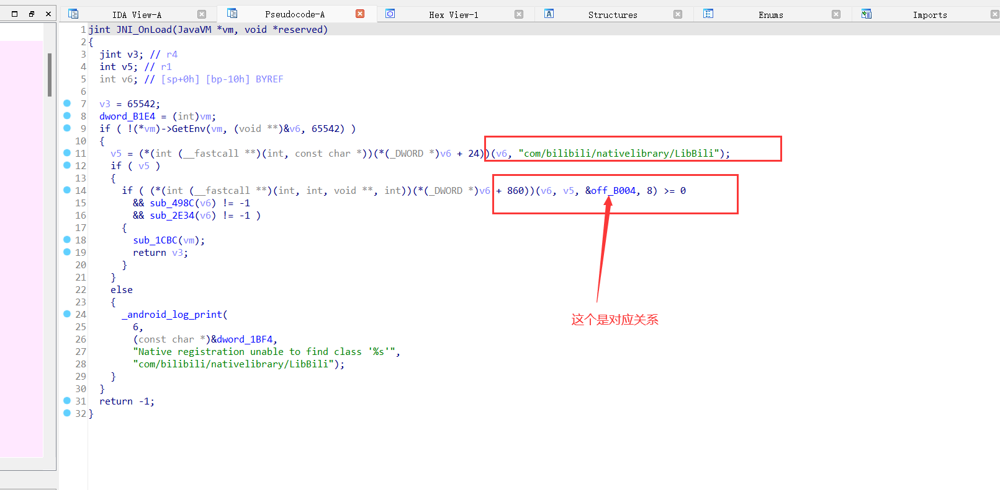

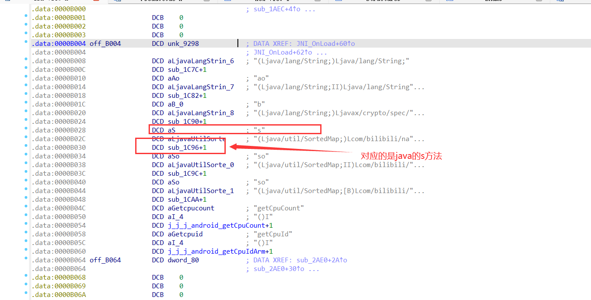

### 4.3.1 硬核破解---hook--RegisterNatives找到具体方法

```python
# 通用脚本
以后如果是动态注册，又找不到对应关系，就可以通过这种方式定位
```


```js
function hook_RegisterNatives() {
    //1 加载安卓手机底层包，系统自带的库，我们hook的RegisterNatives在这个包中
    var symbols = Module.enumerateSymbolsSync("libart.so");
    //2 定义一个变量，用来接收一会找到的addrRegisterNatives的地址
    var addrRegisterNatives = null;
    // 3 循环找到RegisterNatives的地址，赋值给变量
    //注意：此处可能找出多个RegisterNatives的地址，由于咱们是for循环，会把之前的覆盖掉，所有如果hook没反应，尝试加break，使用第一个找到的
    for (var i = 0; i < symbols.length; i++) {
        var symbol = symbols[i];
        if (symbol.name.indexOf("art") >= 0 &&
            symbol.name.indexOf("JNI") >= 0 &&
            symbol.name.indexOf("RegisterNatives") >= 0 &&
            symbol.name.indexOf("CheckJNI") < 0) {
            addrRegisterNatives = symbol.address;
            console.log("RegisterNatives is at ", symbol.address, symbol.name);
            break
        }

    }
    // 4 找到后开始hook
    if (addrRegisterNatives != null) {
        Interceptor.attach(addrRegisterNatives, {
            // 4.1 当进入RegisterNatives时执行
            // RegisterNatives(env, 类型, Java和C的对应关系,个数)
            onEnter: function (args) {
                // 4.2 第0个参数是env
                var env = args[0];
                // 4.3 第1个参数是类型
                var java_class = args[1];
                 // 4.4 通过类型得到具体的类名
                var class_name = Java.vm.tryGetEnv().getClassName(java_class);
                //console.log(class_name);
                // 只有类名为com.bilibili.nativelibrary.LibBili，才打印输出
                var taget_class = "com.bilibili.nativelibrary.LibBili";
                if (class_name === taget_class) {
                    //4.5  只有类名为com.bilibili.nativelibrary.LibBili，再取出第四个参数
                    console.log("\n[RegisterNatives] method_count:", args[3]);
                    // 4.6 第2个参数是：Java和C的对应关系，我们转成指针
                    /*
                    static JNINativeMethod gMethods[] = {
                            {"add", "(III)I", (void *) plus},
                            {"add", "(II)I", (void *) plus},
                            {"add", "(II)I", (void *) plus},
                    };
                     */
                    var methods_ptr = ptr(args[2]);
                    // 4.7 java和c函数对应关系的个数
                    var method_count = parseInt(args[3]);
                    // 4.8 我们循环这个个数，依次移动指针methods_ptr，通过readPointer，往后读取 {"add", "(III)I", (void *) plus}，依次读出Java中函数名字，签名和C中的函数指针
                    for (var i = 0; i < method_count; i++) {
                        // 4.8.1 读取Java中函数名字的
                        var name_ptr = Memory.readPointer(methods_ptr.add(i * Process.pointerSize * 3));
                        // 4.8.2 读取签名， 参数和返回值类型
                        var sig_ptr = Memory.readPointer(methods_ptr.add(i * Process.pointerSize * 3 + Process.pointerSize));
                        // 4.8.3 读取 C中的函数指针
                        var fnPtr_ptr = Memory.readPointer(methods_ptr.add(i * Process.pointerSize * 3 + Process.pointerSize * 2));

                        // 4.8.4 读取java中函数名 字符串名
                        var name = Memory.readCString(name_ptr);
                        // 4.8.5 参数和返回值类型 字符串名
                        var sig = Memory.readCString(sig_ptr);
                        // 4.5.6 根据C中函数指针获取模块
                        var find_module = Process.findModuleByAddress(fnPtr_ptr); // 根据C中函数指针获取模块


                        // 4.8.7 得到该函数的偏移量：ptr(fnPtr_ptr)函数在内存中的地址   减去   该so文件的基地址(find_module.base)====得到偏移量
                        // 地址：函数在内存中的地址
                        // 偏移量：后期单独打开so文件后，可以根据偏移量 定位到函数位置
                        // 基地址：当前so文件从那个位置开始算地址
                        var offset = ptr(fnPtr_ptr).sub(find_module.base)
                        // console.log("[RegisterNatives] java_class:", class_name);
                        // 4.8.8 输出 函数名      参数和返回值类型    模块    偏移量
                        console.log("name:", name, "sig:", sig, "module_name:", find_module.name, "offset:", offset);

                    }
                }
            }
        });
    }
}

setImmediate(hook_RegisterNatives);

// 以spawn方式运行
// frida -U -f tv.danmaku.bili -l 105.js


// 以spawn方式运行
// frida -U -f tv.danmaku.bili -l 7-hook--RegisterNatives找到具体方法.js


/*
name: a sig: (Ljava/lang/String;)Ljava/lang/String; module_name: libbili.so offset: 0x1c7d
name: ao sig: (Ljava/lang/String;II)Ljava/lang/String; module_name: libbili.so offset: 0x1c83
name: b sig: (Ljava/lang/String;)Ljavax/crypto/spec/IvParameterSpec; module_name: libbili.so offset: 0x1c91
# s 对应的c中的函数--》打印出了偏移量0x1c97---》根据偏移量去ida中找到函数--》jump--->jump address 输入地址
name: s sig: (Ljava/util/SortedMap;)Lcom/bilibili/nativelibrary/SignedQuery; module_name: libbili.so offset: 0x1c97
name: so sig: (Ljava/util/SortedMap;II)Lcom/bilibili/nativelibrary/SignedQuery; module_name: libbili.so offset: 0x1c9d
name: so sig: (Ljava/util/SortedMap;[B)Lcom/bilibili/nativelibrary/SignedQuery; module_name: libbili.so offset: 0x1cab
name: getCpuCount sig: ()I module_name: libbili.so offset: 0x1cb3
name: getCpuId sig: ()I module_name: libbili.so offset: 0x1cb7


 */

```

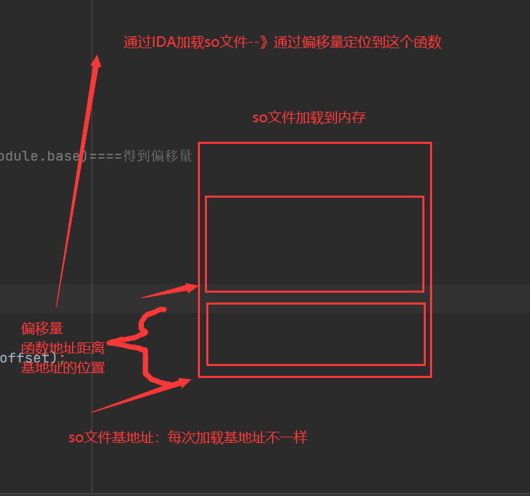


### 4.3.2 通过打印出的偏移量，查找c函数

```python
# 1 偏移量：jump---jump address
# 2 找到
int __fastcall sub_1C96(int a1, int a2, int a3)
{
  return sub_2F88(a1, a3, 0, 0);
}

# 3 sub_2F88 代码如下

int __fastcall sub_2F88(JNIEnv_ *a1, int a2, int a3, int a4){
  # 返回的是SignedQuery类型---》c中调用java---》
    sub_227C(v36);  # md5加密
    sub_22B0(v36, v32, v27); # 加盐
    sprintf(v37, "%08x", v22);# 字符串格式
    sub_22B0(v36, v37, 8); # 加盐
    for ( i = 1; i != 4; ++i )
    {
        sprintf(v37, "%08x", v20[i]);
        sub_22B0(v36, v37, 8);
    }
    sub_2AE0(v37, v36);
    v29 = s;
    for ( j = 0; j != 16; ++j )
  
  v17 = a1->functions->NewStringUTF(a1, s); # 继续找s
  # v17给了第二个参数，第二参数就是this.b--->就是sign
  # 返回SignedQuery对象，所以NewObject
  return (int)a1->functions->NewObject((JNIEnv *)a1, (jclass)dword_B0FC, (jmethodID)dword_B100, v16, v17);
    
}

# 4 c中调用java中的类
# 1 找到类
jclass cls = (*env)->FindClass(env, "com.bilibili.nativelibrary.SignedQuery");
# 2 找到构造方法
jmethodID init = (*env)->GetMethodID(env, cls, "<init>", "(Ljava/lang/String;Ljava/lang/String;)V");
# 3 使用构造方法，实例化得到对象
jobject cls_obj = (*env)->NewObject(env, cls, init, (*env)->NewStringUTF(env, ""), (*env)->NewStringUTF(env, ""));


# 5 整个c的逻辑就是 把明文使用md5+加盐--》得到sign


# 6 sub_227C(v36) 为什么是md5加密
_DWORD *__fastcall sub_227C(_DWORD *result)
{
  *result = 1732584193; # 是md5加密的素数
  result[1] = -271733879;
  result[2] = -1732584194;
  result[3] = 271733878;
  result[4] = 0;
  result[5] = 0;
  return result;
}

# 7 断定是md5加密---》有盐--》确定盐

# 8 hook -sub_22B0 打印出md5加的盐

```


### 4.3.3 hook-sub_22B0确定md5的盐

```python
import frida
import sys

rdev = frida.get_remote_device()
session = rdev.attach("哔哩哔哩")
scr = """
Java.perform(function () {

    var libbili = Module.findBaseAddress("libbili.so");
	// hook sub_22B0函数，通过偏移量找到 偏移量 22B0
	var s_func = libbili.add(0x22b0 + 1); // 32位的so文件都要 +1
    console.log(s_func);

    Interceptor.attach(s_func, {
        onEnter: function (args) {
            // args[0]
            // args[1]，明文字符串
            // args[2]，明文字符串长度

            console.log("执行update，长度是：",args[2], args[2].toInt32());

            // console.log( hexdump(args[1], {length: args[2].toInt32()})  );
            console.log(args[1].readUtf8String())
        },
        onLeave: function (args) {
            console.log("=======================结束===================");
        }
    });
});
"""
script = session.create_script(scr)
script.load()
sys.stdin.read()


''' 
通过hook，找到update进去的盐 
560c52cc
=======================结束===================
执行update，长度是： 0x8 8
d288fed0
=======================结束===================
执行update，长度是： 0x8 8
45859ed1
=======================结束===================
执行update，长度是： 0x8 8
8bffd973

'''
```

### 4.3.4 使用python重过程

```python
import hashlib
obj = hashlib.md5()
obj.update("actual_played_time=0&aid=352533984&appkey=1d8b6e7d45233436&auto_play=0&build=6240300&c_locale=zh-Hans_CN&channel=xxl_gdt_wm_253&cid=1025584249&epid=0&epid_status=&from=6&from_spmid=tm.recommend.0.0&last_play_progress_time=0&list_play_time=0&max_play_progress_time=0&mid=0&miniplayer_play_time=0&mobi_app=android&network_type=1&paused_time=0&platform=android&play_status=0&play_type=1&played_time=0&quality=64&s_locale=zh-Hans_CN&session=2526d8482c1436027b62f1e61ecd4ad374d02d8c&sid=0&spmid=main.ugc-video-detail-vertical.0.0&start_ts=0&statistics=%7B%22appId%22%3A1%2C%22platform%22%3A3%2C%22version%22%3A%226.24.0%22%2C%22abtest%22%3A%22%22%7D&sub_type=0&total_time=0&ts=1692283438&type=3&user_status=0&video_duration=73".encode('utf-8'))
obj.update("560c52cc".encode('utf-8'))
obj.update("d288fed0".encode('utf-8'))
obj.update("45859ed1".encode('utf-8'))
obj.update("8bffd973".encode('utf-8'))
res = obj.hexdigest()
print(res)
```

### 4.3.5 sign加密

```python
 对请求体前面明文使用md5加密---》加了四段盐---》加密的sign拼接到了请求体后面
    
```


# 5 播放量提高代码整合

```python
import datetime
import uuid
import base64
import hashlib
import time
import requests
import re
import json
from Crypto.Cipher import AES
from Crypto.Util.Padding import pad
from urllib.parse import quote_plus
import string
import random
import time
import hashlib
import ctypes
import urllib3

urllib3.disable_warnings(urllib3.exceptions.InsecureRequestWarning)


class BiliBili(object):
    def __init__(self, aid, bvid, cid, duration, proxies):
        self.aid, self.bvid, self.cid, self.duration = aid, bvid, cid, duration

        self.wifi_mac = self.create_random_mac().upper()
        self.device_id = self.create_device_id(self.wifi_mac)  # did
        self.buvid = self.create_buvid_by_wifi()
        self.session_id = self.create_session_id()

        self.build_brand = "HUAWEI"
        self.build_model = 'Mate 10 Pro'

        self.fp_local = self.create_local(self.buvid, self.build_model, "")
        self.fp_remote = self.create_local(self.buvid, self.build_model, "")

        self.app_first_run_time = str(int(time.time()) - random.randint(0, 24 * 60 * 60))  # fts
        self.ts = str(int(time.time() - 10))

        self.session = requests.Session()
        # self.session.proxies = proxies
        self.start_ts = None
        self.heart_beat_session_id = None

    def create_random_mac(self, sep=":"):
        """ 随机生成mac地址 """
        data_list = []
        for i in range(1, 7):
            part = "".join(random.sample("0123456789ABCDEF", 2))
            data_list.append(part)
        mac = sep.join(data_list)

        return mac

    def create_device_id(self, mac):
        """
        根据mac地址生成 3.device_id
        :param mac: 传入参数的格式是 00:00:00:00:00
        :return:
        """

        def gen_sn():
            return "".join(random.sample("123456789" + string.ascii_lowercase, 10))

        def base64_encrypt(data_string):
            data_bytes = bytearray(data_string.encode('utf-8'))
            data_bytes[0] = data_bytes[0] ^ (len(data_bytes) & 0xFF)
            for i in range(1, len(data_bytes)):
                data_bytes[i] = (data_bytes[i - 1] ^ data_bytes[i]) & 0xFF
            res = base64.encodebytes(bytes(data_bytes))
            return res.strip().strip(b"==").decode('utf-8')

        # 1. 生成mac地址（保证mac中的每个元素是不重复的，例如：0000000000)
        mac_str = mac

        # 2. 去除IP地址中的符号，只保留 48e1e828e02e（变小写）
        mac_str = re.sub("[^0-9A-Fa-f]", "", mac_str)
        mac_str = mac_str.lower()

        # 3. 获取手续序列号
        sn = gen_sn()

        # 4. 拼接并进行base64加密
        total_string = "{}|||{}".format(mac_str, sn)
        return base64_encrypt(total_string)

    def create_buvid_by_wifi(self):
        """
            基于wifi mac地址生成buvid （ B站app中有四种获取buvid的方式：设备ID、wifi mac地址、3.device_id、uuid ）
        """
        md5 = hashlib.md5()
        md5.update(self.wifi_mac.encode('utf-8'))
        v0_1 = md5.hexdigest()
        return "XY{}{}{}{}".format(v0_1[2], v0_1[12], v0_1[22], v0_1).upper()

    def create_session_id(self):
        # return "".join([hex(item)[2:] for item in random.randbytes(4)])
        return "".join([hex(random.randint(1, 255))[2:] for i in range(4)])

    def create_local(self, buvid, phone_model, phone_band):
        """
        fp_local和fp_remote都是用这个算法来生成的，在手机初始化阶段生成 fp_local，
        :param buvid: 根据算法生成的buvid，例如："XYBA4F3B2789A879EA8AEEDBE2E4118F78303"
        :param phone_model:  手机型号modal，例如："Mate 10 Pro"
        :param phone_band:  手机品牌band，在模拟器上是空字符串（我猜是程序员想要写成 brand ）哈哈哈哈
        :return:
        """

        def a_b(arg8):
            v3 = 0
            v4 = 60
            v0_1 = 2
            v5 = 0
            while True:
                v6 = arg8[v3:v3 + 2]
                v5 += int(v6, base=16)
                if v3 != v4:
                    v3 += v0_1
                    continue
                break
            xx = "%02x" % (v5 % 0x100,)
            return xx

        def misc_helper_kt(data_bytes):
            data_list = []
            v7 = len(data_bytes)
            v0 = 0
            while v0 < v7:
                v2 = data_bytes[v0]
                data_list.append("%02x" % v2)
                v0 += 1
            return ''.join(data_list)

        data_string = "{}{}{}".format(buvid, phone_model, phone_band)
        hash_object = hashlib.md5()
        hash_object.update(data_string.encode('utf-8'))
        data = hash_object.digest()

        arg1 = misc_helper_kt(data)
        arg2 = datetime.datetime.now().strftime("%Y%m%d%H%M%S")
        # arg3 = misc_helper_kt(random.randbytes(8))
        arg3 = misc_helper_kt([random.randint(1, 255) for i in range(8)])

        str2 = "{}{}{}".format(arg1, arg2, arg3)
        local = str2 + a_b(str2)
        return local

    def x_report_click_android2(self):
        SALT = "9cafa6466a028bfb"
        KEY = "fd6b639dbcff0c2a1b03b389ec763c4b"
        IV = "77b07a672d57d64c"

        def sha_256_encrypt(data_string):
            sha = hashlib.sha256()
            sha.update(data_string.encode('utf-8'))
            sha.update(SALT.encode('utf-8'))
            return sha.hexdigest()

        def aes_encrypt(data_string):
            aes = AES.new(
                key=KEY.encode('utf-8'),
                mode=AES.MODE_CBC,
                iv=IV.encode('utf-8')
            )
            raw = pad(data_string.encode('utf-8'), 16)
            return aes.encrypt(raw)

        ctime = int(time.time())
        info = {
            'aid': self.aid,
            'cid': self.cid,
            'part': 1,
            'mid': 0,
            'lv': 0,
            'ftime': ctime - random.randint(100, 1000),
            'stime': ctime,
            'did': self.device_id,
            'type': 3,
            'sub_type': 0,
            'sid': '0',
            'epid': '',
            'auto_play': 0,
            'build': 6240300,
            'mobi_app': 'android',
            'spmid': 'main.ugc-video-detail.0.0',
            'from_spmid': 'search.search-result.0.0'
        }
        data = "&".join(["{}={}".format(key, info[key]) for key in sorted(info.keys())])
        sign = sha_256_encrypt(data).lower()
        data = "{}&sign={}".format(data, sign)
        aes_string = aes_encrypt(data)

        res = self.session.post(
            url="https://api.bilibili.com/x/report/click/android2",
            headers={
                "accept-length": "gzip",
                "content-type": "application/json; charset=utf-8",
                "app-key": "android",
                "User-Agent": "Mozilla/5.0 BiliDroid/6.24.0 (bbcallen@gmail.com) os/android model/Mate 10 Pro mobi_app/android build/6240300 channel/bili innerVer/6240300 osVer/6.0.1 network/2",
                "env": "prod",
                "buvid": self.buvid,
                "device-id": self.device_id,
                "session_id": self.session_id,
                "fp_local": self.fp_local,
                "fp_remote": self.fp_remote,
            },
            data=aes_string,
            timeout=10,
            verify=False

        )
        # print(res.text)
        res.close()

    def get_param_sign_s(self, param_dict):
        """
        :param param_dict: 要签名的参数字典
        :return:
        """
        ordered_string = "&".join(["{}={}".format(key, param_dict[key]) for key in sorted(param_dict.keys())])
        encrypt_string = ordered_string + "560c52ccd288fed045859ed18bffd973"
        obj = hashlib.md5(encrypt_string.encode('utf-8'))
        sign = obj.hexdigest()

        return "{}&sign={}".format(ordered_string, sign)

    def create_heart_beat_session_id(self):
        arg0 = str(int(time.time() * 1000)) + str(random.randint(1, 1000000))
        # sha1加密
        hash_object = hashlib.sha1()
        hash_object.update(arg0.encode('utf-8'))
        arg7 = hash_object.hexdigest()
        return arg7

    def heart_beat_start(self, aid, cid, duration):
        self.start_ts = ts = int(time.time() - 10)
        self.heart_beat_session_id = self.create_heart_beat_session_id()
        form_dict = {
            "actual_played_time": "0",
            "aid": aid,
            "appkey": "1d8b6e7d45233436",
            "auto_play": "0",
            "build": "6240300",
            "c_locale": "zh_CN",
            "channel": "bili",
            "cid": cid,
            "epid": "0",
            "epid_status": "",
            "from": "2",
            "from_spmid": "main.ugc-video-detail.0.0",
            "last_play_progress_time": "0",
            "list_play_time": "0",
            "max_play_progress_time": "0",
            "mid": "0",
            "miniplayer_play_time": "0",
            "mobi_app": "android",
            "network_type": "1",
            "paused_time": "0",
            "platform": "android",
            "play_status": "0",
            "play_type": "1",
            "played_time": "0",
            "quality": "32",
            "s_locale": "zh_CN",
            "session": self.heart_beat_session_id,
            "sid": "0",
            "spmid": "main.ugc-video-detail.0.0",
            "start_ts": "0",
            "statistics": quote_plus(
                json.dumps({"appId": 1, "platform": 3, "version": "6.24.0", "abtest": ""}, separators=(',', ':'))),
            "sub_type": "0",
            "total_time": "0",
            "type": "3",
            "user_status": "0",
            "video_duration": duration,
            "ts": ts,
        }

        total_body_string = self.get_param_sign_s(form_dict)

        res = self.session.post(
            url="https://api.bilibili.com/x/report/heartbeat/mobile",
            data=total_body_string.encode('utf-8'),
            headers={
                "accept-length": "gzip",
                "content-type": "application/x-www-form-urlencoded; charset=utf-8",
                "app-key": "android",
                "User-Agent": "Mozilla/5.0 BiliDroid/6.24.0 (bbcallen@gmail.com) os/android model/Mate 10 Pro mobi_app/android build/6240300 channel/bili innerVer/6240300 osVer/6.0.1 network/2",
                "env": "prod",
                "buvid": self.buvid,
                "device-id": self.device_id,
                "session_id": self.session_id,
                "fp_local": self.fp_local,
                "fp_remote": self.fp_remote,
            },
            verify=False
        )
        res.close()

    def heart_beat_end(self, aid, cid, duration):
        current_ts = int(time.time())

        form_dict = {
            "actual_played_time": duration,  # 实际播放时间
            "aid": aid,
            "appkey": "1d8b6e7d45233436",
            "auto_play": "0",
            "build": "6240300",
            "c_locale": "zh_CN",
            "channel": "bili",
            "cid": cid,
            "epid": "0",
            "epid_status": "",
            "from": "2",
            "from_spmid": "main.ugc-video-detail.0.0",
            "last_play_progress_time": duration,
            "list_play_time": "0",
            "max_play_progress_time": duration,
            "mid": "0",
            "miniplayer_play_time": "0",
            "mobi_app": "android",
            "network_type": "1",
            "paused_time": current_ts - self.start_ts - duration,  # 暂停时间
            "platform": "android",
            "play_status": "0",
            "play_type": "1",
            "played_time": duration,
            "quality": "32",
            "s_locale": "zh_CN",
            "session": self.heart_beat_session_id,
            "sid": "0",
            "spmid": "main.ugc-video-detail.0.0",
            "start_ts": self.start_ts,
            "statistics": quote_plus(
                json.dumps({"appId": 1, "platform": 3, "version": "6.24.0", "abtest": ""}, separators=(',', ':'))),
            "sub_type": "0",
            "total_time": current_ts - self.start_ts,
            "type": "3",
            "user_status": "0",
            "video_duration": self.duration,
            "ts": current_ts,
            # "sign": "b098ca2c4caa53de22720a9755fde742"
        }

        total_body_string = self.get_param_sign_s(form_dict)

        res = self.session.post(
            url="https://api.bilibili.com/x/report/heartbeat/mobile",
            headers={
                "accept-length": "gzip",
                "content-type": "application/x-www-form-urlencoded; charset=utf-8",
                "app-key": "android",
                "User-Agent": "Mozilla/5.0 BiliDroid/6.24.0 (bbcallen@gmail.com) os/android model/Mate 10 Pro mobi_app/android build/6240300 channel/bili innerVer/6240300 osVer/6.0.1 network/2",
                "env": "prod",
                "buvid": self.buvid,
                "device-id": self.device_id,
                "session_id": self.session_id,
                "fp_local": self.fp_local,
                "fp_remote": self.fp_remote,
            },
            data=total_body_string.encode('utf-8'),
            verify=False
        )
        res.close()


def get_video_id_info(exec_url, proxies):
    session = requests.Session()
    bvid = exec_url.rsplit('/')[-1]
    header = {
        'User-Agent': 'Mozilla/5.0 (Linux; Android 6.0; Nexus 5 Build/MRA58N) AppleWebKit/537.36 (KHTML, like Gecko) Chrome/120.0.0.0 Mobile Safari/537.36'
    }
    res = session.get(
        url="https://api.bilibili.com/x/player/pagelist?bvid={}&jsonp=jsonp".format(bvid),
        # proxies=proxies,
        headers=header,
        verify=False
    )

    cid = res.json()['data'][0]['cid']

    res = session.get(
        url="https://api.bilibili.com/x/web-interface/view?cid={}&bvid={}".format(cid, bvid),
        # proxies=proxies,
        headers=header,
        verify=False
    )
    res_json = res.json()
    aid = res_json['data']['aid']
    view_count = res_json['data']['stat']['view']
    duration = res_json['data']['duration']
    session.close()
    return aid, bvid, cid, duration, int(view_count)


def get_proxy_dict():
    key = "..."
    passwd = "..."
    host = "..."
    return {
        "http": 'http://{}:{}@{}'.format(key, passwd, host),
        "https": 'http://{}:{}@{}'.format(key, passwd, host)
    }


def run():
    url = "https://www.bilibili.com/video/BV1Mu4y1Y7Ho"
    while True:
        try:
            # 1.IP代理
            # proxies = get_proxy_dict()
            proxies = {}

            # 2.获取视频信息
            aid, bvid, cid, duration, view_count = get_video_id_info(url, proxies)
            print("\n播放量为：{}".format(view_count))

            # 3.创建对象 -> buvid、session生成
            bili = BiliBili(aid, bvid, cid, duration, proxies=proxies)

            # 4.播放
            bili.x_report_click_android2()

            # 5.心跳开始
            bili.heart_beat_start(aid, cid, duration)

            # 6.模拟观看视频
            time.sleep(10)

            # 7.结束心跳
            bili.heart_beat_end(aid, cid, duration)

            # 8.关闭连接
            bili.session.close()
        except Exception as e:
            print("异常：", e)


if __name__ == '__main__':
    run()

    # 需要切换ip地址---》如果ip地址不换--次数只能 增加一次--》一段时间能只能增加一次
    # 如果想快速刷，需要切换ip
    # 切换ip，会增加，但不会一直增加---》有风控--》如果视频播放数很高--》有个缓存---》过一段时间才慢慢上去
```


