# 1 目标：B站app心跳和完播

```python
- PC
	- 点击播放：播放请求 + 心跳请求
	- 每15s发送一次
	- 最后一次心跳
- APP
	- 点击播放：播放请求 + 心跳请求
	- 最后一次心跳（暂停时间、播放时间）
	
#1 完播率接口
# b站视频刷播放量
	-破了一个接口：https://api.bilibili.com/x/report/click/android2-->可以提高播放量
    -有个限度---》换设备---》换ip
# 视频是否被完整播放完了---完播率接口
	-PC：
    	-https://api.bilibili.com/x/click-interface/web/heartbeat
        -每隔15s向后端发送一次请求，到最后视频播放完成---》记一次完播率
        -发请求的时候，带了当前时间，视频播放到位置--》登录用户--》下次再打开这个视频，它会从我上次看到的位置继续播放--》前后会差15s钟
        
    -APP：
		-https://api.bilibili.com/x/report/heartbeat/mobile
        -视频点击开，发送一次，视频播放完，发送一次---》app端完播率简单，咱们不需要每隔15s发送一次，只需要发送两次请求，就能触发它的完播率
```

- 版本：v6.24.0

- 设备：真机（必须）

# 2 抓包分析


```python
# 请求地址：
https://api.bilibili.com/x/report/heartbeat/mobile
# 请求方法：
POST
# 请求头：(之前都破好了)
    buvid:XXCE06EC3F65CE60EE272907EC70BD5A491E7
    device-id:IBksFHYQJ0QiF3FAckQmFVUFbBRxHS93Ow
    fp_local:1d6a9c1ac4f284329263021dc511149f20230808200943dd22c10f6ccec20ddd
    fp_remote:1d6a9c1ac4f284329263021dc511149f202308030024054e69106c26213aee5f
    session_id:4f99a692
    env:prod
    app-key:android
# 请求参数：
	#----视频id号--已经处理好
	aid	441087535
    cid	1056967029
    #---设备id号---一台手机就是固定的
    appkey	1d8b6e7d45233436
    actual_played_time	0
    auto_play	0
    build	6240300
    c_locale	zh-Hans_CN
    channel	xxl_gdt_wm_253
    epid	0
    epid_status	
    from	6
    from_spmid	tm.recommend.0.0
    last_play_progress_time	0
    list_play_time	0
    max_play_progress_time	0
    mid	0
    miniplayer_play_time	0
    mobi_app	android
    network_type	1
    paused_time	0   # 暂停了多长时间
    platform	android
    play_status	0
    play_type	1
    played_time	0   # 播放了多长时间
    quality	64
    s_locale	zh-Hans_CN
    sid	0
    spmid	main.ugc-video-detail-vertical.0.0
    start_ts	0
    statistics	{"appId":1,"platform":3,"version":"6.24.0","abtest":""}
    sub_type	0
    total_time	0
    ts	1691657232
    type	3
    user_status	0
    video_duration	449  #视频时长是多少秒
    # --以上都是固定的---需要逆向的如下--
    session	901c6d78daacbf015bd9868d401215e2fac86b9e
    sign	4cf853cd686c9b1be523f762fb117b23

    
    
# 我们的目标：破解session和 sign

```

# 3 破解session

## 3.1 反编译-->搜索url

```python
# 1 搜索url：x/report/heartbeat/mobile
# 2 查找用例：找到三个位置 ---》每个都查看---》最终都是HeartbeatParams的对象
	-依次查看，我们确定位置--》P7
# 3 我们查看传入参数：N7 的类---》HeartbeatParams查找声明
# 4 在类内部发现有位置放入了session
# 5 N7是通过调用N7得到的，我们再查看N7
HeartbeatParams N7 = N7(hVar2, true);
# 6 N7返回了new 一个HeartbeatParams ，传入的第二个参数就是session--》hVar.r1()
# 7 查看hVar.r1()的声明
  # 返回了session
  public final String r1() {
        return this.d;
    }
   # 设置了session
   public final void t2(String str) {
        this.d = str;
    }
# 8 得看谁调用了t2 把session传入了
	1 查找用例，看谁调用了t2
    2 对t2进行hook，打印调用栈查看谁调用
    
# 9 hook t2，打印调用栈
    at tv.danmaku.biliplayerimpl.report.heartbeat.h.t2(Native Method)
	at tv.danmaku.biliplayerimpl.report.heartbeat.h$a.b(BL:5)
	at tv.danmaku.biliplayerimpl.report.heartbeat.d.L7(BL:2)
	at tv.danmaku.biliplayerimpl.report.heartbeat.d.u7(BL:3)
	at tv.danmaku.biliplayerimpl.core.PlayerCoreServiceV2$l.onPrepared(BL:2)
	at t3.a.i.b.i$j.onPrepared(BL:6)
	at tv.danmaku.ijk.media.player.AbstractMediaPlayer.notifyOnPrepared(BL:2)
	at tv.danmaku.ijk.media.player.IjkMediaPlayer$EventHandler.handleMessage(BL:107)
	at android.os.Handler.dispatchMessage(Handler.java:106)
	at android.os.Looper.loop(Looper.java:223)
	at android.app.ActivityThread.main(ActivityThread.java:7656)
	at java.lang.reflect.Method.invoke(Native Method)
	at com.android.internal.os.RuntimeInit$MethodAndArgsCaller.run(RuntimeInit.java:592)
	at com.android.internal.os.ZygoteInit.main(ZygoteInit.java:947)
    
#10 tv.danmaku.biliplayerimpl.report.heartbeat.h$a.b调用了t2
	搜索：tv.danmaku.biliplayerimpl.report.heartbeat.h.a 下的b方法
    
# 11 发现b方法里调用了t2
    public final h b(Video.h commonParams, int i, int i2, int i3) {
        Long G0;
        Integer E0;
        h hVar = new h();
        hVar.y2(d.f24359j.b());
        hVar.w2(d.f24359j.a());
        hVar.Z1(hVar.u1());
        hVar.t2(g.a.a());
# 12 继续查看：g.a.a()
public final String a() {
        Random random = new Random(); # 拿到random对象，后面肯定会用随机的东西
        StringBuilder sb = new StringBuilder(); # sb 为了拼接字符串
        c2.f.b0.c.b.b.a.a E = c2.f.b0.c.b.b.a.a.E();
        sb.append(E.t());  # 字符串中先拼了个  E.t()
        sb.append(System.currentTimeMillis()); # 字符串又拼了当前时间戳
        sb.append(random.nextInt(1000000)); # 字符串又拼了随机1百万以内的一个数字
        String sb2 = sb.toString();  # 转成了字符串
        String sha1 = com.bilibili.commons.m.a.i(sb2); # 我们猜，就是把上面的字符串使用sha1加密
        if (TextUtils.isEmpty(sha1)) {
            return sb2;
        }
        x.h(sha1, "sha1");
        return sha1;
    }
# 13 com.bilibili.commons.m.a.i 是sha1摘要
   public static String i(String str) {
        return j(str.getBytes());
    }
# 14 j函数
      public static String j(byte[] bArr) {
        try {
            return h(bArr, MessageDigest.getInstance("SHA1"));
        } catch (NoSuchAlgorithmException e) {
            e.printStackTrace();
            return null;
        }
    }
#15  h函数
     private static String h(byte[] bArr, MessageDigest messageDigest) {
        messageDigest.update(bArr);
        byte[] digest = messageDigest.digest();
        char[] cArr = new char[digest.length * 2];
        int i = 0;
        for (byte b : digest) {
            int i2 = i + 1;
            char[] cArr2 = a;
            cArr[i] = cArr2[(b >>> 4) & 15];
            i = i2 + 1;
            cArr[i2] = cArr2[b & cv.f24887m];
        }
        return new String(cArr).toLowerCase();
    }

    
# 16 sb2 字符串具体是啥
     sb.append(E.t());  # 字符串中先拼了个  E.t()
     sb.append(System.currentTimeMillis()); # 字符串又拼了当前时间戳
     sb.append(random.nextInt(1000000)); # 字符串又拼了随机1百万以内的一个数字
    
# 17 hook一下com.bilibili.commons.m.a.i，查看传入的字符串是什么--》第一段就是E.t
    hook后发现 E.t() 是空的
    
# 18 最终：使用python重写session生成

```

**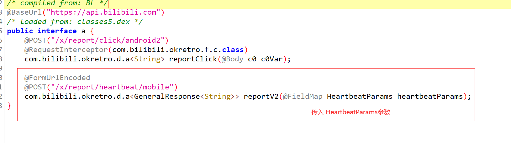**

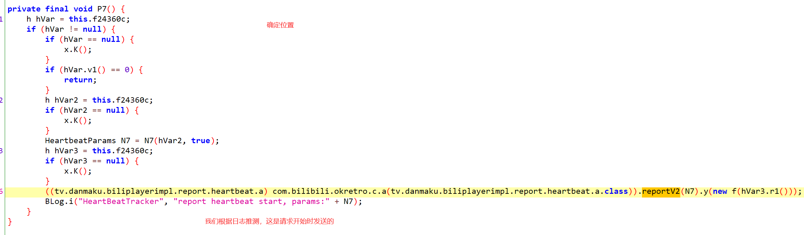

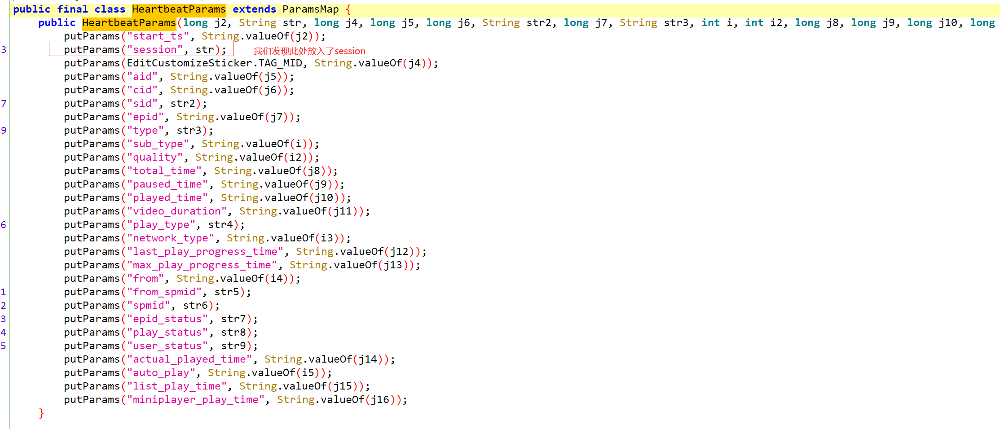

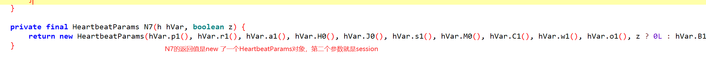

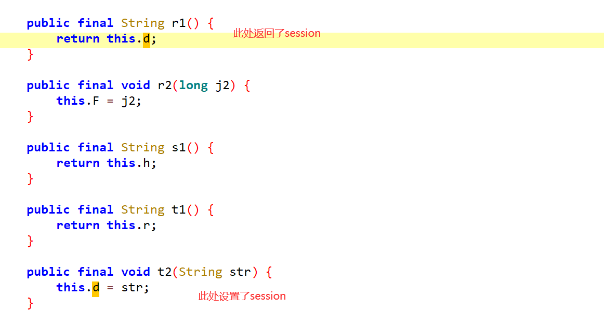


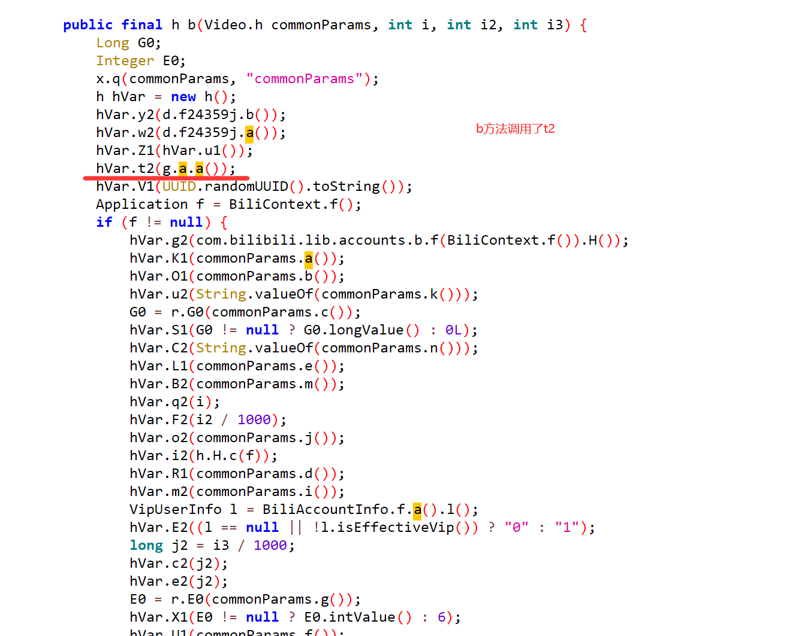


## 3.2 hook--t2--打印调用栈

```python
import frida
import sys

rdev = frida.get_remote_device()
# session = rdev.attach("tv.danmaku.bili")
session = rdev.attach("哔哩哔哩")

scr = """
    Java.perform(function () {
    var h = Java.use("tv.danmaku.biliplayerimpl.report.heartbeat.h");
    h.t2.implementation = function(str){
        console.log("设置session",str);
        this.t2(str);
        //调用栈
      console.log(Java.use("android.util.Log").getStackTraceString(Java.use("java.lang.Throwable").$new()));
    
    };
    
    });
"""

script = session.create_script(scr)

script.load()
sys.stdin.read()


'''
设置session 69a5568e29c5f5bb120901435e2bd98281c1969d
java.lang.Throwable
	at tv.danmaku.biliplayerimpl.report.heartbeat.h.t2(Native Method)
	at tv.danmaku.biliplayerimpl.report.heartbeat.h$a.b(BL:5)
	at tv.danmaku.biliplayerimpl.report.heartbeat.d.L7(BL:2)
	at tv.danmaku.biliplayerimpl.report.heartbeat.d.u7(BL:3)
	at tv.danmaku.biliplayerimpl.core.PlayerCoreServiceV2$l.onPrepared(BL:2)
	at t3.a.i.b.i$j.onPrepared(BL:6)
	at tv.danmaku.ijk.media.player.AbstractMediaPlayer.notifyOnPrepared(BL:2)
	at tv.danmaku.ijk.media.player.IjkMediaPlayer$EventHandler.handleMessage(BL:107)
	at android.os.Handler.dispatchMessage(Handler.java:106)
	at android.os.Looper.loop(Looper.java:223)
	at android.app.ActivityThread.main(ActivityThread.java:7656)
	at java.lang.reflect.Method.invoke(Native Method)
	at com.android.internal.os.RuntimeInit$MethodAndArgsCaller.run(RuntimeInit.java:592)
	at com.android.internal.os.ZygoteInit.main(ZygoteInit.java:947)

'''
```

## 3.3 hook--com.bilibili.commons.m.a.i(sb2)--看E.t()

```python
import frida
import sys
from frida.core import Device
rdev = frida.get_remote_device()

# session = rdev.attach("tv.danmaku.bili")
session = rdev.attach("哔哩哔哩")

scr = """
Java.perform(function () {
    var a = Java.use("com.bilibili.commons.m.a");

    a.i.implementation = function(str){   
       console.log("参数=",str);
       var res = this.i(str);
       console.log("返回值=",res);
       return res;
    }

});
"""
script = session.create_script(scr)

script.load()
sys.stdin.read()


'''
发现E.t()为空
参数= 1691659675405239781
返回值= c7aa4b7423a54f58b36be0a644899246e3095ff6
'''
```


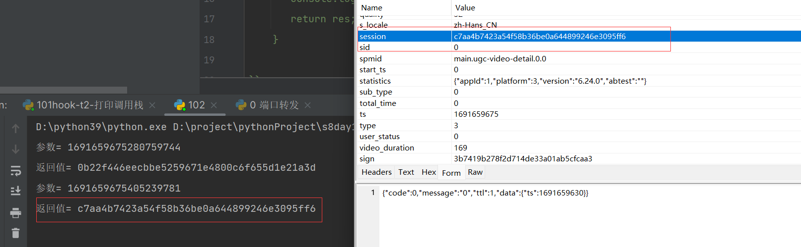


```python
import hashlib

arg0 = "1691659675405239781"

hash_object = hashlib.sha1()
hash_object.update(arg0.encode('utf-8'))
arg7 = hash_object.hexdigest()
print(arg7)
# 返回值= c7aa4b7423a54f58b36be0a644899246e3095ff6
# c7aa4b7423a54f58b36be0a644899246e3095ff6
```

## 3.4 python生成session

```python
import hashlib
import time
import random
# arg0 = "1691659675405239781"
arg0=str(int(time.time() * 1000)) + str(random.randint(1, 1000000))
hash_object = hashlib.sha1()
hash_object.update(arg0.encode('utf-8'))
arg7 = hash_object.hexdigest()
print(arg7)
```


# 4 破解sign


没发现参数，怎么办？

- 搜索：sign   sign=  "sign"  "sign="
- 硬核分析 + Hook验证


```python
#1 按照 刚刚破解session的思路找sign找不到
	-我们猜：把前面一大串明文，用某种加密方式加了密，拼成了sign
    -根据它的格式：md5---》大胆去试--》如果你加密后的，跟抓包抓到的发现一样，都不用破，直接用
    	-当前这个案例确实是md5，但是有盐
        
# 2 按照 刚刚破解session的思路
	-1 拦截器中
    -2 使用so文件得到的
    
# 3 全局搜索：sign   sign=  "sign"  "sign="
# 4 硬核分析+hook验证方式
```


## 4.1 搜索方案破解sign

```python
# 1 全局搜 &sign= 定位到位置---》没那么好找---》猜+hook验证
  public String toString() {
        String str = this.a;
        if (str == null) {
            return "";
        }
        if (this.b == null) {
            return str;
        }
        return this.a + "&sign=" + this.b;
    }


# 2 hook打印toString的调用栈--》看谁调用了我
import frida
import sys
from frida.core import Device
rdev = frida.get_remote_device()

# session = rdev.attach("tv.danmaku.bili")
session = rdev.attach("哔哩哔哩")

scr = """
Java.perform(function () {
    var SignedQuery = Java.use("com.bilibili.nativelibrary.SignedQuery");

    SignedQuery.toString.implementation = function(){   
       var res = this.toString();
       console.log(res);
       console.log(Java.use("android.util.Log").getStackTraceString(Java.use("java.lang.Throwable").$new()));
       return res;
    }

});
"""
script = session.create_script(scr)

script.load()
sys.stdin.read()

# 3 调用toString调用栈
	at com.bilibili.nativelibrary.SignedQuery.toString(Native Method)
	at com.bilibili.okretro.f.a.c(BL:16)
	at com.bilibili.okretro.f.a.a(BL:6)
	at com.bilibili.okretro.d.a.execute(BL:24)
	at com.bilibili.okretro.d.a$a.run(BL:2)
	at java.util.concurrent.ThreadPoolExecutor.runWorker(ThreadPoolExecutor.java:1167)
	at java.util.concurrent.ThreadPoolExecutor$Worker.run(ThreadPoolExecutor.java:641)
	at java.lang.Thread.run(Thread.java:923)
    
# 4 com.bilibili.okretro.f.a类下的c方法调用了toString
public void c(u uVar, c0 c0Var, b0.a aVar) {

     aVar.s(h).l(c0.create(w.d("application/x-www-form-urlencoded; charset=utf-8"), h(hashMap).toString())); # 在这里调用了
        } catch (IOException unused) {
        }
    }

    
# 5 查看h 是什么，传入了一个 hashMap ---》就有如下的key和value
actual_played_time=0&aid=305182753&appkey=1d8b6e7d45233436&auto_play=0&build=6240300&c_locale=zh-Hans_CN&channel=xxl_gdt_wm_253&cid=894984613&epid=0&epid_status=&from=2&from_spmid=main.ugc-video-detail.0.0&last_play_progress_time=0&list_play_time=0&max_play_progress_time=0&mid=0&miniplayer_play_time=0&mobi_app=android&network_type=1&paused_time=0&platform=android&play_status=0&play_type=1&played_time=0&quality=32&s_locale=zh-Hans_CN&session=14d9bcae31742c05158c4cabd04af086cbd71542&sid=0&spmid=main.ugc-video-detail.0.0&start_ts=0&statistics=%7B%22appId%22%3A1%2C%22platform%22%3A3%2C%22version%22%3A%226.24.0%22%2C%22abtest%22%3A%22%22%7D&sub_type=0&total_time=0&ts=1692276394&type=3&user_status=0&video_duration=139

#6 找到h方法
  public SignedQuery h(Map<String, String> map) {
        return LibBili.g(map);
    }
# 7 LibBili.g(map) 代码如下
public static SignedQuery g(Map<String, String> map) {
    return s(map == null ? new TreeMap() : new TreeMap(map));
}

# 8 找到s 是个jni的方法，返回值是SignedQuery，传入了有序的map---》返回值就是sign的加密串
static native SignedQuery s(SortedMap<String, String> sortedMap);

# 9 sign的加密在so层
static {
        com.getkeepsafe.relinker.c.c("bili");
    }
# 10 找so文件  libbili.so---->s方法
```


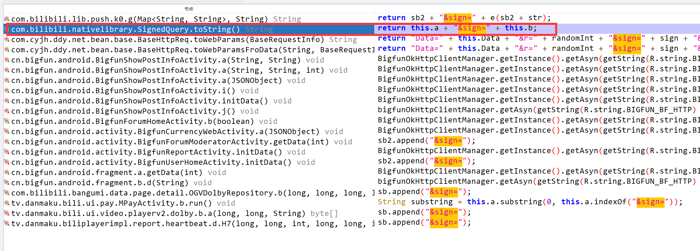


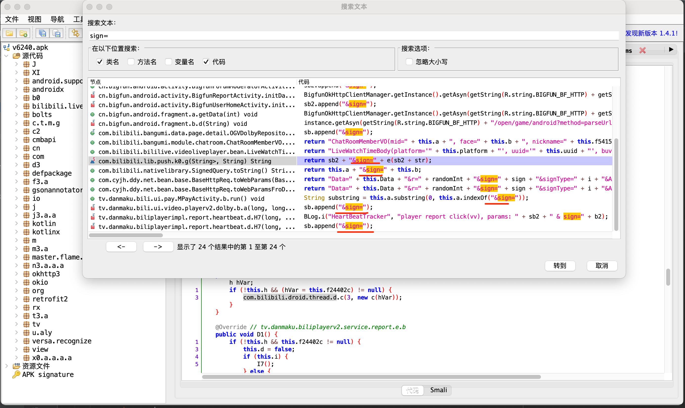

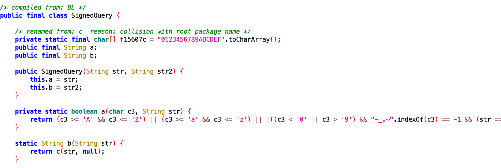

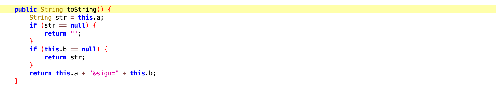

此处，可以hook这个toString，看看谁调用了他。

```python
import frida
import sys
from frida.core import Device
rdev = frida.get_remote_device()

# session = rdev.attach("tv.danmaku.bili")
session = rdev.attach("哔哩哔哩")

scr = """
Java.perform(function () {
    var SignedQuery = Java.use("com.bilibili.nativelibrary.SignedQuery");

    SignedQuery.toString.implementation = function(){   
       var res = this.toString();
       console.log(res);
       console.log(Java.use("android.util.Log").getStackTraceString(Java.use("java.lang.Throwable").$new()));
       return res;
    }

});
"""
script = session.create_script(scr)

script.load()
sys.stdin.read()
```

```python
actual_played_time=2&aid=899864170&appkey=1d8b6e7d45233436&auto_play=0&build=6240300&c_locale=zh_CN&channel=xxl_gdt_wm_253&cid=813668375&epid=0&epid_status=&from=6&from_spmid=ad.tianma.tm-recommendation-card.0&last_play_progress_time=2&list_play_time=0&max_play_progress_time=2&mid=0&miniplayer_play_time=0&mobi_app=android&network_type=1&paused_time=4&platform=android&play_status=0&play_type=1&played_time=2&quality=16&s_locale=zh_CN&session=709a969a775b1bff4e5141b7d74e824b89ae0393&sid=0&spmid=main.ugc-video-detail.0.0&start_ts=1661414921&statistics=%7B%22appId%22%3A1%2C%22platform%22%3A3%2C%22version%22%3A%226.24.0%22%2C%22abtest%22%3A%22%22%7D&sub_type=0&total_time=6&ts=1661414926&type=3&user_status=0&video_duration=279&sign=7805f5c5a4099632cd392ef686227ff4

java.lang.Throwable
	at com.bilibili.nativelibrary.SignedQuery.toString(Native Method)
	at com.bilibili.okretro.f.a.c(BL:16)
	at com.bilibili.okretro.f.a.a(BL:6)
	at com.bilibili.okretro.d.a.execute(BL:24)
	at com.bilibili.okretro.d.a$a.run(BL:2)
	at java.util.concurrent.ThreadPoolExecutor.runWorker(ThreadPoolExecutor.java:1113)
	at java.util.concurrent.ThreadPoolExecutor$Worker.run(ThreadPoolExecutor.java:588)
	at java.lang.Thread.run(Thread.java:818)
```

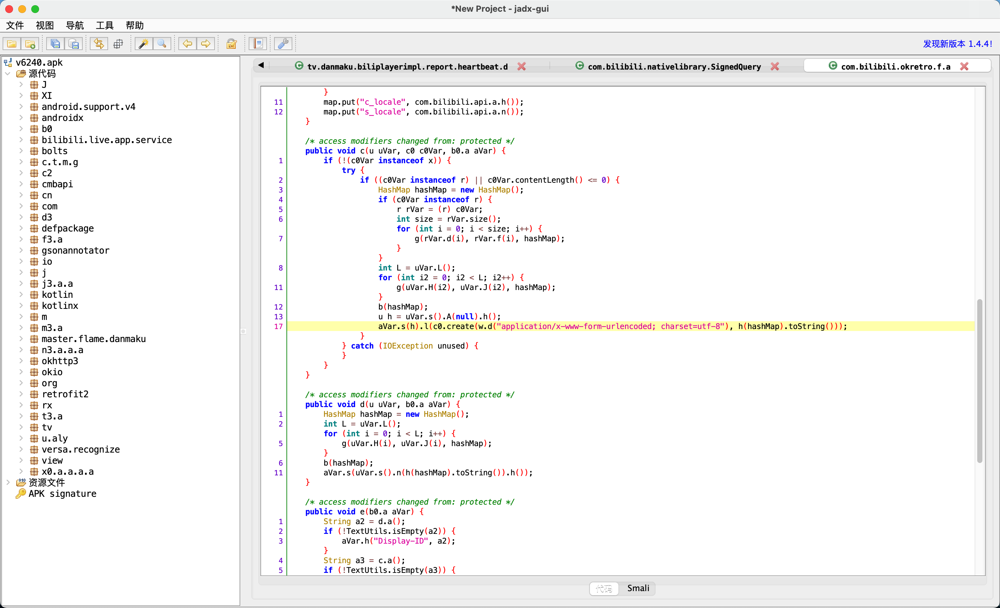


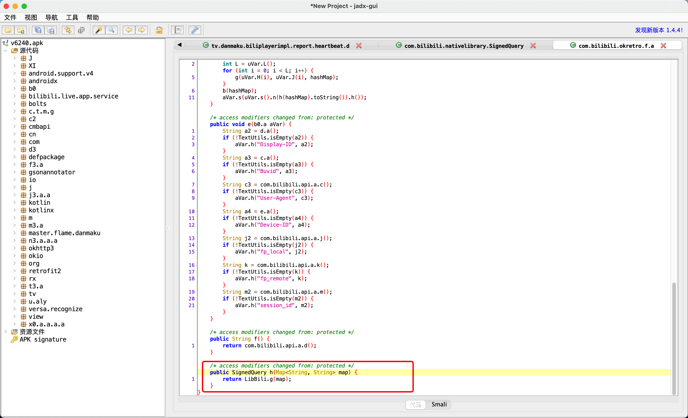


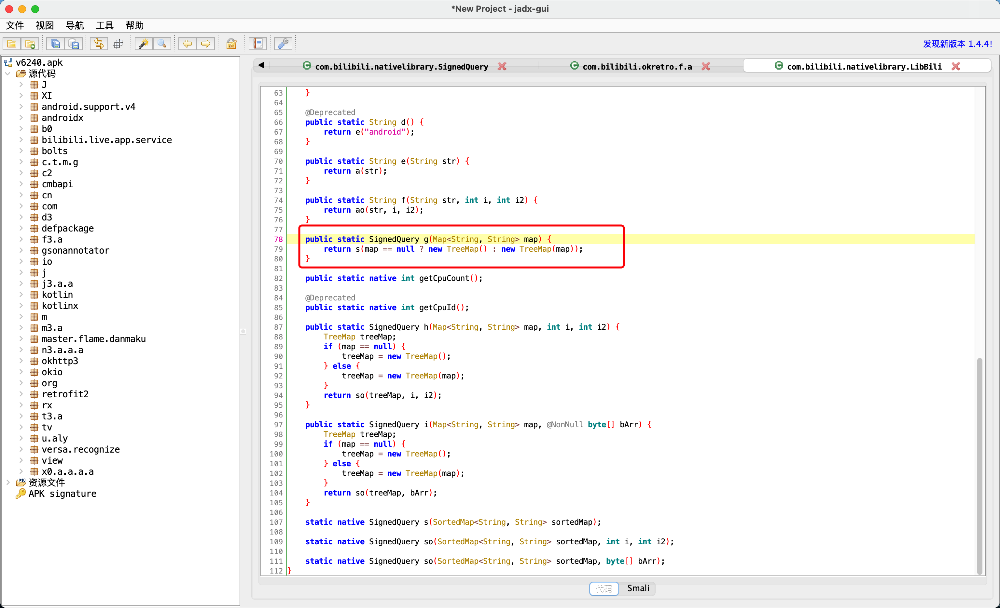

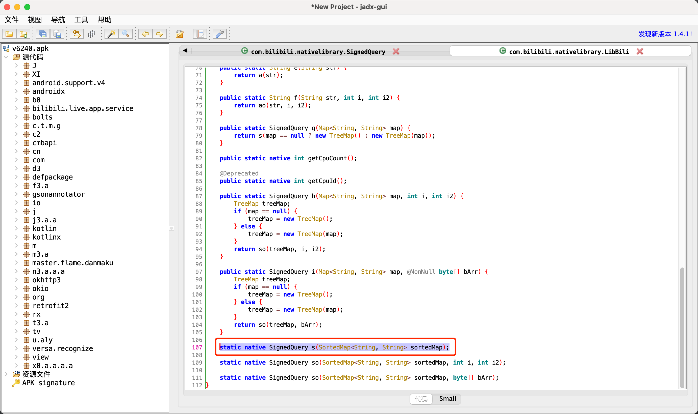


## 4.2 硬核分析破解sign--NewStringUTF

### 4.2.1 硬核分析

```python
# 分析
- HeartbeatParams没有sign
- 搜索sign：sign=   &sign=   &sign
- 假设sign参数没有搜到，怎么办？【sign的算法不在java层，jni开发】
    - jni开发
       【Java业务】        【Java类+native方法】    JNI                  【C函数】
        String            jstring ->  转换  -> C中的字符串
        String            jstring <-  转换  <- C中的字符串
                                                                                sign=12sdfsdfsdf
       jstring <-  转换     <- sign asdfasdfasdf
                                                                                asdfasdfasdfasdf
       jstring                 NewStringUTF(env,C字符串)
- 通用脚本
  Hook底层的NewStringUTF方法，读取第二个参数，筛选：
     - 参数 包含sign  -> 输出 + 调用栈
     - 参数 包含固定的字符串
     - 参数 包含长度  -> 输出 + 调用栈
```

### 4.2.2 通用hook--NewStringUTF

```js
# 后期任何app，都可以使用这个代码--》hook--so返回的字符串

//1 加载安卓手机底层包，系统自带的库，我们hook的NewStringUTF在这个包中
var symbols = Module.enumerateSymbolsSync("libart.so");
//2 定义一个变量，用来接收一会找到的NewStringUTF的地址
var addrNewStringUTF = null;
//3 循环找出libart.so中所有成员，匹配是NewStringUTF的函数，取出地址，赋值给上面的变量
for (var i = 0; i < symbols.length; i++) {
    //3.1 取出libart.so的一个个方法对象
    var symbol = symbols[i];
    //3.2 判断方法对象的名字是不是包含 NewStringUTF和CheckJNI---》因为在真正底层，函数名不叫NewStringUTF，前后有别的字符串
    // 实际它真正的名字：asdfa_NewStringUTF_dadsfasfd
    if (symbol.name.indexOf("NewStringUTF") >= 0 && symbol.name.indexOf("CheckJNI") < 0) {
        // 3.3 找到后，把地址赋值个上面的变量
        addrNewStringUTF = symbol.address;
        // 3.4 控制台打印一下
        console.log("NewStringUTF is at ", symbol.address, symbol.name);
        break
    }
}
// 4 如果不为空，我们开始hook它(通过地址hook，有onEnter和onExit，所有的参数都给了args，通过位置取到每个参数)
if (addrNewStringUTF != null) {
    Interceptor.attach(addrNewStringUTF, {
        onEnter: function (args) {
            // 4.1 取出NewStringUTF传入的第一个参数
            var c_string = args[1];
            // 4.2 第一个参数是c的字符串，我们把它转一下，变成真正的字符串
            var dataString = c_string.readCString();
            // 4.3 改字符串不为空，且长度为32，我们输出一下，并且打印出它的调用栈
            if (dataString) {
                if (dataString.length === 32) {
                    console.log(dataString);
                    // 4.4 读取当前在执行那个so文件,及so文件中的地址
                    console.log(Thread.backtrace(this.context, Backtracer.ACCURATE).map(DebugSymbol.fromAddress).join('\n') + '\n');
                    // 4.5 打印调用栈
                    console.log(Java.use("android.util.Log").getStackTraceString(Java.use("java.lang.Throwable").$new()));
                }
            }

        }
    });
}


/*
fc32f2916a580c712018508d8bda2535
java.lang.Throwable
	at com.bilibili.nativelibrary.LibBili.s(Native Method)
	at com.bilibili.nativelibrary.LibBili.g(BL:1)
	at com.bilibili.okretro.f.a.h(BL:1)
	at com.bilibili.okretro.f.a.c(BL:14)
	at com.bilibili.okretro.f.a.a(BL:6)
	at com.bilibili.okretro.d.a.execute(BL:24)
	at com.bilibili.okretro.d.a$a.run(BL:2)
	at java.util.concurrent.ThreadPoolExecutor.runWorker(ThreadPoolExecutor.java:1167)
	at java.util.concurrent.ThreadPoolExecutor$Worker.run(ThreadPoolExecutor.java:641)
	at java.lang.Thread.run(Thread.java:923)
*/

// frida -UF  -l  hook_new_string_utf.js -o v1.txt
```


### 4.2.3 打印调用栈后继续分析

```python
#1  搜索：com.bilibili.nativelibrary.LibBili 类下的 s 方法
static native SignedQuery s(SortedMap<String, String> sortedMap);

# 2 返回值是：SignedQuery 的对象--》看类内部有那些方法
public final class SignedQuery {
    public final String a;
    public final String b;
    # 类实例化的时候，传入str：之前的明文   和   str2：加密后的
    # 这个类的构造方法---》是在so中调用的---》c语言调用的
    public SignedQuery(String str, String str2) {
        this.a = str;
        this.b = str2;
    }
    public String toString() {
        String str = this.a;
        if (str == null) {
            return "";
        }
        if (this.b == null) {
            return str;
        }
        return this.a + "&sign=" + this.b;
    }
}

# 3 我们知道了通过调用s，返回了sign加密串，我们hook一下s查看---》传入的参数和返回值
import frida
import sys

# 连接手机设备
rdev = frida.get_remote_device()

session = rdev.attach("哔哩哔哩")

scr = """
Java.perform(function () {
    var LibBili = Java.use("com.bilibili.nativelibrary.LibBili");
    var TreeMap = Java.use("java.util.TreeMap");

    LibBili.s.implementation = function(map){   
        console.log("--------------------------");
       console.log("map=",JSON.stringify(map));
       var obj = Java.cast(map,TreeMap);
       console.log("map=",obj.toString());

       var res = this.s(map);
       console.log("返回值=",res.toString());
       return res;
    }
});
"""

script = session.create_script(scr)


def on_message(message, data):
    print(message, data)


script.on("message", on_message)

script.load()
sys.stdin.read()


# 4 hook结果我们发现，
	#s传入的值是：actual_played_time=0&channel=xxl_gdt_wm_253...
    # 返回的值是：actual_played_time=0&channel=xxl_gdt_wm_253&sign=加密串
    
    
# 5 破解so文件：libbili.so
      static {
            com.getkeepsafe.relinker.c.c("bili");
        }

```


## 4.3 s的实现


### 4.3.1 s实现过程

- 静态注册，直接用ida反编译，看导出函数就行。

- 动态注册

  - 在 jni_onload 方法中寻找RegisterNatives

    ```
    (*env)->RegisterNatives(env, clazz, gMethods, 1);
    ```

  - RegisterNatives不好找或找不到咋办？利用libart.so库。


---


apk是将Java代码打包后的包，解压后发现内部都是一大堆的dex文件（代码）。

安卓手机上都是有一个虚拟机，负责读取dex代码转换成机器码去执行，除此以外，也包括：垃圾回收、Java本地方法调用（JNI）、即时编译（JIT）等。

- 安卓4.2之前：DVM(Dalvik VM）。
- 安卓4.2之后：DVM（默认）、ART(Android Runingtime)共存。
- 安卓5.0之后：ART。

关于两种虚拟机：

- DVM，每次运行应用的时候，实时将字节码转化为机器码，再运行程序。【基于libdvm.so库】
- ART，在安装应用的时候，就将应用的字节码转换为机器码，保存在手机里。每次运行应用的时候，无需实时转换，直接使用转换好的机器码。【基于libart.so库】

在JNI在进行动态注册时执行的 RegisterNatives 方法，内部会调用libart.so库。

基于 frida+真机 中的模块来寻找。

```javascript
// 列举 libart.so 中的所有导出函数（成员列表）
var symbols = Module.enumerateSymbolsSync("libart.so");

// 获取 RegisterNatives 函数的内存地址，并赋值给addrRegisterNatives。
var addrRegisterNatives = null;

for (var i = 0; i < symbols.length; i++) {
    var symbol = symbols[i];
    
    console.log(symbol.name)
    //_ZN3art3JNI15RegisterNativesEP7_JNIEnvP7_jclassPK15JNINativeMethodi
    if (symbol.name.indexOf("art") >= 0 &&
        symbol.name.indexOf("JNI") >= 0 &&
        symbol.name.indexOf("RegisterNatives") >= 0 &&
        symbol.name.indexOf("CheckJNI") < 0) {
        
        addrRegisterNatives = symbol.address;
        console.log("RegisterNatives is at ", symbol.address, symbol.name);
    }
}
```

如果我们知道了底层RegisterNatives的内存地址，我们可以直接Hook这个RegisterNatives函数。

- JNI调用： RegisterNatives(env, clazz, gMethods, 1 )
- libart.so中的RegisterNatives函数： RegisterNatives(env, clazz, gMethods, 1 )


如果我知道了一个函数的内存地址，如何对他进行Hook呢？

```c
typedef struct {
    const char* name;
    const char* signature;
    void*       fnPtr;
} JNINativeMethod;

static JNINativeMethod gMethods[] = {
        {"add", "(II)I", (void *) plus}, => JNINativeMethod
        {"add", "(II)I", (void *) plus},
        {"add", "(II)I", (void *) plus},
};

JNIEXPORT jint JNICALL JNI_OnLoad(JavaVM *vm, void *reserved) {

    JNIEnv *env = NULL;

    // 在java虚拟机中获取env
    if ((*vm)->GetEnv(vm, (void **) &env, JNI_VERSION_1_6) != JNI_OK) {
        return JNI_ERR;
    }

    // 找到Java中的类
    jclass clazz = (*env)->FindClass(env, "com/nb/s4dingning/DynamicUtils");

    // 将类中的方法注册到JNI中 (RegisterNatives)
    int res = (*env)->RegisterNatives(env, clazz, gMethods, 3);
    if (res < 0) {
        return JNI_ERR;
    }

    return JNI_VERSION_1_6;
}
```

```
typedef struct {
    const char* name;
    const char* signature;
    void*       fnPtr;
} JNINativeMethod;

static JNINativeMethod gMethods[] = {
        {"add", "(III)I", (void *) plus}, => JNINativeMethod
        {"add", "(II)I", (void *) plus},
        {"add", "(II)I", (void *) plus},
};
```

```javascript
Interceptor.attach(addrRegisterNatives函数的内存地址, {
    onEnter: function (args) {
        var env = args[0];        // jni对象
        var java_class = args[1]; // 类
        var class_name = Java.vm.tryGetEnv().getClassName(java_class);

        // 只有类名为com.bilibili.nativelibrary.LibBili，才打印输出
        var taget_class = "com.bilibili.nativelibrary.LibBili";
        
        if(class_name === taget_class){
            console.log("\n[RegisterNatives] method_count:", args[3]);
            
            // args[2] 就是动态注册的对应关系。
            // ptr是new NativePointer(s) 的缩写。(C语言中的指针)
            var methods_ptr = ptr(args[2]);
            var method_count = parseInt(args[3]);
            
            for (var i = 0; i < method_count; i++) {
                // Java中函数名字的
                var name_ptr = Memory.readPointer(methods_ptr.add(i * Process.pointerSize * 3));
                // 参数和返回值类型
                var sig_ptr = Memory.readPointer(methods_ptr.add(i * Process.pointerSize * 3 + Process.pointerSize));
                // C中的函数内存地址
                var fnPtr_ptr = Memory.readPointer(methods_ptr.add(i * Process.pointerSize * 3 + Process.pointerSize * 2));

                var name = Memory.readCString(name_ptr);
                var sig = Memory.readCString(sig_ptr);
                var find_module = Process.findModuleByAddress(fnPtr_ptr);
                var offset = ptr(fnPtr_ptr).sub(find_module.base) // fnPtr_ptr - 模块基地址
                console.log("name:", name, "module_name:", find_module.name, "offset:", offset);
        	}
        }
    }
});
```


**完整脚本：**

```javascript
function hook_RegisterNatives() {
    var symbols = Module.enumerateSymbolsSync("libart.so");
    var addrRegisterNatives = null;
    for (var i = 0; i < symbols.length; i++) {
        var symbol = symbols[i];

        // _ZN3art3JNI15RegisterNativesEP7_JNIEnvP7_jclassPK15JNINativeMethodi
        if (symbol.name.indexOf("art") >= 0 &&
            symbol.name.indexOf("JNI") >= 0 &&
            symbol.name.indexOf("RegisterNatives") >= 0 &&
            symbol.name.indexOf("CheckJNI") < 0) {
            addrRegisterNatives = symbol.address;
            console.log("RegisterNatives is at ", symbol.address, symbol.name);
        }
    }

    if (addrRegisterNatives != null) {
        Interceptor.attach(addrRegisterNatives, {
            onEnter: function (args) {
                var env = args[0];
                var java_class = args[1];
                var class_name = Java.vm.tryGetEnv().getClassName(java_class);
                //console.log(class_name);
                // 只有类名为com.bilibili.nativelibrary.LibBili，才打印输出
                var taget_class = "com.bilibili.nativelibrary.LibBili";
                if (class_name === taget_class) {
                    console.log("\n[RegisterNatives] method_count:", args[3]);
                    var methods_ptr = ptr(args[2]);
                    var method_count = parseInt(args[3]);

                    for (var i = 0; i < method_count; i++) {
                        // Java中函数名字的
                        var name_ptr = Memory.readPointer(methods_ptr.add(i * Process.pointerSize * 3));
                        // 参数和返回值类型
                        var sig_ptr = Memory.readPointer(methods_ptr.add(i * Process.pointerSize * 3 + Process.pointerSize));
                        // C中的函数指针
                        var fnPtr_ptr = Memory.readPointer(methods_ptr.add(i * Process.pointerSize * 3 + Process.pointerSize * 2));

                        var name = Memory.readCString(name_ptr); // 读取java中函数名
                        var sig = Memory.readCString(sig_ptr); // 参数和返回值类型
                        var find_module = Process.findModuleByAddress(fnPtr_ptr); // 根据C中函数指针获取模块

                        var offset = ptr(fnPtr_ptr).sub(find_module.base) // fnPtr_ptr - 模块基地址
                        // console.log("[RegisterNatives] java_class:", class_name);
                        console.log("name:", name, "sig:", sig, "module_name:", find_module.name, "offset:", offset);

                    }
                }
            }
        });
    }
}

setImmediate(hook_RegisterNatives);
```

上述脚本的执行有两点注意：

- 启动时间问题，自动启动app+hook

  ```
  frida -U  -f tv.danmaku.bili -l native.js
  ```

- 去真机hook

输出：

```
name: a module_name: libbili.so offset: 0x1c7d
name: ao module_name: libbili.so offset: 0x1c83
name: b module_name: libbili.so offset: 0x1c91
name: s module_name: libbili.so offset: 0x1c97
name: so module_name: libbili.so offset: 0x1c9d
name: so module_name: libbili.so offset: 0x1cab
name: getCpuCount module_name: libbili.so offset: 0x1cb3
name: getCpuId module_name: libbili.so offset: 0x1cb7
```

```
[Redmi 8A::tv.danmaku.bili]->
[RegisterNatives] method_count: 0x8
name: a module_name: libbili.so offset: 0x1c7d
name: ao module_name: libbili.so offset: 0x1c83
name: b module_name: libbili.so offset: 0x1c91
name: s module_name: libbili.so offset: 0x1c97
name: so module_name: libbili.so offset: 0x1c9d
name: so module_name: libbili.so offset: 0x1cab
name: getCpuCount module_name: libbili.so offset: 0x1cb3
name: getCpuId module_name: libbili.so offset: 0x1cb7
```

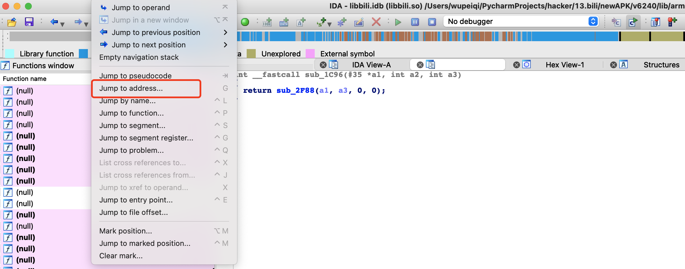


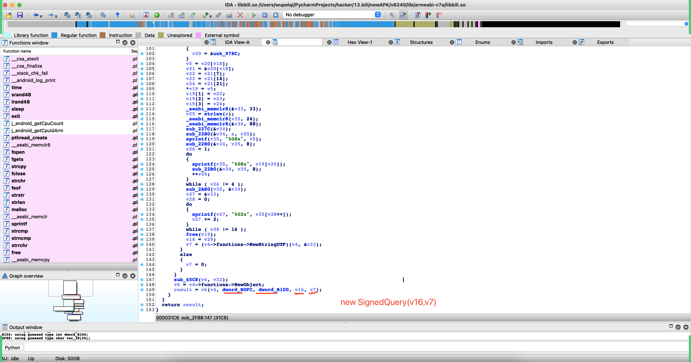


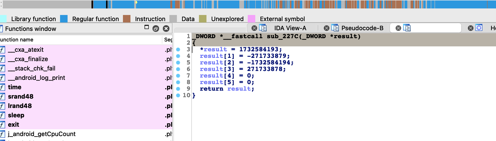


```
obj = hashlib.md5()
obj.update("xxx".encode('utf-8'))
obj.update("xxx".encode('utf-8'))
obj.update("xxx".encode('utf-8'))
obj.update("xxx".encode('utf-8'))
res = obj.hexdigist()
```


如果我们能hook    sub_22B0 方法，就可以把待加密的明文全都获取到。

```python
import frida
import sys

rdev = frida.get_remote_device()
# session = rdev.attach("tv.danmaku.bili")
session = rdev.attach("哔哩哔哩")
scr = """
Java.perform(function () {

    var libbili = Module.findBaseAddress("libbili.so");

	var s_func = libbili.add(0x22b0 + 1);
    console.log(s_func);

    Interceptor.attach(s_func, {
        onEnter: function (args) {
            // args[0]
            // args[1]，明文字符串
            // args[2]，明文字符串长度

            console.log("执行update，长度是：",args[2], args[2].toInt32());

            // console.log( hexdump(args[1], {length: args[2].toInt32()})  );
            console.log(args[1].readUtf8String())
        },
        onLeave: function (args) {
            console.log("=======================结束===================");
        }
    });
});
"""
script = session.create_script(scr)
script.load()
sys.stdin.read()

```


```
obj = hashlib.md5()
obj.update("xxx".encode('utf-8'))
obj.update("560c52cc".encode('utf-8'))
obj.update("d288fed0".encode('utf-8'))
obj.update("45859ed1".encode('utf-8'))
res = obj.hexdigist()
```


所以，最终sign签名的加密，在B站中本质：

```
请求参数凭借 + 560c52ccd288fed0d288fed08bffd973 ，然后再整体md5加密
```

```python
ordered_string = "&".join(["{}={}".format(key, param_dict[key]) for key in sorted(param_dict.keys())])
encrypt_string = ordered_string + "560c52ccd288fed045859ed18bffd973"
obj = hashlib.md5(encrypt_string.encode('utf-8'))
sign = obj.hexdigest()
```

```python
import hashlib

# actual_played_time=0&aid=851776257&appkey=1d8b6e7d45233436&auto_play=0&build=6240300&c_locale=zh_CN&channel=xxl_gdt_wm_253&cid=516350598&epid=0&epid_status=&from=6&from_spmid=tm.recommend.0.0&last_play_progress_time=0&list_play_time=0&max_play_progress_time=0&mid=0&miniplayer_play_time=0&mobi_app=android&network_type=1&paused_time=0&platform=android&play_status=0&play_type=1&played_time=0&quality=80&s_locale=zh_CN&session=897a6991b1f7489f915e420c9b82136d9c5dec62&sid=0&spmid=main.ugc-video-detail-vertical.0.0&start_ts=0&statistics=%7B%22appId%22%3A1%2C%22platform%22%3A3%2C%22version%22%3A%226.24.0%22%2C%22abtest%22%3A%22%22%7D&sub_type=0&total_time=0&ts=1655220112&type=3&user_status=0&video_duration=232
# &sign=d9c63c9726e438cd0e8ce98f1ca177aa
#       d9c63c9726e438cd0e8ce98f1ca177aa

ordered_string = "actual_played_time=0&aid=851776257&appkey=1d8b6e7d45233436&auto_play=0&build=6240300&c_locale=zh_CN&channel=xxl_gdt_wm_253&cid=516350598&epid=0&epid_status=&from=6&from_spmid=tm.recommend.0.0&last_play_progress_time=0&list_play_time=0&max_play_progress_time=0&mid=0&miniplayer_play_time=0&mobi_app=android&network_type=1&paused_time=0&platform=android&play_status=0&play_type=1&played_time=0&quality=80&s_locale=zh_CN&session=897a6991b1f7489f915e420c9b82136d9c5dec62&sid=0&spmid=main.ugc-video-detail-vertical.0.0&start_ts=0&statistics=%7B%22appId%22%3A1%2C%22platform%22%3A3%2C%22version%22%3A%226.24.0%22%2C%22abtest%22%3A%22%22%7D&sub_type=0&total_time=0&ts=1655220112&type=3&user_status=0&video_duration=232"
encrypt_string = ordered_string + "560c52ccd288fed045859ed18bffd973"
obj = hashlib.md5(encrypt_string.encode('utf-8'))
sign = obj.hexdigest()
print(sign)
```


### 4.3.2 s的实现

```python
# 1 使用32位的ida打开   libbili.so

# 2 确认动态注册还是静态注册
	-静态注册：java_
    -动态注册：jni_onload---》RegisterNatives(env, clazz, gMethods, 1);
    
# 3 IDA打开后，发现不好找RegisterNatives
```

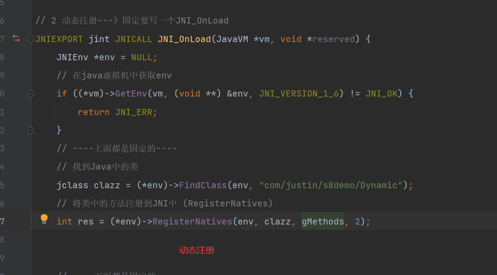

#### 4.3.2.1 如果jni_onload中找不到RegisterNatives的解决方案


```python
# 1 回顾之前学过的知识
# 因为s函数的返回值是java中的SignedQuery类型，我们之前做jni开发的时候讲过，c中调用java的类中的方法，要通过以下几步

# 1 找到类
jclass cls = (*env)->FindClass(env, "com.bilibili.nativelibrary/SignedQuery");

# 2 找到构造方法，而SignedQuery构造方法要传入两个字符串类型
jmethodID init = (*env)->GetMethodID(env, cls, "<init>", "(Ljava/lang/String;Ljava/lang/String)V");

# 3 执行构造方法，得到对象,传入两个参数：String str, String str2 ，第二个参数是sign的密文
jobject cls_obj = (*env)->NewObject(env, cls, init, (*env)->NewStringUTF(env, "str",'str2'));


# 2 找不到RegisterNatives--》可以hook---》RegisterNatives
```

#### 4.3.2.2 hook---》RegisterNatives通用脚本

```js
function hook_RegisterNatives() {
    //1 加载安卓手机底层包，系统自带的库，我们hook的RegisterNatives在这个包中
    var symbols = Module.enumerateSymbolsSync("libart.so");
    //2 定义一个变量，用来接收一会找到的addrRegisterNatives的地址
    var addrRegisterNatives = null;
    // 3 循环找到RegisterNatives的地址，赋值给变量
    //注意：此处可能找出多个RegisterNatives的地址，由于咱们是for循环，会把之前的覆盖掉，所有如果hook没反应，尝试加break，使用第一个找到的
    for (var i = 0; i < symbols.length; i++) {
        var symbol = symbols[i];
        if (symbol.name.indexOf("art") >= 0 &&
            symbol.name.indexOf("JNI") >= 0 &&
            symbol.name.indexOf("RegisterNatives") >= 0 &&
            symbol.name.indexOf("CheckJNI") < 0) {
            addrRegisterNatives = symbol.address;
            console.log("RegisterNatives is at ", symbol.address, symbol.name);
            break
        }

    }
    // 4 找到后开始hook
    if (addrRegisterNatives != null) {
        Interceptor.attach(addrRegisterNatives, {
            // 4.1 当进入RegisterNatives时执行
            // RegisterNatives(env, 类型, Java和C的对应关系,个数)
            onEnter: function (args) {
                // 4.2 第0个参数是env
                var env = args[0];
                // 4.3 第1个参数是类型
                var java_class = args[1];
                 // 4.4 通过类型得到具体的类名
                var class_name = Java.vm.tryGetEnv().getClassName(java_class);
                //console.log(class_name);
                // 只有类名为com.bilibili.nativelibrary.LibBili，才打印输出
                var taget_class = "com.bilibili.nativelibrary.LibBili";
                if (class_name === taget_class) {
                    //4.5  只有类名为com.bilibili.nativelibrary.LibBili，再取出第四个参数
                    console.log("\n[RegisterNatives] method_count:", args[3]);
                    // 4.6 第2个参数是：Java和C的对应关系，我们转成指针
                    /*
                    static JNINativeMethod gMethods[] = {
                            {"add", "(III)I", (void *) plus},
                            {"add", "(II)I", (void *) plus},
                            {"add", "(II)I", (void *) plus},
                    };
                     */
                    var methods_ptr = ptr(args[2]);
                    // 4.7 java和c函数对应关系的个数
                    var method_count = parseInt(args[3]);
                    // 4.8 我们循环这个个数，依次移动指针methods_ptr，通过readPointer，往后读取 {"add", "(III)I", (void *) plus}，依次读出Java中函数名字，签名和C中的函数指针
                    for (var i = 0; i < method_count; i++) {
                        // 4.8.1 读取Java中函数名字的
                        var name_ptr = Memory.readPointer(methods_ptr.add(i * Process.pointerSize * 3));
                        // 4.8.2 读取签名， 参数和返回值类型
                        var sig_ptr = Memory.readPointer(methods_ptr.add(i * Process.pointerSize * 3 + Process.pointerSize));
                        // 4.8.3 读取 C中的函数指针
                        var fnPtr_ptr = Memory.readPointer(methods_ptr.add(i * Process.pointerSize * 3 + Process.pointerSize * 2));

                        // 4.8.4 读取java中函数名 字符串名
                        var name = Memory.readCString(name_ptr);
                        // 4.8.5 参数和返回值类型 字符串名
                        var sig = Memory.readCString(sig_ptr);
                        // 4.5.6 根据C中函数指针获取模块
                        var find_module = Process.findModuleByAddress(fnPtr_ptr); // 根据C中函数指针获取模块


                        // 4.8.7 得到该函数的偏移量：ptr(fnPtr_ptr)函数在内存中的地址   减去   该so文件的基地址(find_module.base)====得到偏移量
                        // 地址：函数在内存中的地址
                        // 偏移量：后期单独打开so文件后，可以根据偏移量 定位到函数位置
                        // 基地址：当前so文件从那个位置开始算地址
                        var offset = ptr(fnPtr_ptr).sub(find_module.base)
                        // console.log("[RegisterNatives] java_class:", class_name);
                        // 4.8.8 输出 函数名      参数和返回值类型    模块    偏移量
                        console.log("name:", name, "sig:", sig, "module_name:", find_module.name, "offset:", offset);

                    }
                }
            }
        });
    }
}

setImmediate(hook_RegisterNatives);

// 以spawn方式运行
// frida -U -f tv.danmaku.bili -l 105.js


/*
[RegisterNatives] method_count: 0x8
name: a sig: (Ljava/lang/String;)Ljava/lang/String; module_name: libbili.so offset: 0x1c7d
name: ao sig: (Ljava/lang/String;II)Ljava/lang/String; module_name: libbili.so offset: 0x1c83
name: b sig: (Ljava/lang/String;)Ljavax/crypto/spec/IvParameterSpec; module_name: libbili.so offset: 0x1c91
// 找到s函数，偏移量是 0x1c97，打开so文件，直接按偏移量，跳转到s函数
name: s sig: (Ljava/util/SortedMap;)Lcom/bilibili/nativelibrary/SignedQuery; module_name: libbili.so offset: 0x1c97
name: so sig: (Ljava/util/SortedMap;II)Lcom/bilibili/nativelibrary/SignedQuery; module_name: libbili.so offset: 0x1c9d
name: so sig: (Ljava/util/SortedMap;[B)Lcom/bilibili/nativelibrary/SignedQuery; module_name: libbili.so offset: 0x1cab
name: getCpuCount sig: ()I module_name: libbili.so offset: 0x1cb3
name: getCpuId sig: ()I module_name: libbili.so offset: 0x1cb7

 */
```


#### 4.3.2.3 通过hook--找到了s对应的c函数

```python
#1  java中的s 对应偏移量是：0x1c97
name: s sig: (Ljava/util/SortedMap;)Lcom/bilibili/nativelibrary/SignedQuery; module_name: libbili.so offset: 0x1c97
                
#2 根据偏移量--》在ida中找到c语言的函数
int __fastcall sub_1C96(int a1, int a2, int a3)
{
  return sub_2F88(a1, a3, 0, 0);
}

# 3 双击 
int __fastcall sub_2F88(JNIEnv_ *a1, int a2, int a3, int a4){
     sub_227C(v36);  #  md5加密
     sub_22B0(v36, v32, v27); # update 加盐
     sprintf(v37, "%08x", v22);
     sub_22B0(v36, v37, 8); ## update 加盐
    # 找s
    v17 = a1->functions->NewStringUTF(a1, s); # s是c语言的字符串
    # v16 就是"str",v17就是：'str2'--》就是加密的sign
    return (int)a1->functions->NewObject((JNIEnv *)a1, (jclass)dword_B0FC, (jmethodID)dword_B100, v16, v17);
}

# 4 sub_227C(v36)---》这是md5加密
_DWORD *__fastcall sub_227C(_DWORD *result)
{
  *result = 1732584193;
  result[1] = -271733879;
  result[2] = -1732584194;
  result[3] = 271733878;
  result[4] = 0;
  result[5] = 0;
  return result;
}

# 5 断定，使用md5加密，但是有盐--》固定的
# 6 通过hook  sub_22B0  拿到盐
```

#### 4.3.2.4 hook--sub_22B0得到md5的盐

```python
import frida
import sys

rdev = frida.get_remote_device()
session = rdev.attach("哔哩哔哩")
scr = """
Java.perform(function () {

    var libbili = Module.findBaseAddress("libbili.so");
	// hook sub_22B0函数，通过偏移量找到 偏移量 22B0
	var s_func = libbili.add(0x22b0 + 1); // 32位的so文件都要 +1
    console.log(s_func);

    Interceptor.attach(s_func, {
        onEnter: function (args) {
            // args[0]
            // args[1]，明文字符串
            // args[2]，明文字符串长度

            console.log("执行update，长度是：",args[2], args[2].toInt32());

            // console.log( hexdump(args[1], {length: args[2].toInt32()})  );
            console.log(args[1].readUtf8String())
        },
        onLeave: function (args) {
            console.log("=======================结束===================");
        }
    });
});
"""
script = session.create_script(scr)
script.load()
sys.stdin.read()


''' 
通过hook，找到update进去的盐 
560c52cc
=======================结束===================
执行update，长度是： 0x8 8
d288fed0
=======================结束===================
执行update，长度是： 0x8 8
45859ed1
=======================结束===================
执行update，长度是： 0x8 8
8bffd973

'''
```

#### 4.3.2.5 python重写这个过程

```python
import hashlib
obj = hashlib.md5()
obj.update("actual_played_time=0&aid=352533984&appkey=1d8b6e7d45233436&auto_play=0&build=6240300&c_locale=zh-Hans_CN&channel=xxl_gdt_wm_253&cid=1025584249&epid=0&epid_status=&from=6&from_spmid=tm.recommend.0.0&last_play_progress_time=0&list_play_time=0&max_play_progress_time=0&mid=0&miniplayer_play_time=0&mobi_app=android&network_type=1&paused_time=0&platform=android&play_status=0&play_type=1&played_time=0&quality=64&s_locale=zh-Hans_CN&session=2526d8482c1436027b62f1e61ecd4ad374d02d8c&sid=0&spmid=main.ugc-video-detail-vertical.0.0&start_ts=0&statistics=%7B%22appId%22%3A1%2C%22platform%22%3A3%2C%22version%22%3A%226.24.0%22%2C%22abtest%22%3A%22%22%7D&sub_type=0&total_time=0&ts=1692283438&type=3&user_status=0&video_duration=73".encode('utf-8'))
obj.update("560c52cc".encode('utf-8'))
obj.update("d288fed0".encode('utf-8'))
obj.update("45859ed1".encode('utf-8'))
obj.update("8bffd973".encode('utf-8'))
res = obj.hexdigest()
print(res)

# 期望结果：73b7c16548f3d366476194cdbbd6f495
#真实结果： 73b7c16548f3d366476194cdbbd6f495


```


#  5 代码整合

```python
import datetime
import uuid
import base64
import hashlib
import time
import requests
import re
import json
from Crypto.Cipher import AES
from Crypto.Util.Padding import pad
from urllib.parse import quote_plus
import string
import random
import time
import hashlib
import ctypes
import urllib3

urllib3.disable_warnings(urllib3.exceptions.InsecureRequestWarning)


class BiliBili(object):
    def __init__(self, aid, bvid, cid, duration, proxies):
        self.aid, self.bvid, self.cid, self.duration = aid, bvid, cid, duration

        self.wifi_mac = self.create_random_mac().upper()
        self.device_id = self.create_device_id(self.wifi_mac)  # did
        self.buvid = self.create_buvid_by_wifi()
        self.session_id = self.create_session_id()

        self.build_brand = "HUAWEI"
        self.build_model = 'Mate 10 Pro'

        self.fp_local = self.create_local(self.buvid, self.build_model, "")
        self.fp_remote = self.create_local(self.buvid, self.build_model, "")

        self.app_first_run_time = str(int(time.time()) - random.randint(0, 24 * 60 * 60))  # fts
        self.ts = str(int(time.time() - 10))

        self.session = requests.Session()
        # self.session.proxies = proxies
        self.start_ts = None
        self.heart_beat_session_id = None

    def create_random_mac(self, sep=":"):
        """ 随机生成mac地址 """
        data_list = []
        for i in range(1, 7):
            part = "".join(random.sample("0123456789ABCDEF", 2))
            data_list.append(part)
        mac = sep.join(data_list)

        return mac

    def create_device_id(self, mac):
        """
        根据mac地址生成 3.device_id
        :param mac: 传入参数的格式是 00:00:00:00:00
        :return:
        """

        def gen_sn():
            return "".join(random.sample("123456789" + string.ascii_lowercase, 10))

        def base64_encrypt(data_string):
            data_bytes = bytearray(data_string.encode('utf-8'))
            data_bytes[0] = data_bytes[0] ^ (len(data_bytes) & 0xFF)
            for i in range(1, len(data_bytes)):
                data_bytes[i] = (data_bytes[i - 1] ^ data_bytes[i]) & 0xFF
            res = base64.encodebytes(bytes(data_bytes))
            return res.strip().strip(b"==").decode('utf-8')

        # 1. 生成mac地址（保证mac中的每个元素是不重复的，例如：0000000000)
        mac_str = mac

        # 2. 去除IP地址中的符号，只保留 48e1e828e02e（变小写）
        mac_str = re.sub("[^0-9A-Fa-f]", "", mac_str)
        mac_str = mac_str.lower()

        # 3. 获取手续序列号
        sn = gen_sn()

        # 4. 拼接并进行base64加密
        total_string = "{}|||{}".format(mac_str, sn)
        return base64_encrypt(total_string)

    def create_buvid_by_wifi(self):
        """
            基于wifi mac地址生成buvid （ B站app中有四种获取buvid的方式：设备ID、wifi mac地址、3.device_id、uuid ）
        """
        md5 = hashlib.md5()
        md5.update(self.wifi_mac.encode('utf-8'))
        v0_1 = md5.hexdigest()
        return "XY{}{}{}{}".format(v0_1[2], v0_1[12], v0_1[22], v0_1).upper()

    def create_session_id(self):
        # return "".join([hex(item)[2:] for item in random.randbytes(4)])
        return "".join([hex(random.randint(1, 255))[2:] for i in range(4)])

    def create_local(self, buvid, phone_model, phone_band):
        """
        fp_local和fp_remote都是用这个算法来生成的，在手机初始化阶段生成 fp_local，
        :param buvid: 根据算法生成的buvid，例如："XYBA4F3B2789A879EA8AEEDBE2E4118F78303"
        :param phone_model:  手机型号modal，例如："Mate 10 Pro"
        :param phone_band:  手机品牌band，在模拟器上是空字符串（我猜是程序员想要写成 brand ）哈哈哈哈
        :return:
        """

        def a_b(arg8):
            v3 = 0
            v4 = 60
            v0_1 = 2
            v5 = 0
            while True:
                v6 = arg8[v3:v3 + 2]
                v5 += int(v6, base=16)
                if v3 != v4:
                    v3 += v0_1
                    continue
                break
            xx = "%02x" % (v5 % 0x100,)
            return xx

        def misc_helper_kt(data_bytes):
            data_list = []
            v7 = len(data_bytes)
            v0 = 0
            while v0 < v7:
                v2 = data_bytes[v0]
                data_list.append("%02x" % v2)
                v0 += 1
            return ''.join(data_list)

        data_string = "{}{}{}".format(buvid, phone_model, phone_band)
        hash_object = hashlib.md5()
        hash_object.update(data_string.encode('utf-8'))
        data = hash_object.digest()

        arg1 = misc_helper_kt(data)
        arg2 = datetime.datetime.now().strftime("%Y%m%d%H%M%S")
        # arg3 = misc_helper_kt(random.randbytes(8))
        arg3 = misc_helper_kt([random.randint(1, 255) for i in range(8)])

        str2 = "{}{}{}".format(arg1, arg2, arg3)
        local = str2 + a_b(str2)
        return local

    def x_report_click_android2(self):
        SALT = "9cafa6466a028bfb"
        KEY = "fd6b639dbcff0c2a1b03b389ec763c4b"
        IV = "77b07a672d57d64c"

        def sha_256_encrypt(data_string):
            sha = hashlib.sha256()
            sha.update(data_string.encode('utf-8'))
            sha.update(SALT.encode('utf-8'))
            return sha.hexdigest()

        def aes_encrypt(data_string):
            aes = AES.new(
                key=KEY.encode('utf-8'),
                mode=AES.MODE_CBC,
                iv=IV.encode('utf-8')
            )
            raw = pad(data_string.encode('utf-8'), 16)
            return aes.encrypt(raw)

        ctime = int(time.time())
        info = {
            'aid': self.aid,
            'cid': self.cid,
            'part': 1,
            'mid': 0,
            'lv': 0,
            'ftime': ctime - random.randint(100, 1000),
            'stime': ctime,
            'did': self.device_id,
            'type': 3,
            'sub_type': 0,
            'sid': '0',
            'epid': '',
            'auto_play': 0,
            'build': 6240300,
            'mobi_app': 'android',
            'spmid': 'main.ugc-video-detail.0.0',
            'from_spmid': 'search.search-result.0.0'
        }
        data = "&".join(["{}={}".format(key, info[key]) for key in sorted(info.keys())])
        sign = sha_256_encrypt(data).lower()
        data = "{}&sign={}".format(data, sign)
        aes_string = aes_encrypt(data)

        res = self.session.post(
            url="https://api.bilibili.com/x/report/click/android2",
            headers={
                "accept-length": "gzip",
                "content-type": "application/json; charset=utf-8",
                "app-key": "android",
                "User-Agent": "Mozilla/5.0 BiliDroid/6.24.0 (bbcallen@gmail.com) os/android model/Mate 10 Pro mobi_app/android build/6240300 channel/bili innerVer/6240300 osVer/6.0.1 network/2",
                "env": "prod",
                "buvid": self.buvid,
                "device-id": self.device_id,
                "session_id": self.session_id,
                "fp_local": self.fp_local,
                "fp_remote": self.fp_remote,
            },
            data=aes_string,
            timeout=10,
            verify=False

        )
        # print(res.text)
        res.close()

    def get_param_sign_s(self, param_dict):
        """
        :param param_dict: 要签名的参数字典
        :return:
        """
        ordered_string = "&".join(["{}={}".format(key, param_dict[key]) for key in sorted(param_dict.keys())])
        encrypt_string = ordered_string + "560c52ccd288fed045859ed18bffd973"
        obj = hashlib.md5(encrypt_string.encode('utf-8'))
        sign = obj.hexdigest()

        return "{}&sign={}".format(ordered_string, sign)

    def create_heart_beat_session_id(self):
        arg0 = str(int(time.time() * 1000)) + str(random.randint(1, 1000000))
        # sha1加密
        hash_object = hashlib.sha1()
        hash_object.update(arg0.encode('utf-8'))
        arg7 = hash_object.hexdigest()
        return arg7

    def heart_beat_start(self, aid, cid, duration):
        self.start_ts = ts = int(time.time() - 10)
        self.heart_beat_session_id = self.create_heart_beat_session_id()
        form_dict = {
            "actual_played_time": "0",
            "aid": aid,
            "appkey": "1d8b6e7d45233436",
            "auto_play": "0",
            "build": "6240300",
            "c_locale": "zh_CN",
            "channel": "bili",
            "cid": cid,
            "epid": "0",
            "epid_status": "",
            "from": "2",
            "from_spmid": "main.ugc-video-detail.0.0",
            "last_play_progress_time": "0",
            "list_play_time": "0",
            "max_play_progress_time": "0",
            "mid": "0",
            "miniplayer_play_time": "0",
            "mobi_app": "android",
            "network_type": "1",
            "paused_time": "0",
            "platform": "android",
            "play_status": "0",
            "play_type": "1",
            "played_time": "0",
            "quality": "32",
            "s_locale": "zh_CN",
            "session": self.heart_beat_session_id,
            "sid": "0",
            "spmid": "main.ugc-video-detail.0.0",
            "start_ts": "0",
            "statistics": quote_plus(
                json.dumps({"appId": 1, "platform": 3, "version": "6.24.0", "abtest": ""}, separators=(',', ':'))),
            "sub_type": "0",
            "total_time": "0",
            "type": "3",
            "user_status": "0",
            "video_duration": duration,
            "ts": ts,
        }

        total_body_string = self.get_param_sign_s(form_dict)

        res = self.session.post(
            url="https://api.bilibili.com/x/report/heartbeat/mobile",
            data=total_body_string.encode('utf-8'),
            headers={
                "accept-length": "gzip",
                "content-type": "application/x-www-form-urlencoded; charset=utf-8",
                "app-key": "android",
                "User-Agent": "Mozilla/5.0 BiliDroid/6.24.0 (bbcallen@gmail.com) os/android model/Mate 10 Pro mobi_app/android build/6240300 channel/bili innerVer/6240300 osVer/6.0.1 network/2",
                "env": "prod",
                "buvid": self.buvid,
                "device-id": self.device_id,
                "session_id": self.session_id,
                "fp_local": self.fp_local,
                "fp_remote": self.fp_remote,
            },
            verify=False
        )
        res.close()

    def heart_beat_end(self, aid, cid, duration):
        current_ts = int(time.time())

        form_dict = {
            "actual_played_time": duration,  # 实际播放时间
            "aid": aid,
            "appkey": "1d8b6e7d45233436",
            "auto_play": "0",
            "build": "6240300",
            "c_locale": "zh_CN",
            "channel": "bili",
            "cid": cid,
            "epid": "0",
            "epid_status": "",
            "from": "2",
            "from_spmid": "main.ugc-video-detail.0.0",
            "last_play_progress_time": duration,
            "list_play_time": "0",
            "max_play_progress_time": duration,
            "mid": "0",
            "miniplayer_play_time": "0",
            "mobi_app": "android",
            "network_type": "1",
            "paused_time": current_ts - self.start_ts - duration,  # 暂停时间
            "platform": "android",
            "play_status": "0",
            "play_type": "1",
            "played_time": duration,
            "quality": "32",
            "s_locale": "zh_CN",
            "session": self.heart_beat_session_id,
            "sid": "0",
            "spmid": "main.ugc-video-detail.0.0",
            "start_ts": self.start_ts,
            "statistics": quote_plus(
                json.dumps({"appId": 1, "platform": 3, "version": "6.24.0", "abtest": ""}, separators=(',', ':'))),
            "sub_type": "0",
            "total_time": current_ts - self.start_ts,
            "type": "3",
            "user_status": "0",
            "video_duration": self.duration,
            "ts": current_ts,
            # "sign": "b098ca2c4caa53de22720a9755fde742"
        }

        total_body_string = self.get_param_sign_s(form_dict)

        res = self.session.post(
            url="https://api.bilibili.com/x/report/heartbeat/mobile",
            headers={
                "accept-length": "gzip",
                "content-type": "application/x-www-form-urlencoded; charset=utf-8",
                "app-key": "android",
                "User-Agent": "Mozilla/5.0 BiliDroid/6.24.0 (bbcallen@gmail.com) os/android model/Mate 10 Pro mobi_app/android build/6240300 channel/bili innerVer/6240300 osVer/6.0.1 network/2",
                "env": "prod",
                "buvid": self.buvid,
                "device-id": self.device_id,
                "session_id": self.session_id,
                "fp_local": self.fp_local,
                "fp_remote": self.fp_remote,
            },
            data=total_body_string.encode('utf-8'),
            verify=False
        )
        res.close()


def get_video_id_info(exec_url, proxies):
    session = requests.Session()
    bvid = exec_url.rsplit('/')[-1]
    header = {
        'User-Agent': 'Mozilla/5.0 (Linux; Android 6.0; Nexus 5 Build/MRA58N) AppleWebKit/537.36 (KHTML, like Gecko) Chrome/120.0.0.0 Mobile Safari/537.36'
    }
    res = session.get(
        url="https://api.bilibili.com/x/player/pagelist?bvid={}&jsonp=jsonp".format(bvid),
        # proxies=proxies,
        headers=header,
        verify=False
    )

    cid = res.json()['data'][0]['cid']

    res = session.get(
        url="https://api.bilibili.com/x/web-interface/view?cid={}&bvid={}".format(cid, bvid),
        # proxies=proxies,
        headers=header,
        verify=False
    )
    res_json = res.json()
    aid = res_json['data']['aid']
    view_count = res_json['data']['stat']['view']
    duration = res_json['data']['duration']
    session.close()
    return aid, bvid, cid, duration, int(view_count)


def get_proxy_dict():
    key = "..."
    passwd = "..."
    host = "..."
    return {
        "http": 'http://{}:{}@{}'.format(key, passwd, host),
        "https": 'http://{}:{}@{}'.format(key, passwd, host)
    }


def run():
    url = "https://www.bilibili.com/video/BV1Mu4y1Y7Ho"
    while True:
        try:
            # 1.IP代理
            # proxies = get_proxy_dict()
            proxies = {}

            # 2.获取视频信息
            aid, bvid, cid, duration, view_count = get_video_id_info(url, proxies)
            print("\n播放量为：{}".format(view_count))

            # 3.创建对象 -> buvid、session生成
            bili = BiliBili(aid, bvid, cid, duration, proxies=proxies)

            # 4.播放
            bili.x_report_click_android2()

            # 5.心跳开始
            bili.heart_beat_start(aid, cid, duration)

            # 6.模拟观看视频
            time.sleep(10)

            # 7.结束心跳
            bili.heart_beat_end(aid, cid, duration)

            # 8.关闭连接
            bili.session.close()
        except Exception as e:
            print("异常：", e)


if __name__ == '__main__':
    run()


```

