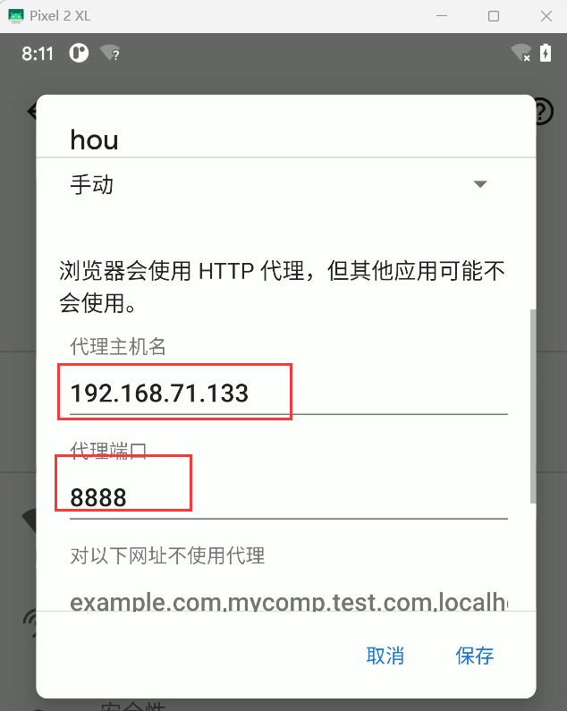
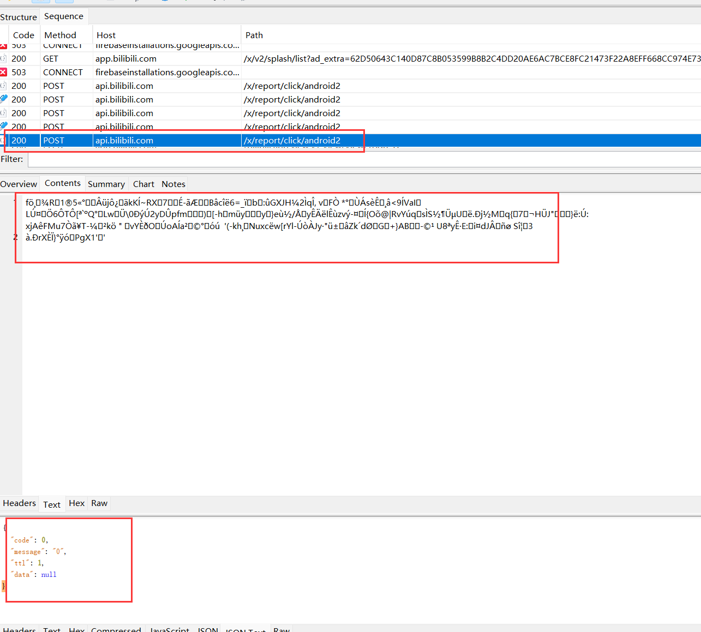
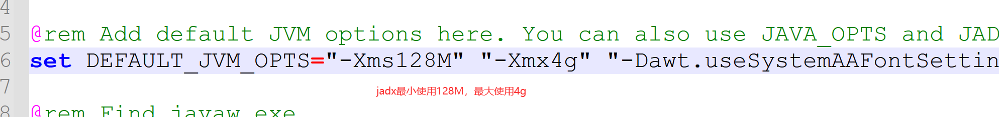
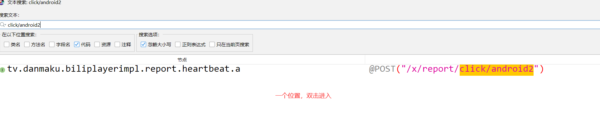
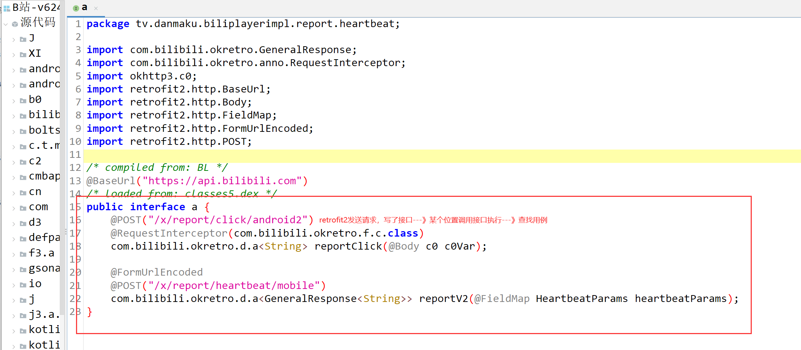
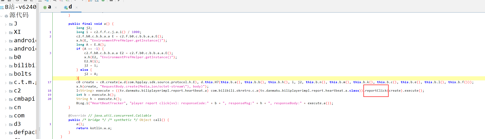
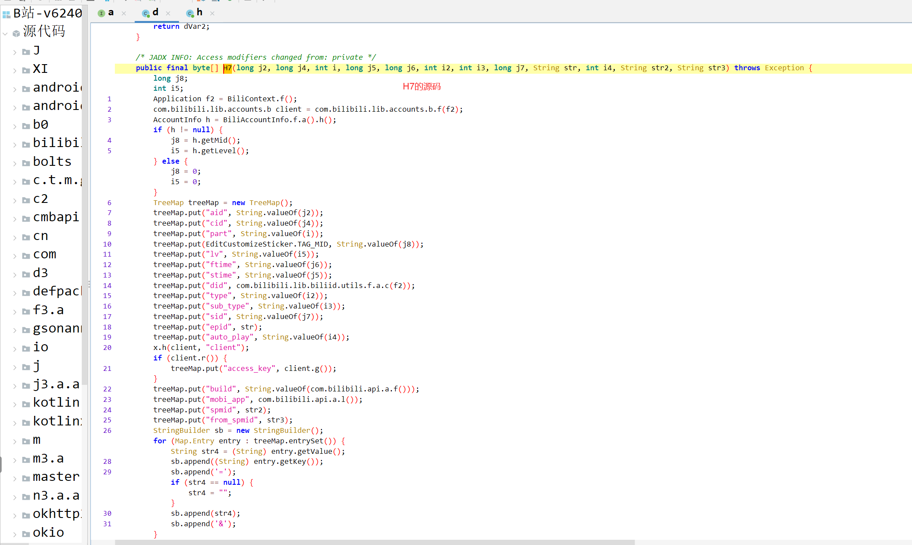
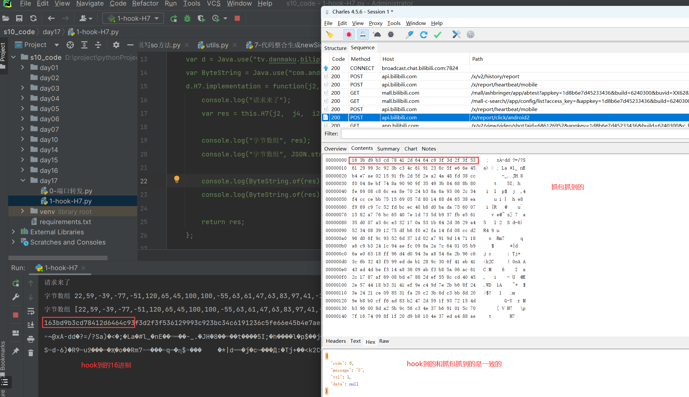
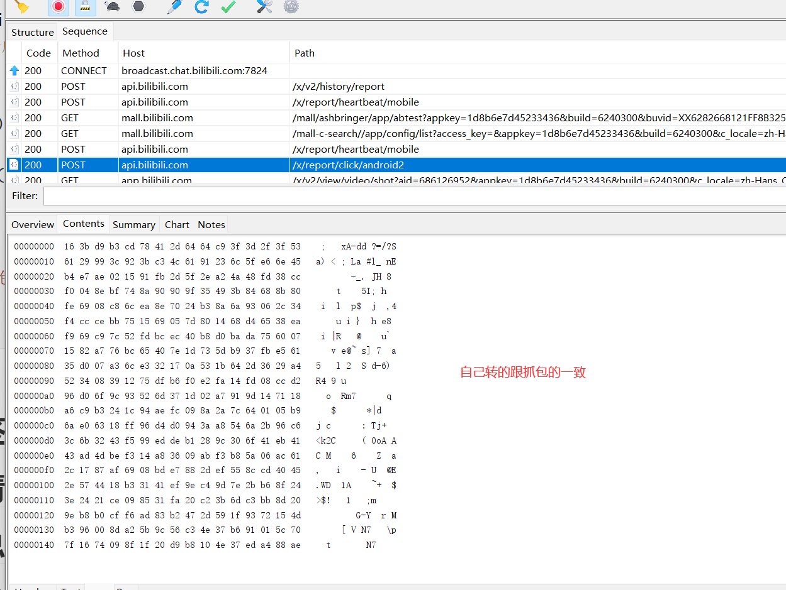

# 今日内容

# 1 目标和版本

```python
#  目标：B站视频播放量---》3次课

#  版本：v6.24.0
	adb install app装好
```

# 2 抓包

```python
# 1 B站没有反代理---》直接手机配置代理抓包即可
# 2 打开B站app，随便点击一个视频，抓包查看
	-定位到某个可以提高播放量的接口
    -多次重复发请求尝试，查看播放量是否增加
# 3 抓包分析地址
	-请求地址：https://api.bilibili.com/x/report/click/android2
    -请求方式：POST
    -请求体：（二进制形式）加密的
    	一堆二进制
    -请求头：（都可以去掉--》但是咱么要破）
    	buvid	
    	device-id
    	fp_local
        fp_remote
        session_id
```






# 3 反编译app

```python
# 1 打开jadx--》把app拖入即可
	-就版本的jadx，默认使用内存比较小，B站app，比较大，可能反编译不出来
    -咱们需要调大jadx的内存
```


## 3.1 jadx调大内存

```python
# 1 如果jadx的内存不足，容易导致反编译失败，所以咱们调大内存
1.使用记事本或者notpad++打开jadx-gui.bat
2.找到 set DEFAULT_JVM_OPTS="-Xms128M" "-Xmx4g"
3.将其修改为 set DEFAULT_JVM_OPTS="-Xms128M" "-Xmx16g" 后保存就ok了 (你要4g 提升到16g把-Xmx4g改成-Xmx16g)
```



# 4 请求体加密破解

## 4.1 搜索定位分析代码

```python
# 1 反编译后---》搜索请求地址： click/android2
# 2 一个位置，双击进入
# 3 查找用例：reportClick，就只有一个位置
# 4 代码如下--》变量都是"魔鬼变量"  a  b  c 单个字母变量--》代码混淆了--》难读
# jadx可以简单反混淆--》读起来稍微好读一些，但是，当我们去hook的时候，还是用hook混淆的方法名，a，b

-咱们之前写的代码
String responseString = retrofit.create(HttpReq.class).Login(username, password, sign).execute().body().string();

-反编译回来的
l<String> execute = retrofit.create(a.class)).reportClick(create).execute();

# 5 核心是查看 create 传了什么东西---》因为它就是请求体
c0 create = c0.create('编码方式', d.this.H7(this.b.a(), this.b.b(), this.b.h(), i, j2, this.b.n(), this.b.m(), this.b.k(), this.b.c(), this.b.e(), this.b.l(), this.b.f()));

# 6 真正的内容：d.this.H7 执行完返回的结果
	H7方法，有很多很多参数
    
# 7 d.this.H7 源码分析

```











### 4.1.1 d.this.H7的源码

```java
public final byte[] H7(long j2, long j4, int i, long j5, long j6, int i2, int i3, long j7, String str, int i4, String str2, String str3) throws Exception {
        long j8;
        int i5;
        Application f2 = BiliContext.f();
        com.bilibili.lib.accounts.b client = com.bilibili.lib.accounts.b.f(f2);
        AccountInfo h = BiliAccountInfo.f.a().h();
        if (h != null) {
            j8 = h.getMid();
            i5 = h.getLevel();
        } else {
            j8 = 0;
            i5 = 0;
        }
    	// 1 把一堆key和value放到了treeMap 字典中
        TreeMap treeMap = new TreeMap();
        treeMap.put("aid", String.valueOf(j2));
        treeMap.put("cid", String.valueOf(j4));
        treeMap.put("part", String.valueOf(i));
        treeMap.put(EditCustomizeSticker.TAG_MID, String.valueOf(j8));
        treeMap.put("lv", String.valueOf(i5));
        treeMap.put("ftime", String.valueOf(j6));
        treeMap.put("stime", String.valueOf(j5));
        treeMap.put("did", com.bilibili.lib.biliid.utils.f.a.c(f2));
        treeMap.put("type", String.valueOf(i2));
        treeMap.put("sub_type", String.valueOf(i3));
        treeMap.put("sid", String.valueOf(j7));
        treeMap.put("epid", str);
        treeMap.put("auto_play", String.valueOf(i4));
        x.h(client, "client");
        if (client.r()) {
            treeMap.put("access_key", client.g());
        }
        treeMap.put("build", String.valueOf(com.bilibili.api.a.f()));
        treeMap.put("mobi_app", com.bilibili.api.a.l());
        treeMap.put("spmid", str2);
        treeMap.put("from_spmid", str3);
    	// 2 构建了sb对象--》做字符串拼接
    	// 循环map做拼接  aid=23232&cid=999&part=sss&lv=xx
        StringBuilder sb = new StringBuilder();
        for (Map.Entry entry : treeMap.entrySet()) {
            String str4 = (String) entry.getValue();
            sb.append((String) entry.getKey());
            sb.append('=');
            if (str4 == null) {
                str4 = "";
            }
            sb.append(str4);
            sb.append('&');
        }
    	// 3 删除字符串最后的 & 
    	// sb2=aid=23232&cid=999&part=sss&lv=xx
        sb.deleteCharAt(sb.length() - 1);
        String sb2 = sb.toString();
    	// 4 执行 t3.a.i.a.a.a.b.e.b 方法把sb2字符串传入，加密得到结果给了b2
        String b2 = t3.a.i.a.a.a.b.e.b(sb2);
		// 5 sb=aid=23232&cid=999&part=sss&lv=xx&sign=前面加密的结果
    	// 对整体进行前面，把签名拼在字符后
        sb.append("&sign=");
        sb.append(b2);
        String sb3 = sb.toString();
    	// 6 对整个字符串 （包含sign）aid=23232&cid=999&part=sss&lv=xx&sign=前面加密的结果
    	// 进行了加密--》最终返回--》就是请求体
        return t3.a.i.a.a.a.b.e.a(sb3);
    }


/*
1 把一堆 key  和 value 放到了 TreeMap中
2 构建sb对象，把treeMap的内容，拼成字符串了
     aid=asdfasdf&cid=asadfasd&part=sadfasd&
3 把字符串最后 & 删除
	sb=aid=asdfasdf&cid=asadfasd&part=sadfasd
4 调用： t3.a.i.a.a.a.b.e.b对 aid=asdfasdf&cid=asadfasd&part=sadfasd进行加密，得到字符串
5 把加密后的字符串拼接到 aid=asdfasdf&cid=asadfasd&part=sadfasd 后面
	sb=aid=asdfasdf&cid=asadfasd&part=sadfasd&sign=加密串
6 调用t3.a.i.a.a.a.b.e.a(sb3)对 上述字符串加密
7 得到的就是 请求体的内
*/
```

### 4.1.2  hook---H7查看

```python
import frida
import sys

rdev = frida.get_remote_device()
session = rdev.attach("哔哩哔哩")

scr = """
Java.perform(function () {

    var d = Java.use("tv.danmaku.biliplayerimpl.report.heartbeat.d");
    var ByteString = Java.use("com.android.okhttp.okio.ByteString");
    d.H7.implementation = function(j2,  j4,  i2,  j5,  j6,  i3,  i4,  j7,  str,  i5,  str2,  str3){
        console.log("请求来了");
        var res = this.H7(j2,  j4,  i2,  j5,  j6,  i3,  i4,  j7,  str,  i5,  str2,  str3);

        console.log("字节数组", res);
        console.log("字节数组", JSON.stringify(res));

        //console.log(ByteString.of(res).hex()); // 在hook时，直接把抓到的字符数组转成16进制
        //console.log(ByteString.of(res).utf8());  //将字节转换成字符串

        return res;
    };

});
"""

script = session.create_script(scr)
def on_message(message, data):
    print(message, data)


script.on("message", on_message)

script.load()
sys.stdin.read()


'''H7的返回数据，就是请求体内容，只不过是bytes的数组转成了字符串--》看上去像乱码而已
请求来了
字节数组 22,59,-39,-77,-51,120,65,45,100,100,-55,63,61,47,63,83,97,41,-103,60,-110,59,-61,76,97,-111,35,108,95,-26,110,69,-76,-25,-82,2,21,-111,-5,45,95,46,-94,74,72,-3,56,-52,-16,4,-114,-65,116,-118,-112,-112,-97,53,73,59,-124,104,-117,-128,-2,105,8,-56,108,-22,-114,112,36,-77,-118,106,-109,6,44,52,-12,-52,-50,-69,117,21,105,5,125,-128,20,104,-44,101,56,-22,-7,105,-55,124,82,-3,-68,-20,64,-72,-48,-70,-38,117,96,7,21,-126,-89,118,-68,101,64,126,29,115,93,-71,55,-5,-27,97,53,-48,7,-93,108,-29,50,23,10,83,27,100,45,54,41,-92,82,52,8,57,18,117,-33,-74,-16,-30,-6,20,-3,8,-52,-46,-106,-48,111,-100,-109,82,109,55,29,2,-89,-111,-99,20,113,24,-90,-55,-77,36,28,-108,-82,-4,9,-118,42,124,100,1,5,-71,106,-32,99,24,-1,-106,-44,-48,-108,58,-88,84,106,43,-106,-58,60,107,50,67,-11,-103,-19,-34,-79,40,-100,48,111,65,-21,65,67,-83,77,-66,-13,20,-88,54,9,-85,-13,-72,90,6,-84,97,44,23,-121,-81,105,8,-67,-25,-120,45,-17,85,-116,-51,64,69,46,87,68,24,-77,49,65,-17,-98,-60,-99,126,43,-74,-113,36,62,36,33,-50,9,-123,49,-6,32,-62,59,109,-61,-69,-115,32,-98,-72,-80,-49,-10,-83,-125,-78,71,45,89,31,-109,114,21,77,-77,-106,0,-115,-94,91,-100,86,-61,78,55,-74,-111,1,92,112,127,22,116,9,-113,31,32,-39,-72,16,78,55,-19,-92,-120,-82
字节数组 [22,59,-39,-77,-51,120,65,45,100,100,-55,63,61,47,63,83,97,41,-103,60,-110,59,-61,76,97,-111,35,108,95,-26,110,69,-76,-25,-82,2,21,-111,-5,45,95,46,-94,74,72,-3,56,-52,-16,4,-114,-65,116,-118,-112,-112,-97,53,73,59,-124,104,-117,-128,-2,105,8,-56,108,-22,-114,112,36,-77,-118,106,-109,6,44,52,-12,-52,-50,-69,117,21,105,5,125,-128,20,104,-44,101,56,-22,-7,105,-55,124,82,-3,-68,-20,64,-72,-48,-70,-38,117,96,7,21,-126,-89,118,-68,101,64,126,29,115,93,-71,55,-5,-27,97,53,-48,7,-93,108,-29,50,23,10,83,27,100,45,54,41,-92,82,52,8,57,18,117,-33,-74,-16,-30,-6,20,-3,8,-52,-46,-106,-48,111,-100,-109,82,109,55,29,2,-89,-111,-99,20,113,24,-90,-55,-77,36,28,-108,-82,-4,9,-118,42,124,100,1,5,-71,106,-32,99,24,-1,-106,-44,-48,-108,58,-88,84,106,43,-106,-58,60,107,50,67,-11,-103,-19,-34,-79,40,-100,48,111,65,-21,65,67,-83,77,-66,-13,20,-88,54,9,-85,-13,-72,90,6,-84,97,44,23,-121,-81,105,8,-67,-25,-120,45,-17,85,-116,-51,64,69,46,87,68,24,-77,49,65,-17,-98,-60,-99,126,43,-74,-113,36,62,36,33,-50,9,-123,49,-6,32,-62,59,109,-61,-69,-115,32,-98,-72,-80,-49,-10,-83,-125,-78,71,45,89,31,-109,114,21,77,-77,-106,0,-115,-94,91,-100,86,-61,78,55,-74,-111,1,92,112,127,22,116,9,-113,31,32,-39,-72,16,78,55,-19,-92,-120,-82]
163bd9b3cd78412d6464c93f3d2f3f536129993c923bc34c6191236c5fe66e45b4e7ae021591fb2d5f2ea24a48fd38ccf0048ebf748a90909f35493b84688b80fe6908c86cea8e7024b38a6a93062c34f4cccebb751569057d801468d46538eaf969c97c52fdbcec40b8d0bada7560071582a776bc65407e1d735db937fbe56135d007a36ce332170a531b642d3629a4523408391275dfb6f0e2fa14fd08ccd296d06f9c93526d371d02a7919d147118a6c9b3241c94aefc098a2a7c640105b96ae06318ff96d4d0943aa8546a2b96c63c6b3243f599eddeb1289c306f41eb4143ad4dbef314a83609abf3b85a06ac612c1787af6908bde7882def558ccd40452e574418b33141ef9ec49d7e2bb68f243e2421ce098531fa20c23b6dc3bb8d209eb8b0cff6ad83b2472d591f9372154db396008da25b9c56c34e37b691015c707f1674098f1f20d9b8104e37eda488ae
;ٳ�xA-dd�?=/?Sa)�<�;�La�#l_�nE����-_.�JH�8����t����5I;�h����l�p$��j�,4��λui}�h�e8��i�|R���@�к�u`��v�e@~s]�7��a5��l�2
Sd-6)�R9u߶����Җ�o��Rm7���q�ɳ$���	�*|d�j�c���Д:�Tj+��<k2C���ޱ(�0oA�AC�M���6	��Z�a,����-�U��@E.WD�1A�ĝ~+��$>$!�	�1� �;mû� ��������G-Y�rM��

'''
```




###  4.1.3 把hook到的字节数组--》转成16进制字符串

```python
# 抓包抓到的是java的，有符号的，有负数，python没有，先转成python的字节数组，再转16进制


# 把java的字节数组，转成python的
# v = [抓包抓到的字节数组]
v = [22, 59, -39, -77, -51, 120, 65, 45, 100, 100, -55, 63, 61, 47, 63, 83, 97, 41, -103, 60, -110, 59, -61, 76, 97,
     -111, 35, 108, 95, -26, 110, 69, -76, -25, -82, 2, 21, -111, -5, 45, 95, 46, -94, 74, 72, -3, 56, -52, -16, 4,
     -114, -65, 116, -118, -112, -112, -97, 53, 73, 59, -124, 104, -117, -128, -2, 105, 8, -56, 108, -22, -114, 112, 36,
     -77, -118, 106, -109, 6, 44, 52, -12, -52, -50, -69, 117, 21, 105, 5, 125, -128, 20, 104, -44, 101, 56, -22, -7,
     105, -55, 124, 82, -3, -68, -20, 64, -72, -48, -70, -38, 117, 96, 7, 21, -126, -89, 118, -68, 101, 64, 126, 29,
     115, 93, -71, 55, -5, -27, 97, 53, -48, 7, -93, 108, -29, 50, 23, 10, 83, 27, 100, 45, 54, 41, -92, 82, 52, 8, 57,
     18, 117, -33, -74, -16, -30, -6, 20, -3, 8, -52, -46, -106, -48, 111, -100, -109, 82, 109, 55, 29, 2, -89, -111,
     -99, 20, 113, 24, -90, -55, -77, 36, 28, -108, -82, -4, 9, -118, 42, 124, 100, 1, 5, -71, 106, -32, 99, 24, -1,
     -106, -44, -48, -108, 58, -88, 84, 106, 43, -106, -58, 60, 107, 50, 67, -11, -103, -19, -34, -79, 40, -100, 48,
     111, 65, -21, 65, 67, -83, 77, -66, -13, 20, -88, 54, 9, -85, -13, -72, 90, 6, -84, 97, 44, 23, -121, -81, 105, 8,
     -67, -25, -120, 45, -17, 85, -116, -51, 64, 69, 46, 87, 68, 24, -77, 49, 65, -17, -98, -60, -99, 126, 43, -74,
     -113, 36, 62, 36, 33, -50, 9, -123, 49, -6, 32, -62, 59, 109, -61, -69, -115, 32, -98, -72, -80, -49, -10, -83,
     -125, -78, 71, 45, 89, 31, -109, 114, 21, 77, -77, -106, 0, -115, -94, 91, -100, 86, -61, 78, 55, -74, -111, 1, 92,
     112, 127, 22, 116, 9, -113, 31, 32, -39, -72, 16, 78, 55, -19, -92, -120, -82]
l = []
for i in v:
    if i < 0:
        i = i + 256
    l.append(i)
print(l)  # 转成16进制

###转成16进制
res=[hex(item)[2:] for item in l]
print(res)
print(''.join(res)) # 转成字符串，跟抓包一样


'''
对比输出发现跟抓包到的16进制内容一致

'''
```



## 4.2 sign签名

```python
# 1 上面分析的：
 调用：t3.a.i.a.a.a.b.e.b对 aid=asdfasdf&cid=asadfasd&part=sadfasd进行加密，得到签名字符串
# 2 代码如下--》破解加密如何加的--》sign是如何加密的
# sb2    aid=asdfasdf&cid=asadfasd&part=sadfasd
String b2 = t3.a.i.a.a.a.b.e.b(sb2); # 加密后拼接到了字符串后面
sb.append("&sign=");
sb.append(b2);
# 最终变成 aid=asdfasdf&cid=asadfasd&part=sadfasd&sign=签名

# 3 查看 t3.a.i.a.a.a.b.e.b

```

### 4.2.1  t3.a.i.a.a.a.b.e.b 源码分析

```java
// 传入的params 就是待加密的字符串： aid=asdfasdf&cid=asadfasd&part=sadfasd
public final String b(String params) {
    Charset charset = com.bilibili.commons.c.b;
    // 1 把传入的字符串，取到utf-8的 byte数组
    byte[] bytes = params.getBytes("utf-8");
    // 2 d是常量 ：9cafa6466a028bfb
    String str = d;
    // 3 charset2 是 utf-8
    Charset charset2 = com.bilibili.commons.c.b;
    if (str != null) {
        //4  把d常量对应的字符串：9cafa6466a028bfb ，使用utf-8编码，得到字节数组
        byte[] bytes2 = str.getBytes(charset2);
        // 5 执行g，传入了 两个参数，返回g字符串
        // 把最上面传入的字符串，和固定值key，进行了sha256加密
        // g 就是sha256加密：明文：传入的字符串，key就是9cafa6466a028bfb
      
        String g = com.bilibili.commons.m.a.g(bytes, bytes2);
        Locale locale = Locale.US;
        if (g != null) {
            // 6 转成小写返回了（把加密后的串转成小写）
            String lowerCase = g.toLowerCase(locale);
            return lowerCase;
        }
        throw new TypeCastException("null cannot be cast to non-null type java.lang.String");
    }
    throw new TypeCastException("null cannot be cast to non-null type java.lang.String");
}

```

### 4.2.2 com.bilibili.commons.m.a.g--sha256加密

```java
// 两个参数，一个是明文，一个是盐
public static String g(byte[] bArr, byte[] bArr2) {
    try {
        MessageDigest messageDigest = MessageDigest.getInstance(AaidIdConstant.SIGNATURE_SHA256);
        messageDigest.reset();
        messageDigest.update(bArr);
        if (bArr2 != null) {
            messageDigest.update(bArr2);
        }
        // 明文+盐进行sha256摘要后，执行了g.H
        return g.H(messageDigest.digest());
    } catch (NoSuchAlgorithmException e) {
        throw new AssertionError(e);
    }
}

```

### 4.2.3 g.H(messageDigest.digest());

```java
// 把传入的 字节数组  转成16进制--》返回字符串
public static String H(byte[] bArr) {
    StringBuilder sb = new StringBuilder();
    for (byte b2 : bArr) {
        int i = b2 & 255;
        if (i < 16) {
            sb.append('0');
        }
        sb.append(Integer.toHexString(i));
    }
    return sb.toString();
}

```

### 4.2.4 签名生成方案

```python
# 把aid=asdfasdf&cid=asadfasd&part=sadfasd 通过sha256+盐---》摘要---》转成16进制---》转成小写返回
```

###  4.2.5 通过hook--g确认盐是什么-明文是什么

```python
# 9cafa6466a028bfb

import frida
import sys

rdev = frida.get_remote_device()
session = rdev.attach("哔哩哔哩")

scr = """
Java.perform(function () {
    var a = Java.use("com.bilibili.commons.m.a");
    var ByteString = Java.use("com.android.okhttp.okio.ByteString");
    a.g.implementation = function(bytes, bytes2){
        console.log("请求来了");
        console.log("bytes=",ByteString.of(bytes).utf8());
        console.log("bytes2=",ByteString.of(bytes2).utf8());

        var res = this.g(bytes, bytes2);
        console.log("sign=",res);

        return res;
    };

});
"""

script = session.create_script(scr)


def on_message(message, data):
    print(message, data)


script.on("message", on_message)

script.load()
sys.stdin.read()

'''
1 一串字符串aid=968620643&auto_play=0&build=6240300&cid=202261238&did=fU52TixILBQlEicfLk93Tw9fNk4rR3UtYQ&epid=329002&from_spmid=tm.recommend.feed.bangumi&ftime=1704374954&lv=0&mid=0&mobi_app=android&part=0&sid=4340&spmid=pgc.pgc-video-detail.0.0&stime=1704374611&sub_type=1&type=4

2 通过盐：9cafa6466a028bfb  + sha256 加密 得到加密串
3 转成16进制

'''
```

### 4.2.6 python复现sha-256加密

```python
import hashlib

data = "aid=968620643&auto_play=0&build=6240300&cid=202261238&did=fU52TixILBQlEicfLk93Tw9fNk4rR3UtYQ&epid=329002&from_spmid=tm.recommend.feed.bangumi&ftime=1704374954&lv=0&mid=0&mobi_app=android&part=0&sid=4340&spmid=pgc.pgc-video-detail.0.0&stime=1704374611&sub_type=1&type=4"

salt = "9cafa6466a028bfb"
obj = hashlib.sha256()
obj.update(data.encode('utf-8'))
obj.update(salt.encode('utf-8'))

res = obj.hexdigest()
print(res)

'''
跟hook到的一样

'''
```


## 4.3 破解请求体加密

```python
# 1 请求头加密：t3.a.i.a.a.a.b.e.a(sb3)
aid=968620643&auto_play=0&build=6240300&cid=202261238&did=fU52TixILBQlEicfLk93Tw9fNk4rR3UtYQ&epid=329002&from_spmid=tm.recommend.feed.bangumi&ftime=1704374954&lv=0&mid=0&mobi_app=android&part=0&sid=4340&spmid=pgc.pgc-video-detail.0.0&stime=1704374611&sub_type=1&type=4&sign=4021718af1f29a2279dbcd7d4098a50cc042d8b69e6233c8e517592d598a403d

# 2 查看t3.a.i.a.a.a.b.e.a源码

```

### 4.3.1 t3.a.i.a.a.a.b.e.a源码分析

```java
// aid=968620643&auto_play=0&build=6240300&cid=202261238&did=fU52TixILBQlEicfLk93Tw9fNk4rR3UtYQ&epid=329002&from_spmid=tm.recommend.feed.bangumi&ftime=1704374954&lv=0&mid=0&mobi_app=android&part=0&sid=4340&spmid=pgc.pgc-video-detail.0.0&stime=1704374611&sub_type=1&type=4&sign=4021718af1f29a2279dbcd7d4098a50cc042d8b69e6233c8e517592d598a403d


public final byte[] a(String body) {
    try {
        // 1 b 是个常量
        String str = b;
        // 2 charset utf-8 
        Charset charset = com.bilibili.commons.c.b;
        if (str != null) {
            // 3 把常量转成utf-8格式的字节数组
            byte[] bytes = str.getBytes(charset);
            // 4 AES 的 SecretKey  常量--》固定的
            SecretKeySpec secretKeySpec = new SecretKeySpec(bytes, "AES");
            String str2 = f22911c;
            // 5 charset2 utf-8 
            Charset charset2 = com.bilibili.commons.c.b;
            if (str2 != null) {
                // 6 str2 就是iv
                byte[] bytes2 = str2.getBytes(charset2);
                IvParameterSpec ivParameterSpec = new IvParameterSpec(bytes2);
                Charset charset3 = com.bilibili.commons.c.b;
                byte[] bytes3 = body.getBytes(charset3);
                // 7 把传入的字符串,通过aes的key和iv加密
                byte[] i = com.bilibili.droid.g0.a.i(secretKeySpec, ivParameterSpec, bytes3);
                return i;
            }
            throw new TypeCastException("null cannot be cast to non-null type java.lang.String");
        }
        throw new TypeCastException("null cannot be cast to non-null type java.lang.String");
    } catch (Exception e2) {
        BLog.e(a, e2);
        Charset charset4 = com.bilibili.commons.c.b;
        x.h(charset4, "Charsets.UTF_8");
        byte[] bytes4 = body.getBytes(charset4);
        x.h(bytes4, "(this as java.lang.String).getBytes(charset)");
        return bytes4;
    }
}


/*
发现是aes加密
	-明文是什么：知道了
	-iv是什么：不知道   77b07a672d57d64c
	-key 是什么：不知道  fd6b639dbcff0c2a1b03b389ec763c4b
*/
```

### 4.3.2 通过hook得到aes的key和iv

```python
import frida
import sys

rdev = frida.get_remote_device()
session = rdev.attach("哔哩哔哩")

scr = """
Java.perform(function () {
    var ByteString = Java.use("com.android.okhttp.okio.ByteString");
    
    var SecretKeySpec = Java.use("javax.crypto.spec.SecretKeySpec");
    SecretKeySpec.$init.overload('[B', 'java.lang.String').implementation = function(key,name){
        console.log("请求来了");
        console.log("key=",ByteString.of(key).utf8());
        console.log("name=",name);
        
        var res = this.$init(key,name);
        return res;
    };
    
    var IvParameterSpec = Java.use("javax.crypto.spec.IvParameterSpec");
    IvParameterSpec.$init.overload('[B').implementation = function(iv){
        console.log("iv=",ByteString.of(iv).utf8());
        var res = this.$init(iv);
        return res;
    };

});
"""

script = session.create_script(scr)


def on_message(message, data):
    print(message, data)


script.on("message", on_message)

script.load()
sys.stdin.read()


'''
最终：aes的秘钥是
key= fd6b639dbcff0c2a1b03b389ec763c4b
name= AES
aes的iv是
iv= 77b07a672d57d64c
'''
```

###  4.3.3 使用python实现aes加密

```python
from Crypto.Cipher import AES
from Crypto.Util.Padding import pad

KEY = "fd6b639dbcff0c2a1b03b389ec763c4b"
IV = "77b07a672d57d64c"

def aes_encrypt(data_string):
    aes = AES.new(
        key=KEY.encode('utf-8'),
        mode=AES.MODE_CBC,
        iv=IV.encode('utf-8')
    )
    raw = pad(data_string.encode('utf-8'), 16)
    return aes.encrypt(raw)


data = "aid=968620643&auto_play=0&build=6240300&cid=202261238&did=fU52TixILBQlEicfLk93Tw9fNk4rR3UtYQ&epid=329002&from_spmid=tm.recommend.feed.bangumi&ftime=1704374954&lv=0&mid=0&mobi_app=android&part=0&sid=4340&spmid=pgc.pgc-video-detail.0.0&stime=1704374611&sub_type=1&type=4&sign=4021718af1f29a2279dbcd7d4098a50cc042d8b69e6233c8e517592d598a403d"

# 字节类型
bytes_data = aes_encrypt(data)

result = [item for item in bytes_data]
print(result)# 输出的是字节数组
```


## 4.4 流程总结

```python
# 1 根据请求地址--》反编译查找：x/report/click/android2
# 2 找到了位置：com.bilibili.okretro.d.a<String> reportClick(@Body c0 c0Var);
# 3 查找用例：
ResponseBody responseBody = retrofit.create(接口类a.class).reportClick(参数).execute().body()
# 4 破解参数：c0.create
c0 create = c0.create('编码方式', d.this.H7());

# 5 破解d.this.H7---》hook脚本--》位置是对的
# 6 H7的逻辑
'''
1 把一堆 key  和 value 放到了 TreeMap中
2 构建sb对象，把treeMap的内容，拼成字符串了
     aid=asdfasdf&cid=asadfasd&part=sadfasd&
3 把字符串最后 & 删除
sb=aid=asdfasdf&cid=asadfasd&part=sadfasd
4 调用： t3.a.i.a.a.a.b.e.b对 aid=asdfasdf&cid=asadfasd&part=sadfasd进行加密，得到字符串
5 把加密后的字符串拼接到 aid=asdfasdf&cid=asadfasd&part=sadfasd 后面
sb=aid=asdfasdf&cid=asadfasd&part=sadfasd&sign=加密串
6 调用t3.a.i.a.a.a.b.e.a(sb3)对 上述字符串加密
7 得到的就是 请求体的内容
'''

# 7 签名的方式 sign加密：t3.a.i.a.a.a.b.e.b
	sha256+盐（盐是固定的）9cafa6466a028bfb
    
# 8 请求体加密：t3.a.i.a.a.a.b.e.a
	aes加密
    明文
    key
    iv
    
```


# 5 请求参数：aid，cid，did

```python
#1 请求体内容分析
aid=968620643&auto_play=0&build=6240300&cid=202261238&did=fU52TixILBQlEicfLk93Tw9fNk4rR3UtYQ&epid=329002&from_spmid=tm.recommend.feed.bangumi&ftime=1704374954&lv=0&mid=0&mobi_app=android&part=0&sid=4340&spmid=pgc.pgc-video-detail.0.0&stime=1704374611&sub_type=1&type=4&sign=4021718af1f29a2279dbcd7d4098a50cc042d8b69e6233c8e517592d598a403d

#2 变成字典
{
    "aid":"968620643",
    "cid":"202261238",
    ---视频和分级id---唯一确定一个视频--点击某个视频，会返回
    
    ---需要破-----
    "did":"fU52TixILBQlEicfLk93Tw9fNk4rR3UtYQ",
    ---视频打开时间和播放时间----
    "ftime":"1704374954",
    "stime":"1704374611",
    -----下面都固定-----
    "auto_play":"0",  # 固定
    "build":"6240300", # 版本
    "epid":"",    # 空 
    "from_spmid":"main.ugc-video-detail.0.0",# 固定
    "lv":"0", 
    "mid":"0",
    "mobi_app":"android",
    "part":"1",
    "sid":"0",
    "spmid":"main.ugc-video-detail.0.0",
    "sub_type":"0",
    "type":"3"
}

# 3 请求体中：3个东西
	aid
    cid
    did
    需要破解
```


## 5.1 aid和cid破解

```python
#1 aid和cid视频唯一id号---》刷某个视频的时候---》我们知道这个视频id号的
#2 打开网页版的视频地址：会返回这俩值
# 通过用户提供的视频地址，拿到aid和cid
```

```python

import requests
import json
import re

header = {
    'User-Agent': 'Mozilla/5.0 (Linux; Android 6.0; Nexus 5 Build/MRA58N) AppleWebKit/537.36 (KHTML, like Gecko) Chrome/120.0.0.0 Mobile Safari/537.36'
}
res = requests.get("https://m.bilibili.com/video/BV1eC4y1e73d?spm_id_from=333.337.search-card.all.click&vd_source=57a9cd275f0e009d56b6c9e7e785064f",
                   headers=header)

data_list = re.findall(r'var options = (.+);', res.text)

data_dict = json.loads(data_list[0])
aid = data_dict['aid']
cid = data_dict['cid']
print(aid)
print(cid)
```


## 5.2 did破解

```python
# 1 找到did位置：treeMap.put("did", com.bilibili.lib.biliid.utils.f.a.c(f2));
# 2 看源码，找到c
public static String c(@Nullable Context context) {
    # 1 判断变量是否有值，如果有值，直接返回了，没有值，继续往下走
    # 先从变量的内存中取，如果取不到--》去xml中读--》再取不到就生成一个，放到xml中和变量中
    if (TextUtils.isEmpty(f13201c)) {
        if (context == null) {
            return "";
        }
        # 2 去xml中读
        String f = c2.f.b0.c.a.e.k().f(context);
        f13201c = f;
        if (!TextUtils.isEmpty(f)) {
            return f13201c;
        }
        # 3 内存，xml中都没有，通过g生成，生成后
        # 赋值给了变量，放在内存中了
        f13201c = g(context);
        # 放在了xml中
        c2.f.b0.c.a.e.k().x(f13201c, context);
        return f13201c;
    }
    return f13201c;
}

# 3 咱们 g如何生成的
static String g(Context context) {
    # 1 通过调用f生成 f字符串
    String f = f(context);
    #2 如果生成的字符串长度小于4，又使用Settings.Secure.getString方案生成
    if (f.length() < 4) {
        f = Settings.Secure.getString(context.getContentResolver(), "android_id") + "@" + g.g(Build.MODEL);
    }
    # 3 调用b生成，并返回
    return b(f);
}

# 4 看f(context)
# 本质：mac地址|蓝牙地址|设备总线|sn号
public static String f(Context context) {
    StringBuffer stringBuffer = new StringBuffer();
    String j2 = j(context); # wlan.lge.wifimac  mac地址 可以伪造
    if (j2 != null) {
        String lowerCase = j2.replaceAll("[^0-9A-Fa-f]", "").toLowerCase();
        if (k(lowerCase)) {
            stringBuffer.append(lowerCase);
        }
    }
    stringBuffer.append('|');
    String a2 = z.a("persist.service.bdroid.bdaddr"); # 蓝牙地址
    if (a2.length() > 0) {
        String lowerCase2 = a2.replaceAll("[^0-9A-Fa-f]", "").toLowerCase();
        if (k(lowerCase2)) {
            stringBuffer.append(lowerCase2);
        }
    }
    stringBuffer.append('|');
    String h = h(); # 设备总线
    if (h != null) {
        stringBuffer.append(h.toLowerCase());
    }
    stringBuffer.append('|');
    String i = i(); # sn号
    if (i != null) {
        stringBuffer.append(i.toLowerCase());
    }
    return stringBuffer.toString();
}

#5  把 mac地址|蓝牙地址|设备总线|sn号 拼成字符串
# 6 看b做了什么 b(mac地址|蓝牙地址|设备总线|sn号 拼成字符串)
# 使用python一步一步复现--》使用chatgpt实现
public static String b(String str) {
    byte[] bytes = str.getBytes();
    bytes[0] = (byte) (bytes[0] ^ ((byte) (bytes.length & 255)));
    for (int i = 1; i < bytes.length; i++) {
        bytes[i] = (byte) ((bytes[i - 1] ^ bytes[i]) & 255);
    }
    try {
        return new String(Base64.encode(bytes, 11));
    } catch (Exception unused) {
        return str;
    }
}

```

###  5.2.1 通过hook得到 did-->一个手机是固定的--》换了手机就变了

```python
import frida
import sys

rdev = frida.get_remote_device()
pid = rdev.spawn(["tv.danmaku.bili"]) # 如果是spawn方案，必须写包名，放到列表中
session = rdev.attach(pid)


scr = """
Java.perform(function () {
    var didCls = Java.use("com.bilibili.lib.biliid.utils.f.a");

    didCls.f.implementation = function(arg5){
        var res = this.f(arg5);
        console.log("生成的did = ",res);
        return res;
    }    

});
"""

script = session.create_script(scr)
def on_message(message, data):
    print(message, data)
script.on("message", on_message)
script.load()
rdev.resume(pid)
sys.stdin.read()

'''
hook到的是：|||
'''
```

### 5.2.2 自己生成did

```python
import random
import string


def create_random_mac(sep=":"):
    """ 随机生成mac地址 """
    data_list = []
    for i in range(1, 7):
        part = "".join(random.sample("0123456789ABCDEF", 2))
        data_list.append(part)
    mac = sep.join(data_list)
	return mac

def gen_sn():
    return "".join(random.sample("123456789" + string.ascii_lowercase, 10))


mac_string = create_random_mac(sep="")
sn = gen_sn()

prev_did = "{}|||{}".format(mac_string, sn)
print(prev_did)
# C775636F793E|||4zlnit6d9q
```


### 5.2.3 位运算

```java
//b函数--使用python实现
public static String b(String str) {
    // 把传入的字符串变成字节
    byte[] bytes = str.getBytes();
    //https://zhuanlan.zhihu.com/p/370167569
    // & 与运算  ^按位异或
    //bytes[0] = bytes[0] ^ (bytes.length & 255);
    bytes[0] = (byte) (bytes[0] ^ ((byte) (bytes.length & 255)));
    for (int i = 1; i < bytes.length; i++) {
        bytes[i] = (byte) ((bytes[i - 1] ^ bytes[i]) & 255);
    }
    try {
        //转成base64返回
        return new String(Base64.encode(bytes, 11));
    } catch (Exception unused) {
        return str;
    }
}
// python 实现
import random
import string
import base64
def base64_encrypt(data_string):
    data_bytes = bytearray(data_string.encode('utf-8'))
    data_bytes[0] = data_bytes[0] ^ (len(data_bytes) & 0xFF)
    for i in range(1, len(data_bytes)):
        data_bytes[i] = (data_bytes[i - 1] ^ data_bytes[i]) & 0xFF
    res = base64.encodebytes(bytes(data_bytes))
    return res.strip().strip(b"==").decode('utf-8')
```


# 6 代码整合

```python
import random
import string
import base64
import time
import re
import json
import requests
import hashlib

from Crypto.Cipher import AES
from Crypto.Util.Padding import pad


def base64_encrypt(data_string):
    data_bytes = bytearray(data_string.encode('utf-8'))
    data_bytes[0] = data_bytes[0] ^ (len(data_bytes) & 0xFF)
    for i in range(1, len(data_bytes)):
        data_bytes[i] = (data_bytes[i - 1] ^ data_bytes[i]) & 0xFF
    res = base64.encodebytes(bytes(data_bytes))
    return res.strip().strip(b"==").decode('utf-8')


def create_random_mac(sep=":"):
    """ 随机生成mac地址 """
    data_list = []
    for i in range(1, 7):
        part = "".join(random.sample("0123456789ABCDEF", 2))
        data_list.append(part)
    mac = sep.join(data_list)
    return mac


def gen_sn():
    return "".join(random.sample("123456789" + string.ascii_lowercase, 10))


mac_string = create_random_mac(sep="")

did = base64_encrypt(f"{mac_string}|||")

header = {
    'User-Agent': 'Mozilla/5.0 (Linux; Android 6.0; Nexus 5 Build/MRA58N) AppleWebKit/537.36 (KHTML, like Gecko) Chrome/120.0.0.0 Mobile Safari/537.36'
}
res = requests.get("https://www.bilibili.com/video/BV1bg4y1D7aJ/?spm_id_from=333.337.search-card.all.click",
                   headers=header)

data_list = re.findall(r'var options = (.+);', res.text)

data_dict = json.loads(data_list[0])
aid = data_dict['aid']
cid = data_dict['cid']
print('视频aid和cid：%s===%s'%(aid,cid))

# 1.明文参数
data_dict = {
    "aid": aid,
    "auto_play": "0",
    "build": "6240300",
    "cid": cid,
    "did": did,
    "epid": "",
    "from_spmid": "main.ugc-video-detail.0.0",
    "ftime": str(int(time.time() - random.randint(100, 5000))),
    "lv": "0",
    "mid": "0",
    "mobi_app": "android",
    "part": "1",
    "sid": "0",
    "spmid": "main.ugc-video-detail.0.0",
    "stime": str(int(time.time())),
    "sub_type": "0",
    "type": "3"
}

# 2.sign签名
v1 = "&".join([f"{key}={data_dict[key]}" for key in sorted(data_dict)])
salt = "9cafa6466a028bfb"
obj = hashlib.sha256()
obj.update(v1.encode('utf-8'))
obj.update(salt.encode('utf-8'))

sign_string = obj.hexdigest()
print(sign_string)

data_string = f"{v1}&sign={sign_string}"

# 3.AES加密

KEY = "fd6b639dbcff0c2a1b03b389ec763c4b"
IV = "77b07a672d57d64c"

aes = AES.new(
    key=KEY.encode('utf-8'),
    mode=AES.MODE_CBC,
    iv=IV.encode('utf-8')
)
bytes_data = pad(data_string.encode('utf-8'), 16)

result = [item for item in bytes_data]
print(result)

```

