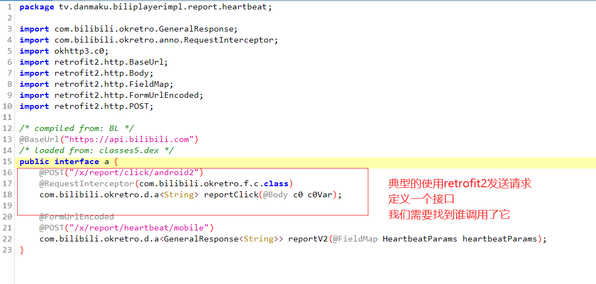

# 1 目标和版本

```python
# 目标：B站视频刷播放量
# 版本：v6.24.0
```

# 2 抓包

```python
# 经过多次测试，找到接口
https://api.bilibili.com/x/report/click/android2
    
# 请求为
	-地址：https://api.bilibili.com/x/report/click/android2
    -请求方式：POST
    -请求体:(二进制形式)
		一堆二进制	
    -请求头：
    buvid	
    device-id	
    fp_local	
    fp_remote	
    session_id # 可以去掉

```


# 3 反编译

## 3.1 jadx增加内存

```python
# jadx-gui 反编译app的时候内存不足
1.使用记事本或者notpad++打开jadx-gui.bat
2.找到 set DEFAULT_JVM_OPTS="-Xms128M" "-Xmx4g"
3.将其修改为 set DEFAULT_JVM_OPTS="-Xms128M" "-Xmx16g" 后保存就ok了 (你要4g 提升到16g把-Xmx4g改成-Xmx16g)
```




# 4 请求体加密算法破解

## 4.0 搜索定位分析


```java
public final void a() {
    long j2;
    long i = c2.f.f.c.j.a.i() / 1000;
    c2.f.b0.c.b.b.a.a E = c2.f.b0.c.b.b.a.a.E();
    long A = E.A();
    if (A == -1) {
        c2.f.b0.c.b.b.a.a E2 = c2.f.b0.c.b.b.a.a.E();
        E2.V(i);
        j2 = i;
    } else {
        j2 = A;
    }
    c0 create = c0.create(w.d(com.hpplay.sdk.source.protocol.h.E), d.this.H7(this.b.a(), this.b.b(), this.b.h(), i, j2, this.b.n(), this.b.m(), this.b.k(), this.b.c(), this.b.e(), this.b.l(), this.b.f()));
    // retrofit.create(HttpReq.class).getFilm("").execute()
    // create 就是请求体内容，create是通过c0.create得到的
    l<String> execute = ((tv.danmaku.biliplayerimpl.report.heartbeat.a) com.bilibili.okretro.c.a(tv.danmaku.biliplayerimpl.report.heartbeat.a.class)).reportClick(create).execute();
    int b = execute.b();
    String h = execute.h();
}

/*
c0 create = c0.create(w.d(com.hpplay.sdk.source.protocol.h.E), d.this.H7(this.b.a(), this.b.b(), this.b.h(), i, j2, this.b.n(), this.b.m(), this.b.k(), this.b.c(), this.b.e(), this.b.l(), this.b.f()));

com.hpplay.sdk.source.protocol.h.E是一个常量：application/octet-stream
d.this.H7：传入了参数，我们查看H7代码  
*/

```

### 4.0.1 d.this.H7

```java
public final byte[] H7(long j2, long j4, int i, long j5, long j6, int i2, int i3, long j7, String str, int i4, String str2, String str3) throws Exception {
    long j8;
    int i5;
    Application f2 = BiliContext.f();
    com.bilibili.lib.accounts.b client = com.bilibili.lib.accounts.b.f(f2);
    AccountInfo h = BiliAccountInfo.f.a().h();
    if (h != null) {
        j8 = h.getMid();
        i5 = h.getLevel();
    } else {
        j8 = 0;
        i5 = 0;
    }
    // 1 把一堆 key  和 value 放到了 TreeMap中
    TreeMap treeMap = new TreeMap();
    treeMap.put("aid", String.valueOf(j2));
    treeMap.put("cid", String.valueOf(j4));
    treeMap.put("part", String.valueOf(i));
    treeMap.put(EditCustomizeSticker.TAG_MID, String.valueOf(j8));
    treeMap.put("lv", String.valueOf(i5));
    treeMap.put("ftime", String.valueOf(j6));
    treeMap.put("stime", String.valueOf(j5));
    treeMap.put("did", com.bilibili.lib.biliid.utils.f.a.c(f2));
    treeMap.put("type", String.valueOf(i2));
    treeMap.put("sub_type", String.valueOf(i3));
    treeMap.put("sid", String.valueOf(j7));
    treeMap.put("epid", str);
    treeMap.put("auto_play", String.valueOf(i4));
    x.h(client, "client");
    if (client.r()) {
        treeMap.put("access_key", client.g());
    }
    treeMap.put("build", String.valueOf(com.bilibili.api.a.f()));
    treeMap.put("mobi_app", com.bilibili.api.a.l());
    treeMap.put("spmid", str2);
    treeMap.put("from_spmid", str3);
    // 2 构建sb对象，把treeMap的内容，拼成字符串了
    // aid=asdfasdf&cid=asadfasd&part=sadfasd&
    StringBuilder sb = new StringBuilder();
    for (Map.Entry entry : treeMap.entrySet()) {
        String str4 = (String) entry.getValue();
        sb.append((String) entry.getKey());
        sb.append('=');
        if (str4 == null) {
            str4 = "";
        }
        sb.append(str4);
        sb.append('&');
    }
    // 3 sb=aid=asdfasdf&cid=asadfasd&part=sadfasd
    sb.deleteCharAt(sb.length() - 1);
    // 4 转成字符串了 aid=asdfasdf&cid=asadfasd&part=sadfasd
    String sb2 = sb.toString();
    // 5 调用： t3.a.i.a.a.a.b.e.b对 aid=asdfasdf&cid=asadfasd&part=sadfasd进行加密，得到字符串
    String b2 = t3.a.i.a.a.a.b.e.b(sb2);
	// 6 sb=aid=asdfasdf&cid=asadfasd&part=sadfasd&sign=加密串
    sb.append("&sign=");
    sb.append(b2);
    String sb3 = sb.toString();
	// 7 对整个字符串：aid=asdfasdf&cid=asadfasd&part=sadfasd&sign=加密串 调用了a加密得到结果
    return t3.a.i.a.a.a.b.e.a(sb3);
}

/*
1 把一堆 key  和 value 放到了 TreeMap中
2 构建sb对象，把treeMap的内容，拼成字符串了
     aid=asdfasdf&cid=asadfasd&part=sadfasd&
3 把字符串最后 & 删除
sb=aid=asdfasdf&cid=asadfasd&part=sadfasd
4 调用： t3.a.i.a.a.a.b.e.b对 aid=asdfasdf&cid=asadfasd&part=sadfasd进行加密，得到字符串
5 把加密后的字符串拼接到 aid=asdfasdf&cid=asadfasd&part=sadfasd 后面
sb=aid=asdfasdf&cid=asadfasd&part=sadfasd&sign=加密串
6 调用t3.a.i.a.a.a.b.e.a(sb3)对 上述字符串加密
7 得到的就是 请求体的内
*/
```

### 4.0.2 hook-->h7查看

```python
import subprocess
subprocess.run('adb forward tcp:27042 tcp:27042')
subprocess.run('adb forward tcp:27043 tcp:27043')
```


```python
import frida
import sys

rdev = frida.get_remote_device()
session = rdev.attach("哔哩哔哩")

scr = """
Java.perform(function () {

    var d = Java.use("tv.danmaku.biliplayerimpl.report.heartbeat.d");
    var ByteString = Java.use("com.android.okhttp.okio.ByteString");
    d.H7.implementation = function(j2,  j4,  i2,  j5,  j6,  i3,  i4,  j7,  str,  i5,  str2,  str3){
        console.log("请求来了");
        var res = this.H7(j2,  j4,  i2,  j5,  j6,  i3,  i4,  j7,  str,  i5,  str2,  str3);

        console.log("字节数组", res);
        console.log("字节数组", JSON.stringify(res));

        //console.log(ByteString.of(res).hex()); // 在hook时，直接把抓到的字符数组转成16进制
        //console.log(ByteString.of(res).utf8());  //将字节转换成字符串

        return res;
    };

});
"""

script = session.create_script(scr)
def on_message(message, data):
    print(message, data)


script.on("message", on_message)

script.load()
sys.stdin.read()

```

### 4.0.3 把抓包得到的二进制字节数组--》转成16进制字符串

```python
# 把java的有符号的字节，转成python无符号的字节---》转成16进制

v=[-84,80,71,-56,45,62,-111,-96,41,107,1,-92,32,103,-68,5,62,10,-30,-1,88,-113,115,-110,-90,60,-44,8,3,50,106,112,126,-35,58,-73,5,22,2,61,5,105,-104,-16,88,-94,27,-109,72,-112,16,-103,-111,-73,98,-49,54,19,121,9,-55,-60,-124,-3,-18,126,91,-10,-102,109,71,16,-114,101,-29,-125,125,108,-22,-89,46,43,-56,106,96,-77,-89,-12,11,65,-8,-24,71,119,53,72,-54,-95,-20,-85,-110,-69,-126,-101,60,-105,33,-126,-66,-70,-86,66,-46,3,-38,73,-81,-104,-7,82,92,31,99,-89,-116,-119,61,6,123,-113,-58,1,98,90,-23,-83,25,-3,107,116,-76,123,43,64,90,-62,91,68,111,78,0,95,-89,-2,-1,44,-15,-112,-123,-89,-124,-18,-82,-112,-46,12,-80,-111,-110,94,-82,80,-91,54,-73,55,8,22,-2,-125,-39,-90,5,67,-108,-119,-16,-97,-13,-5,-127,12,-81,79,18,52,107,48,-10,58,-9,28,-12,102,86,-110,46,83,63,61,17,-55,44,67,-37,-53,-85,-7,-36,93,127,-16,-94,87,34,-3,-75,-99,40,-30,-39,-1,0,123,14,-108,10,71,72,96,6,118,89,-89,-95,75,111,2,47,97,20,26,-68,-43,77,-97,112,-32,54,-81,0,51,-69,-92,-92,72,-109,36,-61,-91,94,31,29,48,-100,118,-83,-15,19,22,89,43,-74,-60,92,99,116,-66,-15,-121,-66,-27,18,-13,-126,109,-14,69,-113,102,-69,-95,-76,-56,10,-112,-16,28,-76,-118,109,-66,35,-52,10,80,-61,-121,-6,-75,-4,-109,-102,110,18,-94,96,84,-117,-81,44,-7,-124,-26,66,-63]
l=[]
for i in v:
    if i<0:
        i=i+256
    l.append(i)
print(l) # 转成16进制
res=[hex(item)[2:] for item in l]
print(res)
print(''.join(res)) # 转成字符串


'''
对比输出发现跟抓包到的16进制内容一致

'''
```


## 4.1 sign签名

### 4.1.1 分析d.this.H7源码

```java
public final byte[] H7(long j2, long j4, int i, long j5, long j6, int i2, int i3, long j7, String str, int i4, String str2, String str3) throws Exception {
    // 1 把一堆key-value放到TreeMap中
    TreeMap treeMap = new TreeMap();
    treeMap.put("aid", String.valueOf(j2));
    treeMap.put("cid", String.valueOf(j4));
    treeMap.put("part", String.valueOf(i));
    treeMap.put(EditCustomizeSticker.TAG_MID, String.valueOf(j8));
    treeMap.put("lv", String.valueOf(i5));
    treeMap.put("ftime", String.valueOf(j6));
    treeMap.put("stime", String.valueOf(j5));
    treeMap.put("did", com.bilibili.lib.biliid.utils.f.a.c(f2));
    treeMap.put("type", String.valueOf(i2));
    treeMap.put("sub_type", String.valueOf(i3));
    treeMap.put("sid", String.valueOf(j7));
    treeMap.put("epid", str);
    treeMap.put("auto_play", String.valueOf(i4));
    x.h(client, "client");
    if (client.r()) {
        treeMap.put("access_key", client.g());
    }
    treeMap.put("build", String.valueOf(com.bilibili.api.a.f()));
    treeMap.put("mobi_app", com.bilibili.api.a.l());
    treeMap.put("spmid", str2);
    treeMap.put("from_spmid", str3);
    StringBuilder sb = new StringBuilder();
    for (Map.Entry entry : treeMap.entrySet()) {
        String str4 = (String) entry.getValue();
        sb.append((String) entry.getKey());
        sb.append('=');
        if (str4 == null) {
            str4 = "";
        }
        sb.append(str4);
        sb.append('&');
    }
    //  2 把treeMap放入的内容，拼成字符串
    //aid=asdfsd&cid=121342&part=3dseffs&
    sb.deleteCharAt(sb.length() - 1);
    // 3 把最后的&符号删除
    String sb2 = sb.toString();
    // 4 调用t3.a.i.a.a.a.b.e.b把上面字符串传入，返回b2
    String b2 = t3.a.i.a.a.a.b.e.b(sb2);
	// 5 继续拼接sign=
    sb.append("&sign=");
    sb.append(b2);
    String sb3 = sb.toString();
	// 6 最终调用了t3.a.i.a.a.a.b.e.a 把字符串传入了
    return t3.a.i.a.a.a.b.e.a(sb3);
}

/*
// 1 把一堆key-value放到TreeMap中
//  2 把treeMap放入的内容，拼成字符串
//aid=asdfsd&cid=121342&part=3dseffs&
// 3 把最后的&符号删除
// 4 调用t3.a.i.a.a.a.b.e.b把上面字符串传入，返回b2
String b2 = t3.a.i.a.a.a.b.e.b(sb2);
// 5 继续拼接sign=
// 6 最终调用了t3.a.i.a.a.a.b.e.a 把字符串传入了
t3.a.i.a.a.a.b.e.a(sb3);
我们要研究：t3.a.i.a.a.a.b.e.b和t3.a.i.a.a.a.b.e.a

*/
```


### 4.1.2 分析t3.a.i.a.a.a.b.e.b

####  4.1.2.1 t3.a.i.a.a.a.b.e.b

```java
public final String b(String params) {
    Charset charset = com.bilibili.commons.c.b;
    //1  把传入的params字符串，得到bytes格式，params=aid=asdfsd&cid=121342&part=3dseffs
    byte[] bytes = params.getBytes(charset);
    //2 d 是类中一个常量
    String str = d;
    //3 com.bilibili.commons.c.b也是个常量
    Charset charset2 = com.bilibili.commons.c.b;
    if (str != null) {
        //4 把charset2转成字节数组
        byte[] bytes2 = str.getBytes(charset2);
        //5 调用com.bilibili.commons.m.a.g完成加密
        String g = com.bilibili.commons.m.a.g(bytes, bytes2);
        Locale locale = Locale.US;
        if (g != null) {
            String lowerCase = g.toLowerCase(locale);
            // 6 转成小写返回
            return lowerCase;
        }
        throw new TypeCastException("null cannot be cast to non-null type java.lang.String");
    }
    throw new TypeCastException("null cannot be cast to non-null type java.lang.String");
}


// 继续分析com.bilibili.commons.m.a.g(bytes, bytes2)
// 典型的SHA256加密:对传入的两个参数加密，一个是加密体，一个是盐，盐一般不变

```

#### 4.1.2.2 com.bilibili.commons.m.a.g(bytes, bytes2)

```java
// 继续分析com.bilibili.commons.m.a.g(bytes, bytes2)
// 典型的SHA256加密:对传入的两个参数加密，一个是加密体，一个是盐，盐一般不变
public static String g(byte[] bArr, byte[] bArr2) {
    try {
        MessageDigest messageDigest = MessageDigest.getInstance(AaidIdConstant.SIGNATURE_SHA256);
        messageDigest.reset();
        messageDigest.update(bArr);
        if (bArr2 != null) {
            messageDigest.update(bArr2);
        }
        // 又调用了g.H
        return g.H(messageDigest.digest());
    } catch (NoSuchAlgorithmException e) {
        throw new AssertionError(e);
    }
}
// 继续分析g.H---》就是把传入的字符数组转成16进制字符串
```

#### 4.1.2.3 g.H

```java
// 继续分析g.H---》就是把传入的字符数组转成16进制字符串
public static String H(byte[] bArr) {
    StringBuilder sb = new StringBuilder();
    for (byte b2 : bArr) {
        int i = b2 & 255;
        if (i < 16) {
            sb.append('0');
        }
        sb.append(Integer.toHexString(i));
    }
    return sb.toString();
}
```

#### 4.1.2.4 hook-->g看看sha256的盐是什么

```python
import frida
import sys

rdev = frida.get_remote_device()
# Application(identifier="tv.danmaku.bili", name="哔哩哔哩", pid=20650, parameters={})
session = rdev.attach("哔哩哔哩")

scr = """
Java.perform(function () {
    var a = Java.use("com.bilibili.commons.m.a");
    var ByteString = Java.use("com.android.okhttp.okio.ByteString");
    a.g.implementation = function(bytes, bytes2){
        console.log("请求来了");
        console.log("bytes=",ByteString.of(bytes).utf8());
        console.log("bytes2=",ByteString.of(bytes2).utf8());

        var res = this.g(bytes, bytes2);
        console.log("sign=",res);

        return res;
    };

});
"""

script = session.create_script(scr)


def on_message(message, data):
    print(message, data)


script.on("message", on_message)

script.load()
sys.stdin.read()


# 多试几次发现盐是：9cafa6466a028bfb

### 总结：sign逻辑
	1 一串字符串aid=319287973&auto_play=0&build=6240300&cid=1289959578&did=IBksFHYQJ0QiF3FAckQmFVUFbBRxHS93Ow&epid=&from_spmid=main.ugc-video-detail.0.0&ftime=1692278308&lv=0&mid=0&mobi_app=android&part=1&sid=0&spmid=main.ugc-video-detail.0.0&stime=1697634744&sub_type=0&type=3
    2 通过盐：9cafa6466a028bfb  + sha256 加密 得到加密串
    3 转成16进制
```

#### 4.1.2.5 python实现sha256加密

```python
import hashlib

data = "aid=201583388&auto_play=0&build=6240300&cid=219823580&did=IBksFHYQJ0QiF3FAckQmFVUFbBRxHS93Ow&epid=&from_spmid=main.ugc-video-detail.0.0&ftime=1690993444&lv=0&mid=0&mobi_app=android&part=1&sid=0&spmid=main.ugc-video-detail.0.0&stime=1691055961&sub_type=0&type=3"

salt = "9cafa6466a028bfb"
obj = hashlib.sha256()
obj.update(data.encode('utf-8'))
obj.update(salt.encode('utf-8'))

res = obj.hexdigest()
print(res)

'''
bytes= aid=201583388&auto_play=0&build=6240300&cid=219823580&did=IBksFHYQJ0QiF3FAckQmFVUFbBRxHS93Ow&epid=&from_spmid=main.ugc-video-detail.0.0&ftime=1690993444&lv=0&mid=0&mobi_app=android&part=1&sid=0&spmid=main.ugc-video-detail.0.0&stime=1691055961&sub_type=0&type=3
bytes2= 9cafa6466a028bfb
sign= 2c3744b21ae185adf9e9d90b4b2f89e8826b4837a6fcc78aae2438e9cb55e280

# 自己使用python加密得到结果：是一样的
2c3744b21ae185adf9e9d90b4b2f89e8826b4837a6fcc78aae2438e9cb55e280
'''
```

## 4.2 请求体内容加密

### 4.2.1 分析t3.a.i.a.a.a.b.e.a--》返回字节数组

```java
// aes加密
public final byte[] a(String body) {
    try {
        String str = b;
        Charset charset = com.bilibili.commons.c.b;
        if (str != null) {
            byte[] bytes = str.getBytes(charset);
            // 那aes加密的秘钥：
            SecretKeySpec secretKeySpec = new SecretKeySpec(bytes, "AES");
            String str2 = f22911c;
            Charset charset2 = com.bilibili.commons.c.b;
            if (str2 != null) {
                byte[] bytes2 = str2.getBytes(charset2);
                // 拿aes加密的iv
                IvParameterSpec ivParameterSpec = new IvParameterSpec(bytes2);
                Charset charset3 = com.bilibili.commons.c.b;
                byte[] bytes3 = body.getBytes(charset3);
                byte[] i = com.bilibili.droid.g0.a.i(secretKeySpec, ivParameterSpec, bytes3);
                return i;
            }
            throw new TypeCastException("null cannot be cast to non-null type java.lang.String");
        }
        throw new TypeCastException("null cannot be cast to non-null type java.lang.String");
    } catch (Exception e2) {
        BLog.e(a, e2);
        Charset charset4 = com.bilibili.commons.c.b;
        x.h(charset4, "Charsets.UTF_8");
        byte[] bytes4 = body.getBytes(charset4);
        x.h(bytes4, "(this as java.lang.String).getBytes(charset)");
        return bytes4;
    }
}

// 可以通过hook拿到iv和key--》需要hook----SecretKeySpec和IvParameterSpec构造函数
// 其实iv和可以都在上面 key=fd6b639dbcff0c2a1b03b389ec763c4b   iv=77b07a672d57d64c
static {
    String str = (String) a.C1483a.a(ConfigManager.Companion.b(), "videodetail.report_click_secret_key", null, 2, null);
    if (str == null) {
        str = "fd6b639dbcff0c2a1b03b389ec763c4b";
    }
    b = str;
    String str2 = (String) a.C1483a.a(ConfigManager.Companion.b(), "videodetail.report_click_iv", null, 2, null);
    if (str2 == null) {
        str2 = "77b07a672d57d64c";
    }
    f22911c = str2;
    String str3 = (String) a.C1483a.a(ConfigManager.Companion.b(), "videodetail.report_click_salt", null, 2, null);
    if (str3 == null) {
        str3 = "9cafa6466a028bfb";
    }
    d = str3;
}


```

### 4.2.2 hook-->得到aes秘钥和iv

```python
import frida
import sys

rdev = frida.get_remote_device()
session = rdev.attach("哔哩哔哩")

scr = """
Java.perform(function () {
    var ByteString = Java.use("com.android.okhttp.okio.ByteString");
    
    var SecretKeySpec = Java.use("javax.crypto.spec.SecretKeySpec");
    SecretKeySpec.$init.overload('[B', 'java.lang.String').implementation = function(key,name){
        console.log("请求来了");
        console.log("key=",ByteString.of(key).utf8());
        console.log("name=",name);
        
        var res = this.$init(key,name);
        return res;
    };
    
    var IvParameterSpec = Java.use("javax.crypto.spec.IvParameterSpec");
    IvParameterSpec.$init.overload('[B').implementation = function(iv){
        console.log("iv=",ByteString.of(iv).utf8());
        var res = this.$init(iv);
        return res;
    };

});
"""

script = session.create_script(scr)


def on_message(message, data):
    print(message, data)


script.on("message", on_message)

script.load()
sys.stdin.read()

'''
最终：aes的秘钥是
key= fd6b639dbcff0c2a1b03b389ec763c4b
name= AES
aes的iv是
iv= 77b07a672d57d64c
'''
```

### 4.2.3 python实现aes加密

```python
from Crypto.Cipher import AES
from Crypto.Util.Padding import pad

KEY = "fd6b639dbcff0c2a1b03b389ec763c4b"
IV = "77b07a672d57d64c"

def aes_encrypt(data_string):
    aes = AES.new(
        key=KEY.encode('utf-8'),
        mode=AES.MODE_CBC,
        iv=IV.encode('utf-8')
    )
    raw = pad(data_string.encode('utf-8'), 16)
    return aes.encrypt(raw)


data = "aid=201583388&auto_play=0&build=6240300&cid=219823580&did=IBksFHYQJ0QiF3FAckQmFVUFbBRxHS93Ow&epid=&from_spmid=main.ugc-video-detail.0.0&ftime=1690993444&lv=0&mid=0&mobi_app=android&part=1&sid=0&spmid=main.ugc-video-detail.0.0&stime=1691055961&sub_type=0&type=3&sign=2c3744b21ae185adf9e9d90b4b2f89e8826b4837a6fcc78aae2438e9cb55e280"

# 字节类型
bytes_data = aes_encrypt(data)

result = [item for item in bytes_data]
print(result)
```

## 4.3   总结流程

```python
# 1 根据请求地址：x/report/click/android2  ---》反编译查找
# 2 retrofit发送请求---》用例
	ResponseBody responseBody = retrofit.create(接口类a.class).reportClick(参数).execute().body()
# 3 破解参数，create
# 4 参数是通过：d.this.H7 传了一堆参数进去，得到的结果

# 5 H7的逻辑是：
'''
1 把一堆 key  和 value 放到了 TreeMap中
2 构建sb对象，把treeMap的内容，拼成字符串了
     aid=asdfasdf&cid=asadfasd&part=sadfasd&
3 把字符串最后 & 删除
sb=aid=asdfasdf&cid=asadfasd&part=sadfasd
4 调用： t3.a.i.a.a.a.b.e.b对 aid=asdfasdf&cid=asadfasd&part=sadfasd进行加密，得到字符串
5 把加密后的字符串拼接到 aid=asdfasdf&cid=asadfasd&part=sadfasd 后面
sb=aid=asdfasdf&cid=asadfasd&part=sadfasd&sign=加密串
6 调用t3.a.i.a.a.a.b.e.a(sb3)对 上述字符串加密
7 得到的就是 请求体的内容
'''

# 6 破解sign加密
	-sha256+盐 
    
# 7 得到最终的字符串，又加密了---》aes加密：秘钥，iv，明文
```


# 5 请求体中aid，cid，did破解


```python
# 把请求体字符串转成字典
"aid=201583388&auto_play=0&build=6240300&cid=219823580&did=IBksFHYQJ0QiF3FAckQmFVUFbBRxHS93Ow&epid=&from_spmid=main.ugc-video-detail.0.0&ftime=1690993444&lv=0&mid=0&mobi_app=android&part=1&sid=0&spmid=main.ugc-video-detail.0.0&stime=1691055961&sub_type=0&type=3"

# 字典
{
    "aid":"201583388",
    "cid":"219823580",
    ---视频和分级id---请求返回的--通过网页版返回
    
    ---需要破-----
    "did":"IBksFHYQJ0QiF3FAckQmFVUFbBRxHS93Ow",
    ---视频打开时间和播放时间----
    "ftime":"1690993444",
    "stime":"1691055961",
    -----下面都固定-----
    "auto_play":"0",  # 固定
    "build":"6240300", # 版本
    "epid":"",    # 空 
    "from_spmid":"main.ugc-video-detail.0.0",# 固定
    "lv":"0", 
    "mid":"0",
    "mobi_app":"android",
    "part":"1",
    "sid":"0",
    "spmid":"main.ugc-video-detail.0.0",
    "sub_type":"0",
    "type":"3"
}
```


## 5.1 aid和cid


```python
# 正常app也是可以返回aid和cid的，但是之前在web端破解过这个，我们因为要刷自己的视频，地址是知道的，所以直接获得即可
import requests
import json
import re

header = {
    'User-Agent': 'Mozilla/5.0 (Linux; Android 6.0; Nexus 5 Build/MRA58N) AppleWebKit/537.36 (KHTML, like Gecko) Chrome/120.0.0.0 Mobile Safari/537.36'
}
res = requests.get("https://www.bilibili.com/video/BV1bg4y1D7aJ/?spm_id_from=333.337.search-card.all.click",
                   headers=header)

data_list = re.findall(r'var options = (.+);', res.text)

data_dict = json.loads(data_list[0])
aid = data_dict['aid']
cid = data_dict['cid']
print(aid)
print(cid)

```


## 5.2 参数did

```python
# 1 找到did位置
 treeMap.put("did", com.bilibili.lib.biliid.utils.f.a.c(f2));
# 2 找到c
public static String c(@Nullable Context context) {
    # 1判断类中字段是否为空，就是从内存中拿，第一次生成放到内存，以后直接从内存中取
    if (TextUtils.isEmpty(f13201c)) {
        if (context == null) {
            return "";
        }
        # 2 内存中没有，去xml中读取
        String f = c2.f.b0.c.a.e.k().f(context);
        f13201c = f;
        if (!TextUtils.isEmpty(f)) {
            return f13201c;
        }
        # 3 内存中没有，xml中没有，就去生成，调用某个算法生成
        # 复制给内存中的变量
        f13201c = g(context);
        # 放到xml中
        c2.f.b0.c.a.e.k().x(f13201c, context);
        return f13201c;
    }
    return f13201c;
}

# 3 找到f，明显是在SharedPreferences中取，xml中还没有才生成，所以这个值以后都是一样的
public String f(Context context) {
    SharedPreferences c3 = l().c();
    String string = c3.getString("persist.c.bl.did", null);
    if (!TextUtils.isEmpty(string)) {
        com.bilibili.lib.biliid.internal.storage.external.d.y(string);
        return string;
    }
    String f = com.bilibili.lib.biliid.internal.storage.external.d.f();
    if (!TextUtils.isEmpty(f)) {
        c3.edit().putString("persist.c.bl.did", f).apply();
    }
    return f;
}

# 4 查看g中如何生成的
static String g(Context context) {
    String f = f(context);
    if (f.length() < 4) {
        f = Settings.Secure.getString(context.getContentResolver(), "android_id") + "@" + g.g(Build.MODEL);
    }
    return b(f);
}

#5  调用f生成，判断长度是否小于4，通过hook后发现很长，不小于4
#6 所以did的生成是通过 f(context)---》b(f)---》生成的
# 7 f函数 本质就是 mac地址|蓝牙地址|设备总线|sn号 拼接读安卓手机的各种信息，如果读不到，就是三个 |
public static String f(Context context) {
    StringBuffer stringBuffer = new StringBuffer();
    String j2 = j(context);
    if (j2 != null) {
        String lowerCase = j2.replaceAll("[^0-9A-Fa-f]", "").toLowerCase();
        if (k(lowerCase)) {
            stringBuffer.append(lowerCase);
        }
    }
    stringBuffer.append('|');
    String a2 = z.a("persist.service.bdroid.bdaddr");
    if (a2.length() > 0) {
        String lowerCase2 = a2.replaceAll("[^0-9A-Fa-f]", "").toLowerCase();
        if (k(lowerCase2)) {
            stringBuffer.append(lowerCase2);
        }
    }
    stringBuffer.append('|');
    String h = h();
    if (h != null) {
        stringBuffer.append(h.toLowerCase());
    }
    stringBuffer.append('|');
    String i = i(); #可以点进去看它，其实就是读手机的sn号：/sys/class/android_usb/android0/iSerial
    if (i != null) {
        stringBuffer.append(i.toLowerCase());
    }
    return stringBuffer.toString();
}
# b函数
public static String b(String str) {
    byte[] bytes = str.getBytes();
    bytes[0] = (byte) (bytes[0] ^ ((byte) (bytes.length & 255)));
    for (int i = 1; i < bytes.length; i++) {
        bytes[i] = (byte) ((bytes[i - 1] ^ bytes[i]) & 255);
    }
    try {
        return new String(Base64.encode(bytes, 11));
    } catch (Exception unused) {
        return str;
    }
}


```

### 5.2.1 hook--》f拿到did-->清除所有数据

```python
import frida
import sys

rdev = frida.get_remote_device()
session = rdev.attach("tv.danmaku.bili")

scr = """
Java.perform(function () {
    var didCls = Java.use("com.bilibili.lib.biliid.utils.f.a");
    
    didCls.f.implementation = function(arg5){
        var res = this.f(arg5);
        console.log("生成的did = ",res);
        return res;
    }    
   
});
"""
script = session.create_script(scr)


def on_message(message, data):
    print(message, data)


script.on("message", on_message)
script.load()
sys.stdin.read()

# hook发现为：|||
# 或
```


### 5.3 生成字符串（mac地址|蓝牙地址|设备总线|sn号）

#### 5.3.1 生成mac和sn

```python
import random
import string


def create_random_mac(sep=":"):
    """ 随机生成mac地址 """
    data_list = []
    for i in range(1, 7):
        part = "".join(random.sample("0123456789ABCDEF", 2))
        data_list.append(part)
    mac = sep.join(data_list)
	return mac

def gen_sn():
    return "".join(random.sample("123456789" + string.ascii_lowercase, 10))


mac_string = create_random_mac(sep="")
sn = gen_sn()

prev_did = "{}|||{}".format(mac_string, sn)
print(prev_did)
```


### 5.4 位运算

```java
//b函数
public static String b(String str) {
    // 把传入的字符串变成字节
    byte[] bytes = str.getBytes();
    //https://zhuanlan.zhihu.com/p/370167569
    // & 与运算  ^按位异或
    //bytes[0] = bytes[0] ^ (bytes.length & 255);
    bytes[0] = (byte) (bytes[0] ^ ((byte) (bytes.length & 255)));
    for (int i = 1; i < bytes.length; i++) {
        bytes[i] = (byte) ((bytes[i - 1] ^ bytes[i]) & 255);
    }
    try {
        //转成base64返回
        return new String(Base64.encode(bytes, 11));
    } catch (Exception unused) {
        return str;
    }
}
```

#### 5.4.1 python实现

```python
import random
import string
import base64

def base64_encrypt(data_string):
    data_bytes = bytearray(data_string.encode('utf-8'))
    data_bytes[0] = data_bytes[0] ^ (len(data_bytes) & 0xFF)
    for i in range(1, len(data_bytes)):
        data_bytes[i] = (data_bytes[i - 1] ^ data_bytes[i]) & 0xFF
    res = base64.encodebytes(bytes(data_bytes))
    return res.strip().strip(b"==").decode('utf-8')
```


# 6 代码整合

```python
import random
import string
import base64
import time
import re
import json
import requests
import hashlib

from Crypto.Cipher import AES
from Crypto.Util.Padding import pad


def base64_encrypt(data_string):
    data_bytes = bytearray(data_string.encode('utf-8'))
    data_bytes[0] = data_bytes[0] ^ (len(data_bytes) & 0xFF)
    for i in range(1, len(data_bytes)):
        data_bytes[i] = (data_bytes[i - 1] ^ data_bytes[i]) & 0xFF
    res = base64.encodebytes(bytes(data_bytes))
    return res.strip().strip(b"==").decode('utf-8')


def create_random_mac(sep=":"):
    """ 随机生成mac地址 """
    data_list = []
    for i in range(1, 7):
        part = "".join(random.sample("0123456789ABCDEF", 2))
        data_list.append(part)
    mac = sep.join(data_list)
    return mac


def gen_sn():
    return "".join(random.sample("123456789" + string.ascii_lowercase, 10))


mac_string = create_random_mac(sep="")

did = base64_encrypt(f"{mac_string}|||")

header = {
    'User-Agent': 'Mozilla/5.0 (Linux; Android 6.0; Nexus 5 Build/MRA58N) AppleWebKit/537.36 (KHTML, like Gecko) Chrome/120.0.0.0 Mobile Safari/537.36'
}
res = requests.get("https://www.bilibili.com/video/BV1bg4y1D7aJ/?spm_id_from=333.337.search-card.all.click",
                   headers=header)

data_list = re.findall(r'var options = (.+);', res.text)

data_dict = json.loads(data_list[0])
aid = data_dict['aid']
cid = data_dict['cid']

# 1.明文参数
data_dict = {
    "aid": aid,
    "auto_play": "0",
    "build": "6240300",
    "cid": cid,
    "did": did,
    "epid": "",
    "from_spmid": "main.ugc-video-detail.0.0",
    "ftime": str(int(time.time() - random.randint(100, 5000))),
    "lv": "0",
    "mid": "0",
    "mobi_app": "android",
    "part": "1",
    "sid": "0",
    "spmid": "main.ugc-video-detail.0.0",
    "stime": str(int(time.time())),
    "sub_type": "0",
    "type": "3"
}

# 2.sign签名
v1 = "&".join([f"{key}={data_dict[key]}" for key in sorted(data_dict)])
salt = "9cafa6466a028bfb"
obj = hashlib.sha256()
obj.update(v1.encode('utf-8'))
obj.update(salt.encode('utf-8'))

sign_string = obj.hexdigest()
print(sign_string)

data_string = f"{v1}&sign={sign_string}"

# 3.AES加密

KEY = "fd6b639dbcff0c2a1b03b389ec763c4b"
IV = "77b07a672d57d64c"

aes = AES.new(
    key=KEY.encode('utf-8'),
    mode=AES.MODE_CBC,
    iv=IV.encode('utf-8')
)
bytes_data = pad(data_string.encode('utf-8'), 16)

result = [item for item in bytes_data]
print(result)

```

