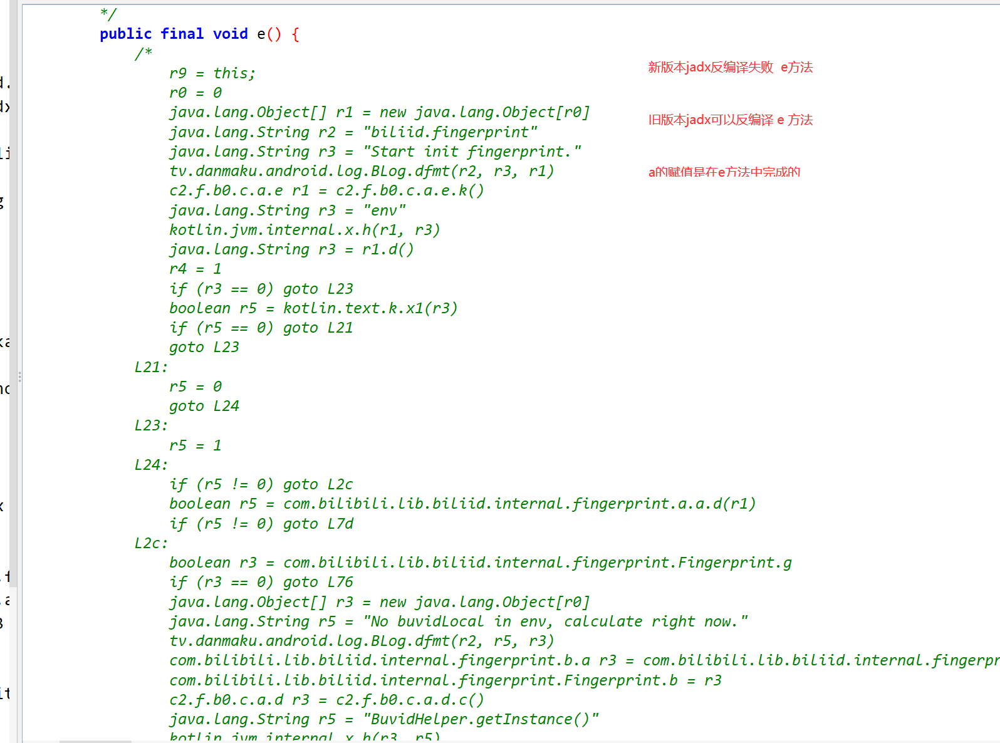

# 内容

# 1 目标

```python
#  上节课破解B站播放量接口
	-请求体加密
    -没有破解请求头中的参数
        buvid
        session_id
        fp_local（有点难度）
```


# 2 抓包分析

```python
# 播放量增加接口
# 接口是：
# 经过多次测试，找到接口
https://api.bilibili.com/x/report/click/android2
    
# 请求为
	-地址：https://api.bilibili.com/x/report/click/android2
    -请求方式：POST
    -请求体:(二进制形式)  上次课破解了
		一堆二进制	
    -请求头：
        buvid	
        device-id	
        fp_local	
        fp_remote
```


# 3 buvid破解

```python
# 1 反编译app---》把app拖入 jadx中---》搜索report/click/android2
# 2 只有一个
public interface a {
    @POST("/x/report/click/android2")
    @RequestInterceptor(com.bilibili.okretro.f.c.class) # 请求头一般会在拦截器中
    com.bilibili.okretro.d.a<String> reportClick(@Body c0 c0Var); # 之前读过，没发现请求头的数据
}


#3 查看com.bilibili.okretro.f.c.class 拦截器
public class c extends a {
    @Override 
    public final b0 a(b0 b0Var) {
        # 1 传入参数b0Var对象，调用对象的h方法 返回了h变量
        b0.a h = b0Var.h();
        # 2 调用e，把h变量传入---》核心
        # java中喜欢 调用某个东西，返回一个类的对象，把对象传入一个函数中，在函数中对对象进行操作
        # 核心：就在这里面放了请求头的数据
        e(h);
        # 3 返回了h 对象调用b方法
        return h.b();
    }
}

# 4 e(h)---》我们要破解的 Buvid，Device-ID，fp_local都在这里生成并放入的
public void e(b0.a aVar) {
    String a2 = com.bilibili.api.d.a();
    if (!TextUtils.isEmpty(a2)) {
        aVar.h("Display-ID", a2);
    }
    String a3 = com.bilibili.api.c.a();
    if (!TextUtils.isEmpty(a3)) {
        aVar.h("Buvid", a3);
    }
    String c3 = com.bilibili.api.a.c();
    if (!TextUtils.isEmpty(c3)) {
        aVar.h("User-Agent", c3);
    }
    String a4 = com.bilibili.api.e.a();
    if (!TextUtils.isEmpty(a4)) {
        aVar.h("Device-ID", a4);
    }
    String j2 = com.bilibili.api.a.j();
    if (!TextUtils.isEmpty(j2)) {
        aVar.h("fp_local", j2);
    }
    String k = com.bilibili.api.a.k();
    if (!TextUtils.isEmpty(k)) {
        aVar.h("fp_remote", k);
    }
    String m2 = com.bilibili.api.a.m();
    if (TextUtils.isEmpty(m2)) {
        return;
    }
    aVar.h("session_id", m2);
}


# 5 buvid核心代码如下
# 调用com.bilibili.api.c.a 得到buvid，如果返回不是空，就追加到请求头中
String a3 = com.bilibili.api.c.a(); # 这句话生产的buvid
if (!TextUtils.isEmpty(a3)) {
    aVar.h("Buvid", a3);
}


# 6 生成buvid的核心：com.bilibili.api.c.a
# c是一个类，a是c这个类的类[静态]方法
public class c {
    private static String a;

    public static String a() {
        return a; # 直接把a返回，a就是buvid---》找到a在哪里赋值的
    }

    public static void b(String str) {
        a = str; # a在这里赋值了，str就是buvid---》目标：找到谁调用了b，传入了buvid
    }
}


# 7 两种方案找到谁调用了com.bilibili.api.c类的b方法传入的字符串，传入的字符串就是buvid
	-1 直接查找用例--》在b上，右键--》查找用例--》之前学过，我们是会的
        private void e(@Nullable String str) {
            com.bilibili.api.c.b(str);
        }
    -2 hook一下b，打印它的调用栈信息---》我们就能知道是谁调用了b
    	at com.bilibili.api.c.b(Native Method)  #看谁调用了它
        at c2.f.b0.c.a.d.e(BL:1)  # c2.f.b0.c.a.d类的e方法调用了 b
        at c2.f.b0.c.a.d.a(BL:11) # c2.f.b0.c.a.d类的a方法调用了 e
        at tv.danmaku.bili.utils.x.a(BL:14)
        at tv.danmaku.bili.proc.y.f(BL:1)
        at tv.danmaku.bili.proc.c.run(Unknown Source:2)
        at android.os.Handler.handleCallback(Handler.java:938)
        at android.os.Handler.dispatchMessage(Handler.java:99)
        at android.os.Looper.loop(Looper.java:223)
        at android.os.HandlerThread.run(HandlerThread.java:67)
# 8通过调用栈，我们知道了com.bilibili.api.c.b 方法是被 c2.f.b0.c.a.d类的e方法调用的
	-直接看：c2.f.b0.c.a.d 的e方法
    public final class d {
        private String a;
        private void e(@Nullable String str) { # 还得看谁调用了e，传入了buvid
            com.bilibili.api.c.b(str); # 这个str就是buvid
        }
    }
    
# 9 c2.f.b0.c.a.d类的 a 方法调用了e，传入了buvid
    public String a() {
        String str;
            synchronized (d.class) {
                str = this.a; #this.a 就是buvid
            }
        	# 在这里调用了e，传入了str，str就是buvid，str是上面this.a 赋值的
            e(str);
        }
        return str;
    }
# 10 找到this.a 是在哪赋值的，它就是buvid
public final class d {
	private String a; # 是私有变量，它的赋值，肯定在类内部
}

# 11 找到对a赋值的位置  this.a 是buvid
public  void d() {
    #1 buvid可能是MiscHelperKt.d(e.k().b())生成的
    # 先去xml中取，取不到，去内存中取，如果取不到返回空（没写笔记，自己点进去看）
    String d = MiscHelperKt.d(e.k().b());
    if (!TextUtils.isEmpty(d)) {
        synchronized (d.class) {
            this.a = d;
        }
        return;
    }
    #2  buvid可能是MiscHelperKt.d(e.k().c()) 生成的
    # 先去xml中取，取不到，去内存中取，如果取不到返回空（没写笔记，自己点进去看）
    String d2 = MiscHelperKt.d(e.k().c());
    if (!TextUtils.isEmpty(d2)) {
        synchronized (d.class) {
            this.a = d2;
        }
        return;
    }
    # 3 buvid可能是c2.f.b0.c.b.a.c.a().toUpperCase() 转成大写
    # 生成buvid的位置：程序一启动就生成，以后直接从 xml，内存中取了使用
    # c2.f.b0.c.b.a.c.a() 这里生成了buvid
    String upperCase = c2.f.b0.c.b.a.c.a().toUpperCase();
    synchronized (d.class) {
        this.a = upperCase;
        if (!TextUtils.isEmpty(upperCase)) {
            e.k().u(this.a); # 生成后，放到xml中和内存中，以后直接从xml和内存中取，就不变了
        }
    }
}

# 12 c2.f.b0.c.b.a.c.a() 生成buvid
public static String a() {
    Application f = BiliContext.f();
    # 1 获取手机状态：获取到状态字符串后，执行e(字符串)+使用md5加密字符串加密
    String b2 = com.bilibili.lib.biliid.utils.f.c.b(f);
    if (!TextUtils.isEmpty(b2) && com.bilibili.lib.biliid.utils.f.d.b(b2)) {
        # 生成位置
        String d = com.bilibili.commons.m.a.d(b2);
        return "XZ" + e(d) + d;
    }
    #2 读mac地址 String a2 = z.a("wlan.lge.wifimac")  字符串：执行 XY+e(d2) + d2
    String j2 = com.bilibili.lib.biliid.utils.f.a.j(f);
    if (!TextUtils.isEmpty(j2) && com.bilibili.lib.biliid.utils.f.d.c(j2)) {
        String d2 = com.bilibili.commons.m.a.d(j2);
        return "XY" + e(d2) + d2;
    }
    # 3 XX获取andriodid ：a = Settings.Secure.getString(context.getContentResolver(), "android_id");
    String a2 = com.bilibili.lib.biliid.utils.f.c.a(f);
    if (!TextUtils.isEmpty(a2) && com.bilibili.lib.biliid.utils.f.d.a(a2)) {
        String d4 = com.bilibili.commons.m.a.d(a2);
        return "XX" + e(d4) + d4;
    }
    # 4 e.k().i()是uuid，替换掉uuid中的 - 为 ''
    String replace = e.k().i().replace(com.bilibili.base.util.d.f, "");
    return "XW" + e(replace) + replace;
}


# 13 e 方法的代码--》取出字符串第2个位置，第12个位置，第22个位置转成字符串 返回
private static String e(@NonNull String str) {
    try {
        StringBuilder sb = new StringBuilder();
        sb.append(str.charAt(2));
        sb.append(str.charAt(12));
        sb.append(str.charAt(22));
        return sb.toString();
    } catch (IndexOutOfBoundsException unused) {
        return Constant.DEFAULT_CVN2;
    }
}


# 14 buvid的生成核心
	1 XZ开头的：XZ+手机状态返回的字符串md5后 取2,12，22个位置字符+md5(手机状态字符串)
	2 XY开头的：XY+手机mac地址字符串 md5后 取2,12，22个位置字符+md5(手机mac地址字符串)
	3 XX开头的：XX+手机andriodid字符串 md5后 取2,12，22个位置字符+md5(手机andriodid字符串)
    4 XW开头的：XW+uuid字符串去掉-后 md5后 取2,12，22个位置字符+uuid字符串去掉-后
    
# 15  以上，用哪种都可以
	-简单方案，就是XW 的uuid方案
```


## 3.1 hook--b--查看b的调用栈

```python
##### 如果不打印，重装一个app，再运行脚本即可### 

import frida
import sys

rdev = frida.get_remote_device()
pid = rdev.spawn(["tv.danmaku.bili"])
session = rdev.attach(pid)

scr = """
Java.perform(function () {
    var c = Java.use("com.bilibili.api.c");

    c.b.implementation = function(arg0){   
       console.log("buvid=",arg0);
       console.log(Java.use("android.util.Log").getStackTraceString(Java.use("java.lang.Throwable").$new()));
       this.b(arg0);
    }
});
"""
script = session.create_script(scr)


def on_message(message, data):
    print(message, data)


script.on("message", on_message)
script.load()
rdev.resume(pid)
sys.stdin.read()

'''
buvid= XX6282668121FF8B3256F67E76387E4253613
java.lang.Throwable
	at com.bilibili.api.c.b(Native Method)
	at c2.f.b0.c.a.d.e(BL:1)
	at c2.f.b0.c.a.d.a(BL:11)
	at tv.danmaku.bili.utils.x.a(BL:14)
	at tv.danmaku.bili.proc.y.f(BL:1)
	at tv.danmaku.bili.proc.c.run(Unknown Source:2)
	at android.os.Handler.handleCallback(Handler.java:938)
	at android.os.Handler.dispatchMessage(Handler.java:99)
	at android.os.Looper.loop(Looper.java:223)
	at android.os.HandlerThread.run(HandlerThread.java:67)


'''
```


## 3.2 两种方案生成buvid（用哪个都可以）

```python

#### mac地址方案
# 第1步：随机生成mac地址
# 第2步：对mac地址进行md5加密
# 第3步：xy + c.e(md5结果) + md5密文
# 	  xy + md5结果[2] + md5结果[12] + md5结果[22] + 结果
# 第4步：变大写

## uuid方案
# 第1步：生成uuid，去掉中间的 -
# 第2步：xw + c.e(uuid) + uuid
# 	  xy +uuid取了 [2] + [12] + [22] + 结果
# 第3步：变大写

import uuid
import hashlib
import random


def create_random_mac(sep=":"):
    # 00:90:4C:11:22:33
    data_list = []
    for i in range(1, 7):
        part = "".join(random.sample("0123456789ABCDEF", 2))
        data_list.append(part)
    mac = sep.join(data_list)
    return mac


def get_buvid_by_wifi_mac():
    mac = create_random_mac()
    md5 = hashlib.md5()
    md5.update(mac.encode('utf-8'))
    v0_1 = md5.hexdigest()
    return "XY{}{}{}{}".format(v0_1[2], v0_1[12], v0_1[22], v0_1).upper()


if __name__ == '__main__':
    buvid = get_buvid_by_wifi_mac()
    print(buvid)


###uuid方案
import uuid
u=str(uuid.uuid4()).replace('-','')
print("XW{}{}{}{}".format(u[2], u[12], u[22], u).upper())

```


# 4 session_id破解

```python
# 1 找到session_id位置---》com.bilibili.api.a.m 生成的session_id
String m2 = com.bilibili.api.a.m();
if (TextUtils.isEmpty(m2)) {
    return;
}
aVar.h("session_id", m2);
# 2 查看com.bilibili.api.a.m
public static String m() {
    a();
    # 调用b对象的getSessionId方法--》返回的 session_id字符串
    # 确认 b 是谁的对象，去b的类中找到 getSessionId方法即可
    return b.getSessionId();
}

# 3 直接双击进入---》发现getSessionId  是个接口---》没有具体实现---》找到是那个类的对象--》真正的实现了getSessionId

# 4 确定 b 是谁---》找到b的赋值位置
# 某个位置调用了 o 传入了 一个对象，这个对象 有个 getSessionId 方法
public static void o(b bVar) {
    b = bVar;
}


# 5 hook 一下 o方法，打印传入参数的类型--》就能确定 bVar也就是b是什么类型
   确认这个类：tv.danmaku.bili.utils.p.a
   直接搜索类：找到a类

# 6 搜索 tv.danmaku.bili.utils.p 这个类下的a类
找到a这个类，查看它的getSessionId
 public static final class a implements a.b {
     public String getSessionId() {
         return com.bilibili.lib.foundation.e.b().getSessionId();
     }
 }


# 7 确认 com.bilibili.lib.foundation.e.b() 具体是那个类？
# com.bilibili.lib.foundation.e.b()
public static final a b() {
    return d.g.b().d(); # 确认 d.g.b().d() 执行结果是那个类的对象
}

# 8 hook--d.g.b().d()确定返回值是那个类的对象，去这个类中找到getSessionId
'''确定了
它是接口类型的对象：com.bilibili.lib.foundation.a
具体类型是：com.bilibili.lib.foundation.DefaultApps---》getSessionId
'''

# 9 搜索：com.bilibili.lib.foundation.DefaultApps

public final class DefaultApps implements com.bilibili.lib.foundation.a {
    public String getSessionId() {
        #1 去xml中取，取不到，返回了l
        String string = e.e().getString("foundation:session_id", l);
        if (string == null) {
            x.K();
        }
        return string;
    }
}

# 10 核心代码：e.e().getString("foundation:session_id", l) 
	去xml中按foundation:session_id取，如果取不到，就返回l
    l是成员变量
# 11 l的生成
static {
    byte[] bArr = new byte[4]; # 生成4字节数组
    new Random().nextBytes(bArr);# 随机填入字节
    String hex = ByteString.of(bArr, 0, 4).hex();# 转成16进制
    l = hex;
}

# 12 session_id的生成：
	随机4个字节--》转成16进制，不足两位用0补齐---》总共8位
    6a  e8  7c   4b
```

## 4.1 hook--o--确认b的类型

```python
import frida
import sys

rdev = frida.get_remote_device()
pid = rdev.spawn(["tv.danmaku.bili"])
session = rdev.attach(pid)

scr = """
Java.perform(function () {
    var a = Java.use("com.bilibili.api.a");

    a.o.implementation = function(arg0){   
       console.log("obj=",arg0);
       console.log("obj=",JSON.stringify(arg0));
       this.o(arg0);
    }
});
"""
script = session.create_script(scr)


def on_message(message, data):
    print(message, data)


script.on("message", on_message)
script.load()
rdev.resume(pid)
sys.stdin.read()

'''
obj= [object Object]
obj= "<instance: com.bilibili.api.a$b, $className: tv.danmaku.bili.utils.p$a>"
# 可以看到：是com.bilibili.api.a$b接口类型
# 具体类型是：tv.danmaku.bili.utils.p$a

'''
```

## 4.2 hook--e的b方法--查看具体返回什么类型

```python
import frida
import sys

rdev = frida.get_remote_device()
pid = rdev.spawn(["tv.danmaku.bili"])
session = rdev.attach(pid)

scr = """
Java.perform(function () {
    var e = Java.use("com.bilibili.lib.foundation.e");

    e.b.implementation = function(){   
        var res = this.b();
       console.log("res=",JSON.stringify(res));
       return res;
    }
});
"""
script = session.create_script(scr)


def on_message(message, data):
    print(message, data)


script.on("message", on_message)
script.load()
rdev.resume(pid)
sys.stdin.read()


'''
res= "<instance: com.bilibili.lib.foundation.a, $className: com.bilibili.lib.foundation.DefaultApps>"
真正的类是：com.bilibili.lib.foundation.DefaultApps

'''
```

## 4.3 python 生成session_id

```python
# python 3.9及以后
import random
session_id = "".join([hex(item)[2:] for item in random.randbytes(4)])
print(session_id)


# python 3.8及以前
import random
session_id = "".join([hex(random.randint(0,255))[2:] for i in range(4)])
print(session_id)
```


# 5 fp_local 破解

```python
# 1 找到fp_local的位置
String j2 = com.bilibili.api.a.j();
if (!TextUtils.isEmpty(j2)) {
    aVar.h("fp_local", j2);
}

# 2 com.bilibili.api.a.j代码
public static String j() {
    a();
    return b.F(); # b.F生成的---》b接口类型--》F是个接口没有具体实现
}

# 3 b 是接口类型的对象，上面破解session_id的时候，知道了b是 tv.danmaku.bili.utils.p$a的对象
	tv.danmaku.bili.utils.p$a
    
# 4 查找：tv.danmaku.bili.utils.p.a 类的F方法
public String F() {
    String a = c2.f.b0.c.a.c.a();
    return a; # 返回的a 就是fp_local
}

# 5 查看代码：c2.f.b0.c.a.c.a()
public static String a() {
    return Fingerprint.h.c(); # 返回值就是fp_local
}

# 6 继续查看 Fingerprint.h.c()
public final String c() {
    String str = ""; # 空的
    if (k()) {
        ReentrantReadWriteLock.ReadLock r = e;
        x.h(r, "r");
        r.lock();
        try {
            # 使用a对str赋值了，a 是类的变量--》去类中找 a是如何生成的
            if (a != null && (str = a) == null) {
                x.Q("buvidLocal");
            }
        } finally {
            r.unlock();
        }
    }
    return str; # 就是fp_local--》a赋值给了它--》所以a就是fp_local-->
}

# 7 去类中找 a ，a 是类属性，在类内部直接使用 a
	public static String a;
# 8 在类中找，发现找不到---》新版本的jadx反编译后，代码没反编译全，找不到a的赋值位置
	这个类中：e和f方法都没正常返编译---》换了一个旧版本：1.2.0-->发现可以顺利反编译
    
    
# 9 使用 1.2.0 的jadx打开apk---》扩大内存--》搜索  Fingerprint 类--》找a的赋值位置
	a = d2; # 找到了a的赋值位置，继续找d2的生成--》d2就 fp_local
    
    
    
# 10 d2 的生成方案
	1 String d2 = k.d(); # 读起来不好找--》先去xml中读，xml中没有又去内存中找
    2 d2 = com.bilibili.lib.biliid.internal.fingerprint.a.a.a(a2, aVar); # 直接看这个位置

# 11 查看：d2 = com.bilibili.lib.biliid.internal.fingerprint.a.a.a(a2, aVar);

public static final String a(String str, com.bilibili.lib.biliid.internal.fingerprint.b.a aVar) {
    String str2 = MiscHelperKt.a(f(str, aVar)) + h() + MiscHelperKt.a(g());
    return str2 + b(str2);
}

# 12 核心
	1 执行 f(str, aVar),调用 MiscHelperKt.a 得到字符串
    2 拼接了 h()
    3 拼接了 执行 g()，调用了MiscHelperKt.a 得到了字符串
    4 最终 把 上面的字符串+b(上面的字符串)  # fp_local的生成
    
    
# 13 读：抓包抓到的fp_local=2cbf1dbb4af112fafc0a754f02011305202401092030210ff1a1eb78af53efa3
	f(str, aVar)：使用md5对buvid+手机型号+手机品牌进行加密
    h()：当前时间戳
    g()：随机生成8个字节返回
    MiscHelperKt.a
    b()
    
# 14 简单的：h()--->当前时间戳
private static final String h() {
        String format = a.format(new Date(System.currentTimeMillis()));
        return format;
    }

# 15 读 f(str, aVar)-->使用md5对buvid+手机型号+手机品牌进行加密
private static final byte[] f(String str, com.bilibili.lib.biliid.internal.fingerprint.b.a aVar) {
        Map<String, String> a2 = aVar.a();
    	# a2是个map字典，取出了手机型号（model）和手机品牌（band）
    	# str 就是buvid--》hook出来的
    	# 最终调用e加密了--》e是md5加密
        return e(str + a2.get(PersistEnv.KEY_PUB_MODEL) + a2.get("band"));
    }
# 使用md5对buvid+手机型号+手机品牌进行加密

# 16 e就是md5加密
 private static final byte[] e(String str) {
        try {
            MessageDigest instance = MessageDigest.getInstance("MD5");
            Charset forName = Charset.forName("UTF-8");
            x.h(forName, "Charset.forName(\"UTF-8\")");
            if (str != null) {
                byte[] bytes = str.getBytes(forName);
                x.h(bytes, "(this as java.lang.String).getBytes(charset)");
                byte[] digest = instance.digest(bytes);
                x.h(digest, "digest");
                return digest;
            }
            throw new TypeCastException("null cannot be cast to non-null type java.lang.String");
        } catch (Exception unused) {
            return new byte[16];
        }
    }

# 17 读 g()：随机生成8个字节返回
private static final byte[] g() {
    # 随机生成 8 个字节返回
    byte[] a2 = com.bilibili.commons.e.a(8);
    x.h(a2, "RandomUtils.nextBytes(SALT_BYTES)");
    return a2;
}
# 18 com.bilibili.commons.e.a 随机生成传入数字大小的字节数

public static byte[] a(int i) {
    byte[] bArr = new byte[i]; # new出传入数字大小的 byte数组
    a.nextBytes(bArr);# 随机填入字节，返回
    return bArr;
}


#19 读：MiscHelperKt.a--》源码如下
  public static final String a(byte[] bArr) {
      	# 调用了f.Oe--->跳到声明--》跳不进去了--》不是用java写的 kotlion--》jadx反编译不出来
        return f.Oe(bArr, "", null, null, 0, null, MiscHelperKt$asHex$1.INSTANCE, 30, null);
    }

# 20 换一款反编译工具：GDA 
	-GDA：下载地址：http://www.gda.wiki:9090/  使用免费版就够了
    -下载，解压开即用--》把apk拖入即可
    
# 21 在GDA中搜索： MiscHelperKt 类
    public static final String a(byte[] p0){
       x.q(p0, "$this$asHex");
       return f.Oe(p0, "", null, null, 0, null, MiscHelperKt$asHex$1.INSTANCE, 30, null);
    }

# 22 查看 f.Oe
public static String Oe(byte[] p0,CharSequence p1,CharSequence p2,CharSequence p3,int p4,CharSequence p5,l p6,int p7,Object p8){
       return ArraysKt___ArraysKt.Oe(p0, p1, p2, p3, p4, p5, p6, p7, p8);
    }
# 23 ArraysKt___ArraysKt.Oe
public static String Oe(byte[] p0,CharSequence p1,CharSequence p2,CharSequence p3,int p4,CharSequence p5,l p6,int p7,Object p8){
       String str;
       String str2;
       int i1;
       if ((p7 & 0x01)) {
          str = ", ";
       }
       String str1 = "";
       p8 = ((p7 & 0x02))? str1: p2;
       if (!((p7 & 0x04))) {
          str1 = p3;
       }
       int i = ((p7 & 0x08))? -1: p4;
       if ((p7 & 0x10)) {
          str2 = "...";
       }
       String str3 = str2;
       if ((p7 & 0x20)) {
          p6 = null;
       }
       return ArraysKt___ArraysKt.Fe(p0, str, p8, str1, i, str3, p6);
    }

# 24 ArraysKt___ArraysKt.Fe
    public static final String Fe(byte[] p0,CharSequence p1,CharSequence p2,CharSequence p3,int p4,CharSequence p5,l p6){
       String str = ArraysKt___ArraysKt.ne(p0, "", p1, p2, p3, p4, p5, p6);
       return str;
    }

# 25 ArraysKt___ArraysKt.ne
public static final Appendable ne(byte[] p0,Appendable p1,CharSequence p2,CharSequence p3,CharSequence p4,int p5,CharSequence p6,l p7){
       p1.append(p3);
       int len = p0.length;
       int i = 0;
       int i1 = 0;
       while (true) { # 起了一个死循环
          if (i < len) {
             byte b = p0[i];
             if ((i1 = i1 + 1) > 1) {
                p1.append(p2);
             }
             if (p5 < 0 || i1 <= p5) {
                if (p7 != null) {
                   # p7是当时调用oE传入的MiscHelperKt$asHex$1.INSTANCE 单例对象
                   # 查看：MiscHelperKt$asHex$1的invoke方法
                   # 把传入的字符串，一个一个字符循环调用 p7.invoke
                   # invode 是把传入的字符转成16进制，不足两位用0补齐
                   p1.append(p7.invoke(Byte.valueOf(b)));
                }else {
                   p1.append(String.valueOf(b));
                }
                i = i + 1;
             }else if(p5 >= 0 && i1 > p5){
                p1.append(p6);
                break ;
             }
             break ;
          }else {
          }
       }
       p1.append(p4);
       return p1;
    }


# 26 找到 MiscHelperKt$asHex$1 的invoke方法
public final class MiscHelperKt$asHex$1 extends Lambda implements l<Byte, String> {
    public static final MiscHelperKt$asHex$1 INSTANCE = new MiscHelperKt$asHex$1();

    public final String invoke(byte b) {
        e0 e0Var = e0.a;
        String format = String.format("%02x", Arrays.copyOf(new Object[]{Byte.valueOf(b)}, 1));
        x.h(format, "java.lang.String.format(format, *args)");
        return format;
    }
}


# 27 MiscHelperKt.a 核心 是把传入的字符串 ，循环一个个字符取出来转成16进制，不足两位用0补齐
	MiscHelperKt.a(MD5(buvid+手机品牌+手机型号)) + h() + MiscHelperKt.a(随机生成8个字节)
    '''
    MiscHelperKt.a(md5(buvid+手机型号+手机品牌))：1d6a9c1ac4f284329263021dc511149f
	h():20230810190748636
    MiscHelperKt.a(随机生成8个字符):c2890a1385da9
    '''

    
# 28 最终 看b
String str2 = MiscHelperKt.a(f(str, aVar)) + h() + MiscHelperKt.a(g());
return str2 + b(str2);

# 29 b() 的核心代码如下
public static final String b(String str) {
    int i;
    i iVar = q.S0(q.n1(0, Math.min(str.length() - 1, 62)), 2);
    # 1 从iVar变量中取出了 三个数字  g  h  i--》猜它应该是固定的--》hook验证
    int g = iVar.g();
    int h = iVar.h();
    int i2 = iVar.i();
    if (i2 < 0 ? g >= h : g <= h) {
        i = 0;
        while (true) {
            # 2 把传入的字符串，按 三个数字截取
            String substring = str.substring(g, g + 2);
            i += Integer.parseInt(substring, b.a(16));
            if (g == h) {
                break;
            }
            g += i2;
        }
    } else {
        i = 0;
    }
    e0 e0Var = e0.a;
    #3 把截取完的，转成16进制，不足两位用两位补齐
    String format = String.format("%02x", Arrays.copyOf(new Object[]{Integer.valueOf(i % 256)}, 1));
   
    return format;
}


# 30 b() 总结：
	把传入的字符串，按固定的位置取出来，转成16进制
    
# 31 确认 数字是固定值
int g = iVar.g();  # 0
int h = iVar.h();  # 60 
int i2 = iVar.i(); # 2

# 32 hook得到g-h-i2的值  0  60  2


# 33 总结：
String str2 = MiscHelperKt.a(f(str, aVar)) + h() + MiscHelperKt.a(g());
return str2 + b(str2); # 返回值就是fp_local
# f(str, aVar)：使用md5对buvid+手机型号+手机品牌进行加密
# h()：当前时间戳
# g()：随机生成8个字节返回
# MiscHelperKt.a：是把传入的字符串 ，循环一个个字符取出来转成16进制，不足两位用0补齐
# b()：把传入的字符串，按固定的位置取出来，转成16进制 就两位  4b
```




## 5.1 hook得到g-h-i2的值

```python
import frida
import sys
from frida.core import Device

rdev = frida.get_remote_device()
session = rdev.attach("哔哩哔哩")

scr = """
Java.perform(function () {
    var a = Java.use("com.bilibili.lib.biliid.internal.fingerprint.a.a");
    a.b.implementation = function(str){   
       console.log("参数=",str);
       var res = this.b(str);
       console.log("结果=",res);
       return res;
    }
    
    var q = Java.use("kotlin.g0.q");
    q.S0.implementation = function(iVar,i ){   
       var res = this.S0(iVar,i);
       console.log('g=',res.g());
       console.log('h=',res.h());
       console.log('i=',res.i());
       return res;
    }

});
"""
script = session.create_script(scr)

script.load()
sys.stdin.read()

'''

参数= a2d2ceff7d22f8fe4167e9cf389e88ed2023032317424507d8304083431dd8
g= 0
h= 60
i= 2
结果= 92

arg8参数-> ebd3c8c59b86464ebdbbc1c5a6fdfcde20211031221728cd035396399a661a
生成的值->g= 0
生成的值->h= 60
生成的值->i2= 2
生成的值-> 6a


arg8参数-> ebd3c8c59b86464ebdbbc1c5a6fdfcde202110312218403c321d4a34a9ba22
生成的值->v3= 0
生成的值->v4= 60
生成的值->v0_1= 2
生成的值-> 05


arg8参数-> ebd3c8c59b86464ebdbbc1c5a6fdfcde20211031221924d1d1602203c78c79
生成的值->v3= 0
生成的值->v4= 60
生成的值->v0_1= 2
生成的值-> 4f

'''
```

## 5.2 b方法使用python实现

```python
arg8 = "ebd3c8c59b86464ebdbbc1c5a6fdfcde20211031221924d1d1602203c78c79"
v3 = 0
v4 = 60
v0_1 = 2
v5 = 0

while True:
    v6 = arg8[v3:v3 + 2]
    v5 += int(v6, base=16)
    if v3 != v4:
        v3 += v0_1
        continue
    break
data = "%02x" % (v5 % 0x100,)
print(data)
```

## 5.3 fp_local 实现代码

```python
import hashlib
import datetime
import random


def gen_local_v1(buvid, phone_model, phone_band):
    """
    fp_local和fp_remote都是用这个算法来生成的，在手机初始化阶段生成 fp_local，
    :param buvid: 根据算法生成的buvid，例如："XYBA4F3B2789A879EA8AEEDBE2E4118F78303"
    :param phone_model:  手机型号modal，例如："Mate 10 Pro"
    :param phone_band:  手机品牌band，在模拟器上是空字符串（我猜是程序员想要写成 brand ）哈哈哈哈
    :return:
    """

    def misc_helper_kt(data_bytes):
        data_list = []
        v7 = len(data_bytes)
        v0 = 0
        while v0 < v7:
            v2 = data_bytes[v0]
            data_list.append("%02x" % v2)
            v0 += 1
        return ''.join(data_list)

    data_string = "{}{}{}".format(buvid, phone_model, phone_band)
    hash_object = hashlib.md5()
    hash_object.update(data_string.encode('utf-8'))
    data = hash_object.digest()

    arg1 = misc_helper_kt(data)
    arg2 = datetime.datetime.now().strftime("%Y%m%d%H%M%S")
    #arg3 = misc_helper_kt(random.randbytes(8))  # python3.9可以
    arg3 = misc_helper_kt([random.randint(1, 255) for i in range(8)])

    return "{}{}{}".format(arg1, arg2, arg3)


def a_b(arg8):
    v3 = 0
    v4 = 60
    v0_1 = 2
    v5 = 0
    while True:
        v6 = arg8[v3:v3 + 2]
        v5 += int(v6, base=16)
        if v3 != v4:
            v3 += v0_1
            continue
        break
    data = "%02x" % (v5 % 0x100,)
    return data


str2 = gen_local_v1("XYBA4F3B2789A879EA8AEEDBE2E4118F78303", "Mate 10 Pro", "")
fp_local = str2 + a_b(str2)
print(fp_local)
```

## 5.4 关于fp_remote

```python
# 关于fp_remote
样子 + fp_local不是相同，是相似，直接调用fp_local算法生成fp_remote发现可以用。

```

