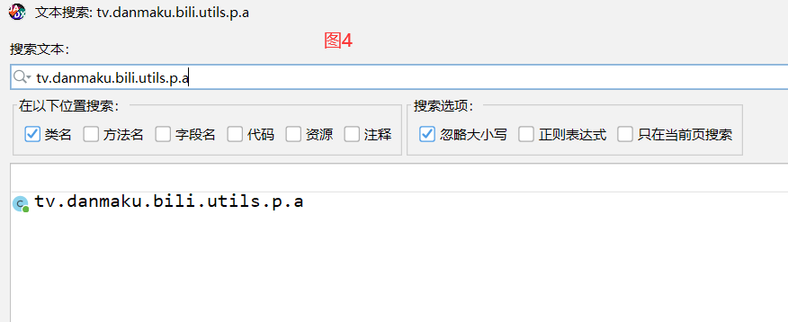
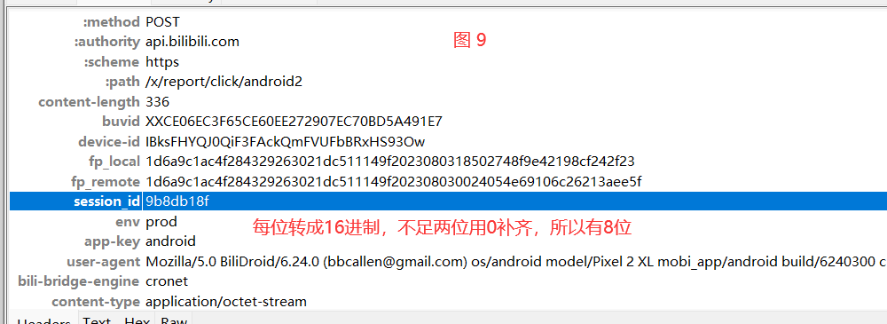

# 1 目标

```python
# 破解请求头
	buvid
    session_id
    fp_local
```


# 2 抓包分析

```python
# 经过多次测试，找到接口
https://api.bilibili.com/x/report/click/android2
    
# 请求为
	-地址：https://api.bilibili.com/x/report/click/android2
    -请求方式：POST
    -请求体:(二进制形式)
		一堆二进制	
    -请求头：
    buvid	
    device-id	
    fp_local	
    fp_remote	
    session_id # 可以去掉
```

# 3 buvid破解

```python
# 1 根据请求地址搜索：
public interface a {
    @POST("/x/report/click/android2")
    # RequestInterceptor注册一个拦截器--》com.bilibili.okretro.f.c.class--》请求头中的数据，都是在拦截器中放入的
    @RequestInterceptor(com.bilibili.okretro.f.c.class)
    # 读了reportClick
    com.bilibili.okretro.d.a<String> reportClick(@Body c0 c0Var);
}

# 2 查看com.bilibili.okretro.f.c.class 类的源码、
public class c extends a {
    @Override
    public final b0 a(b0 b0Var) {
        #1  b0Var参数，调用了h，完成了一些操作，返回 h --->是一个类的对象
        b0.a h = b0Var.h();
        #2 把得到的h，调用e方法，完成一些操作 调用e，把某个对象传入了
        # java中喜欢，把一个对象传到某个方法中，在方法中，操作这个对象，往对象中放值
        e(h);
        #3 返回了h.b()
        return h.b();
    }
}

# 3 看e(h)---》咱们要破的位置--找到了--》buvid，device-id	fp_local	session_id--》hook确认--》我不确认el
    public void e(b0.a aVar) {
        String a2 = com.bilibili.api.d.a();
        if (!TextUtils.isEmpty(a2)) {
            aVar.h("Display-ID", a2);
        }
        # 猜测，buvid在这里放---》hook一下确认e执行了--》不带你hook了，hook代码给你
        String a3 = com.bilibili.api.c.a();
        # 得到buvid的值，如果不为空，就放到请求头中
        if (!TextUtils.isEmpty(a3)) {
            aVar.h("Buvid", a3);
        }
        String c3 = com.bilibili.api.a.c();
        if (!TextUtils.isEmpty(c3)) {
            aVar.h("User-Agent", c3);
        }
        String a4 = com.bilibili.api.e.a();
        if (!TextUtils.isEmpty(a4)) {
            aVar.h("Device-ID", a4);
        }
        String j2 = com.bilibili.api.a.j();
        if (!TextUtils.isEmpty(j2)) {
            aVar.h("fp_local", j2);
        }
        String k = com.bilibili.api.a.k();
        if (!TextUtils.isEmpty(k)) {
            aVar.h("fp_remote", k);
        }
        String m2 = com.bilibili.api.a.m();
        if (TextUtils.isEmpty(m2)) {
            return;
        }
        aVar.h("session_id", m2);
    }


# 4 查看 String a3 = com.bilibili.api.c.a() 源码
    public class c {
        private static String a;
        public static String a() { # 返回了a，a放在内存中的变量---》什么时候给a赋值了
            return a; # 它就是buvid
        }

        public static void b(String str) {
            a = str;  # 这里对a赋值了，str就是buvid---》某个位置调了b，传入了buvid
        }
    }

# 5 两种方案去做：
	1 看看谁调用了b--》在b上查找用例--》咱们会
     private void e(@Nullable String str) {
            com.bilibili.api.c.b(str);
        }
    2 hook一下b，打印它的调用栈---》方法的调用顺序---》知道谁调用了b
    	at com.bilibili.api.c.b(Native Method) # hook了b
        at c2.f.b0.c.a.d.e(BL:1)  # c2.f.b0.c.a.d.e调用了b，把buvid传入了
        at c2.f.b0.c.a.d.a(BL:11) #c2.f.b0.c.a.d.a 里面调用了c2.f.b0.c.a.d.e
        at tv.danmaku.bili.utils.x.a(BL:14)
        at tv.danmaku.bili.proc.y.f(BL:1)
        at tv.danmaku.bili.proc.c.run(Unknown Source:2)
        at android.os.Handler.handleCallback(Handler.java:938)
        at android.os.Handler.dispatchMessage(Handler.java:99)
        at android.os.Looper.loop(Looper.java:223)
        at android.os.HandlerThread.run(HandlerThread.java:67)
        
 # 6 通过调用栈查看
	hook的它：com.bilibili.api.c.b--》是被c2.f.b0.c.a.d.e调用了----》e又被c2.f.b0.c.a.d.a调用了
    直接搜索：c2.f.b0.c.a.d类下有e方法
    
# 7 c2.f.b0.c.a.d类下有e方法--》str就是buvid--》被c2.f.b0.c.a.d.a的e调用时传入的
   private void e(@Nullable String str) {
        com.bilibili.api.c.b(str);
    }
    
 # 8 c2.f.b0.c.a.d.a 内部调用了e---》这里是str也就是buvid生成的真正位置
  public String a() {
        String str;
        synchronized (d.class) {
            str = TextUtils.isEmpty(this.a) ? "" : this.a;
        }
        if (TextUtils.isEmpty(str)) {
            com.bilibili.droid.thread.d.h(2, new Runnable() { // from class: c2.f.b0.c.a.a
                @Override 
                public final void run() {
                    d.this.d();
                }
            });
            synchronized (d.class) {
                # 要找到a在哪里赋值的，私有的，一定在类内找
                str = this.a;# this.a 就是str，就是buvid---》类内部用this就是对象，对象的a属性
            }
            # 调用了e，传入了buvid，str就是buvid
            e(str);
        }
        return str;
    }
# 9 代码删减后--this.a就是buvid
  public String a() {
        String str; # 一开始是空的
      	# 起了个线程，加锁---》在里面生成了 buvid--》赋值给了 对象.a
        com.bilibili.droid.thread.d.h(2, new Runnable() {d.class});
       # 对象.a-->buvid--->给了str--》调用e
        str = this.a;
        e(str);# str就是buvid
        return str;
    }
# 10 private String a 私有变量--》只能在类内部使用---》在类内部找到它的赋值位置即可
    public void d() {
        String d = MiscHelperKt.d(e.k().b()); # 1 第一层：e.k().b()得到--》去xml中找，找不到去内存中找
        if (!TextUtils.isEmpty(d)) {
            synchronized (d.class) {
                this.a = d;
            }
            return;
        }
        String d2 = MiscHelperKt.d(e.k().c());  #第二层：e.k().c() --从xml中找
        if (!TextUtils.isEmpty(d2)) {
            synchronized (d.class) {
                this.a = d2;
            }
            return;
        }
        String upperCase = c2.f.b0.c.b.a.c.a().toUpperCase(); # 第三层是：c2.f.b0.c.b.a.c.a()-》真正生成的核心位置
        synchronized (d.class) {
            this.a = upperCase;
            if (!TextUtils.isEmpty(upperCase)) {
                e.k().u(this.a);
            }
        }
    }

# 11 生成buvid的真正位置：c2.f.b0.c.b.a.c.a().toUpperCase()
	String upperCase = c2.f.b0.c.b.a.c.a().toUpperCase();

# 12 核心代码（可以hook测试）
    public static String a() {
        Application f = BiliContext.f();
        # 1 获取手机状态 ：android.permission.READ_PHONE_STATE 
        String b2 = com.bilibili.lib.biliid.utils.f.c.b(f);
        if (!TextUtils.isEmpty(b2) && com.bilibili.lib.biliid.utils.f.d.b(b2)) {
            String d = com.bilibili.commons.m.a.d(b2);
            return "XZ" + e(d) + d;
        }
        #2  读mac地址 String a2 = z.a("wlan.lge.wifimac");
        String j2 = com.bilibili.lib.biliid.utils.f.a.j(f);
        if (!TextUtils.isEmpty(j2) && com.bilibili.lib.biliid.utils.f.d.c(j2)) {
            String d2 = com.bilibili.commons.m.a.d(j2);
            return "XY" + e(d2) + d2;
        }
        #3 XX获取andriodid ：a = Settings.Secure.getString(context.getContentResolver(), "android_id");
        String a2 = com.bilibili.lib.biliid.utils.f.c.a(f);
        if (!TextUtils.isEmpty(a2) && com.bilibili.lib.biliid.utils.f.d.a(a2)) {
            String d4 = com.bilibili.commons.m.a.d(a2);
            return "XX" + e(d4) + d4;
        }
        # 4 uuid ：e.k().i() 获取uuid UUID.randomUUID().toString()
        #e.k().i()本质是uuid--》替换掉了把 - 替换成了空--》String uuid = UUID.randomUUID().toString();

        String replace = e.k().i().replace('-', "");
        return "XW" + e(replace) + replace;
    }


    # replace  是uuid
    "XW" + e(replace) + replace

# 13 e是什么--》str是uuid去掉了 - 
	#str是mac
    #str是android_id
	# 取了第2个位置--》取了第12个位置--》取了第22位位置--》转成字符串

    private static String e(@NonNull String str) {
        try {
            StringBuilder sb = new StringBuilder();
            sb.append(str.charAt(2)); # 
            sb.append(str.charAt(12));
            sb.append(str.charAt(22));
            return sb.toString();
        } catch (IndexOutOfBoundsException unused) {
            return Constant.DEFAULT_CVN2;
        }
    }
# 14 python复现代码

```


```python
# 1 我们根据增加播放的接口url地址搜索---》如图1
   @POST("/x/report/click/android2")
   @RequestInterceptor(com.bilibili.okretro.f.c.class)
   com.bilibili.okretro.d.a<String> reportClick(@Body c0 c0Var);


# 2 图1中使用了拦截器  c.class 类---》我们看c.class类---》图2
	-java中常用方式--》把一个类的【对象】传入到一个方法中，在方法中执行一些操作，放入一些数据，这样这个对象中就有很多数据，然后在调用【对象】的方法返回
    -图2就是典型案例，所以e方法是对对象h增加了很多属性
    public class c extends a {
    @Override
    public final b0 a(b0 b0Var) {
        b0.a h = b0Var.h();
        e(h);
        return h.b();
    }
}

# 3 我们查看e(h)--->图3
	发现e内部在放入buvid，session_id 等我们要破解的字段
    public void e(b0.a aVar) {
        String a2 = com.bilibili.api.d.a();
        if (!TextUtils.isEmpty(a2)) {
            aVar.h("Display-ID", a2);
        }
        String a3 = com.bilibili.api.c.a();
        if (!TextUtils.isEmpty(a3)) {
            aVar.h("Buvid", a3);
        }
        String c3 = com.bilibili.api.a.c();
        if (!TextUtils.isEmpty(c3)) {
            aVar.h("User-Agent", c3);
        }
        String a4 = com.bilibili.api.e.a();
        if (!TextUtils.isEmpty(a4)) {
            aVar.h("Device-ID", a4);
        }
        String j2 = com.bilibili.api.a.j();
        if (!TextUtils.isEmpty(j2)) {
            aVar.h("fp_local", j2);
        }
        String k = com.bilibili.api.a.k();
        if (!TextUtils.isEmpty(k)) {
            aVar.h("fp_remote", k);
        }
        String m2 = com.bilibili.api.a.m();
        if (TextUtils.isEmpty(m2)) {
            return;
        }
        aVar.h("session_id", m2);
    }

# 4 hook一下看位置是否正确 -->代码如 3.1 

# 5 断定buvid是由com.bilibili.api.c.a生成的--》String a3 = com.bilibili.api.c.a();
# 6 com.bilibili.api.c.a()的代码---》图4
	buvid是调用a()返回的，a()中返回了私有变量a，我们需要找到私有变量a赋值的地方--》b
    	-1 我们通过查找b的用例，确定谁调用了b
        -2 我们通过hook--》b，打印调用栈，确定谁调用了b【今天我们用这种方式】
# 7 通过打印调用栈，确定：c2.f.b0.c.a.e 调用了b把buvid传入了--》图5  
	at com.bilibili.api.c.b(Native Method)
	at c2.f.b0.c.a.d.e(BL:1)
	at c2.f.b0.c.a.d.a(BL:11)
	at tv.danmaku.bili.utils.x.a(BL:14)
	at tv.danmaku.bili.proc.y.f(BL:1)
	at tv.danmaku.bili.proc.c.run(Unknown Source:2)
	at android.os.Handler.handleCallback(Handler.java:938)
	at android.os.Handler.dispatchMessage(Handler.java:99)
	at android.os.Looper.loop(Looper.java:223)
	at android.os.HandlerThread.run(HandlerThread.java:67)
    
# 8 通过调用栈继续寻找--》调了c2.f.b0.c.a.d.a 后又调用了c2.f.b0.c.a.d.e，我们继续看c2.f.b0.c.a.d.a--》图6
	-所以c2.f.b0.c.a.d.a返回的str其实就是buvid
    -我们查看buvid是如何生成的--》代码简化后
	public String a() {
        String str;
        com.bilibili.droid.thread.d.h(2, d.class) # 本质就是把使用多线程把当前类传入，生成a后，赋值给this.a
        # 因为a是私有的，所以只能在类内部修改a的值
        str = this.a;  #核心代码，如果str位空，调用com.bilibili.droid.thread.d.h得到后，把this.a赋值给str
        e(str);
        return str;
    }
# 9 我们去找this.a 是在哪里赋值的--》图7--》可以hook一下--》我就不hook了
    public  void d() {
        # 查看b()声明---》String t = l().t();--》查看t的声明--》return c().getString("buvid", "");--》查看c的声明---》看到--->SharedPreferences
        #  查看b()声明---》String b2 = com.bilibili.lib.biliid.internal.storage.external.d.b();--》查看b的声明--->return f13195c.buvid;-->从内存中取
        String d = MiscHelperKt.d(e.k().b());  # 先去xml中找，找不到去 内存中找，找不到，继续往下
        if (!TextUtils.isEmpty(d)) {
            synchronized (d.class) {
                this.a = d;
            }
            return;
        }
        String d2 = MiscHelperKt.d(e.k().c()); # 也是读xml文件
        if (!TextUtils.isEmpty(d2)) {
            synchronized (d.class) {
                this.a = d2;
            }
            return;
        }
        String upperCase = c2.f.b0.c.b.a.c.a().toUpperCase(); #上面都找不到，再生成(此处核心)，生成的秘钥串--》变大写--》我们抓包得到的buvid就是大写的
        synchronized (d.class) {
            this.a = upperCase;
            if (!TextUtils.isEmpty(upperCase)) {
                e.k().u(this.a);
            }
        }
    }

# 10 String upperCase = c2.f.b0.c.b.a.c.a().toUpperCase() buvid是大写的---》图7
# 11 查看c2.f.b0.c.b.a.c.a()--》图8
  public static String a() {
        Application f = BiliContext.f();
        String b2 = com.bilibili.lib.biliid.utils.f.c.b(f);
        if (!TextUtils.isEmpty(b2) && com.bilibili.lib.biliid.utils.f.d.b(b2)) {
            String d = com.bilibili.commons.m.a.d(b2);
            return "XZ" + e(d) + d;
        }
      	# 读取mac地址
        #com.bilibili.lib.biliid.utils.f.a.j跳到声明--》c3 = com.bilibili.droid.g.c(context);--》跳到声明--》看到wlan.lge.wifimac字眼--》就是获取mac，网络地址---》图9
        String j2 = com.bilibili.lib.biliid.utils.f.a.j(f);
        if (!TextUtils.isEmpty(j2) && com.bilibili.lib.biliid.utils.f.d.c(j2)) {
            # 把传入的字符串--》转成bytes数组--调用e--》e是md5加密---》图10
            # d2的是值是mac地址字符串转成bytes数组--》调用md5加密
            String d2 = com.bilibili.commons.m.a.d(j2);
            # 拼接XY+e(md5值)+md5加密
            #  e(d2)--》把传入的md5值取：第二位,第12位和第22位，放到字符串中返回--》图11
            return "XY" + e(d2) + d2; 
        }
        String a2 = com.bilibili.lib.biliid.utils.f.c.a(f); #获取 androidid
        if (!TextUtils.isEmpty(a2) && com.bilibili.lib.biliid.utils.f.d.a(a2)) {
            String d4 = com.bilibili.commons.m.a.d(a2);
            return "XX" + e(d4) + d4;
        }
      	# e.k().i()--》生成uuid把 - 替换成空
        String replace = e.k().i().replace(com.bilibili.base.util.d.f, "");
        return "XW" + e(replace) + replace;
    }
# 12 最终，我们使用python来生成buvid---》3.3
```


```python
# 1 根据请求地址搜索：
public interface a {
    @POST("/x/report/click/android2")
    # RequestInterceptor注册一个拦截器--》com.bilibili.okretro.f.c.class--》请求头中的数据，都是在拦截器中放入的
    @RequestInterceptor(com.bilibili.okretro.f.c.class)
    # 读了reportClick
    com.bilibili.okretro.d.a<String> reportClick(@Body c0 c0Var);
}

# 2 查看com.bilibili.okretro.f.c.class 类的源码、
public class c extends a {
    @Override
    public final b0 a(b0 b0Var) {
        #1  调用了b0Var.h()完成一些操作
        b0.a h = b0Var.h();
        #2 把h对象传入到e中---》真正的增加请求头
        e(h);
        #3 h.b返回了
        return h.b();
    }
}

# 3 看e(h)---》咱们要破的位置--找到了--》buvid，device-id	fp_local	session_id--》hook确认--》我不确认el
    public void e(b0.a aVar) {
        String a2 = com.bilibili.api.d.a();
        if (!TextUtils.isEmpty(a2)) {
            aVar.h("Display-ID", a2);
        }
        String a3 = com.bilibili.api.c.a();
        if (!TextUtils.isEmpty(a3)) {
            aVar.h("Buvid", a3);
        }
        String c3 = com.bilibili.api.a.c();
        if (!TextUtils.isEmpty(c3)) {
            aVar.h("User-Agent", c3);
        }
        String a4 = com.bilibili.api.e.a();
        if (!TextUtils.isEmpty(a4)) {
            aVar.h("Device-ID", a4);
        }
        String j2 = com.bilibili.api.a.j();
        if (!TextUtils.isEmpty(j2)) {
            aVar.h("fp_local", j2);
        }
        String k = com.bilibili.api.a.k();
        if (!TextUtils.isEmpty(k)) {
            aVar.h("fp_remote", k);
        }
        String m2 = com.bilibili.api.a.m();
        if (TextUtils.isEmpty(m2)) {
            return;
        }
        aVar.h("session_id", m2);
    }


# 4 String a3 = com.bilibili.api.c.a() 源码
    public class c {
        private static String a;

        public static String a() { # 返回了a，a放在内存中的变量---》什么时候给a赋值了
            return a;
        }

        public static void b(String str) {
            a = str;  # 就在这里给a赋值了
        }
    }

# 5 两种方案去做：
	1 看看谁调用了b--》在b上查找用例--》咱们会
    2 hook一下b，打印它的调用栈---》方法的调用顺序---》知道谁调用了b
    	at com.bilibili.api.c.b(Native Method) # hook了b
        at c2.f.b0.c.a.d.e(BL:1)  # c2.f.b0.c.a.d.e调用了b，把buvid传入了
        at c2.f.b0.c.a.d.a(BL:11) #c2.f.b0.c.a.d.a 里面调用了c2.f.b0.c.a.d.e
        at tv.danmaku.bili.utils.x.a(BL:14)
        at tv.danmaku.bili.proc.y.f(BL:1)
        at tv.danmaku.bili.proc.c.run(Unknown Source:2)
        at android.os.Handler.handleCallback(Handler.java:938)
        at android.os.Handler.dispatchMessage(Handler.java:99)
        at android.os.Looper.loop(Looper.java:223)
        at android.os.HandlerThread.run(HandlerThread.java:67)
        
 # 6 通过调用栈查看
	hook的它：com.bilibili.api.c.b--》是被c2.f.b0.c.a.d.e调用了----》e又被c2.f.b0.c.a.d.a调用了
    直接搜索：c2.f.b0.c.a.d类下有e方法
    
# 7 c2.f.b0.c.a.d类下有e方法--》str就是buvid--》被c2.f.b0.c.a.d.a的e调用时传入的
   private void e(@Nullable String str) {
        com.bilibili.api.c.b(str);
    }
    
 # 8 c2.f.b0.c.a.d.a 内部调用了e---》这里是str也就是buvid生成的真正位置
  public String a() {
        String str;
        synchronized (d.class) {
            str = TextUtils.isEmpty(this.a) ? "" : this.a;
        }
        if (TextUtils.isEmpty(str)) {
            com.bilibili.droid.thread.d.h(2, new Runnable() { // from class: c2.f.b0.c.a.a
                @Override 
                public final void run() {
                    d.this.d();
                }
            });
            synchronized (d.class) {
                str = this.a;
            }
            e(str);
        }
        return str;
    }
# 9 代码删减后--this.a就是buvid
  public String a() {
        String str; # 一开始是空的
      	# 起了个线程，加锁---》在里面生成了 buvid--》赋值给了 对象.a
        com.bilibili.droid.thread.d.h(2, new Runnable() {d.class});
       # 对象.a-->buvid--->给了str--》调用e
        str = this.a;
        e(str);# str就是buvid
        return str;
    }
# 10 private String a 私有变量--》只能在类内部使用---》在类内部找到它的赋值位置即可
    public void d() {
        String d = MiscHelperKt.d(e.k().b()); # 1 第一层：e.k().b()得到--》去xml中找，找不到去内存中找
        if (!TextUtils.isEmpty(d)) {
            synchronized (d.class) {
                this.a = d;
            }
            return;
        }
        String d2 = MiscHelperKt.d(e.k().c());  #第二层：e.k().c() --从xml中找
        if (!TextUtils.isEmpty(d2)) {
            synchronized (d.class) {
                this.a = d2;
            }
            return;
        }
        String upperCase = c2.f.b0.c.b.a.c.a().toUpperCase(); # 第三层是：c2.f.b0.c.b.a.c.a()-》真正生成的核心位置
        synchronized (d.class) {
            this.a = upperCase;
            if (!TextUtils.isEmpty(upperCase)) {
                e.k().u(this.a);
            }
        }
    }

# 11 生成buvid的真正位置：c2.f.b0.c.b.a.c.a().toUpperCase()
	String upperCase = c2.f.b0.c.b.a.c.a().toUpperCase();

# 12 核心代码（可以hook测试）
    public static String a() {
        Application f = BiliContext.f();
        # 
        String b2 = com.bilibili.lib.biliid.utils.f.c.b(f);
        if (!TextUtils.isEmpty(b2) && com.bilibili.lib.biliid.utils.f.d.b(b2)) {
            String d = com.bilibili.commons.m.a.d(b2);
            return "XZ" + e(d) + d;
        }
        # 读mac地址 String a2 = z.a("wlan.lge.wifimac");
        String j2 = com.bilibili.lib.biliid.utils.f.a.j(f);
        if (!TextUtils.isEmpty(j2) && com.bilibili.lib.biliid.utils.f.d.c(j2)) {
            String d2 = com.bilibili.commons.m.a.d(j2);
            return "XY" + e(d2) + d2;
        }
        # XX获取andriodid ：a = Settings.Secure.getString(context.getContentResolver(), "android_id");
        String a2 = com.bilibili.lib.biliid.utils.f.c.a(f);
        if (!TextUtils.isEmpty(a2) && com.bilibili.lib.biliid.utils.f.d.a(a2)) {
            String d4 = com.bilibili.commons.m.a.d(a2);
            return "XX" + e(d4) + d4;
        }
        #e.k().i()本质是uuid--》替换掉了把 - 替换成了空--》String uuid = UUID.randomUUID().toString();

        String replace = e.k().i().replace('-', "");
        return "XW" + e(replace) + replace;
    }


    # replace  是uuid
    "XW" + e(replace) + replace

# 13 e是什么--》str是uuid去掉了 - 
	#str是mac
    #str是android_id
	# 取了第2个位置--》取了第12个位置--》取了第22位位置--》转成字符串

    private static String e(@NonNull String str) {
        try {
            StringBuilder sb = new StringBuilder();
            sb.append(str.charAt(2)); # 
            sb.append(str.charAt(12));
            sb.append(str.charAt(22));
            return sb.toString();
        } catch (IndexOutOfBoundsException unused) {
            return Constant.DEFAULT_CVN2;
        }
    }
# 14 python复现代码

```


## 3.1 hook-e-查看放入buvid的位置

```python
import frida
import sys

rdev = frida.get_remote_device()
pid = rdev.spawn(["tv.danmaku.bili"])
session = rdev.attach(pid)

scr = """
Java.perform(function () {
    var a = Java.use("com.bilibili.okretro.f.a");

    a.e.implementation = function(aVar){   
       console.log("aVar=",aVar);
       console.log("aVar=",JSON.stringify(aVar));
       this.e(aVar);
    }
});
"""
script = session.create_script(scr)


def on_message(message, data):
    print(message, data)


script.on("message", on_message)
script.load()
rdev.resume(pid)
sys.stdin.read()
```

## 3.2 hook--b--查看b的调用栈--确认谁调用了b--把buvid传入了

```python
import frida
import sys

rdev = frida.get_remote_device()
pid = rdev.spawn(["tv.danmaku.bili"])
session = rdev.attach(pid)

scr = """
Java.perform(function () {
    var c = Java.use("com.bilibili.api.c");

    c.b.implementation = function(arg0){   
       console.log("buvid=",arg0);
       console.log(Java.use("android.util.Log").getStackTraceString(Java.use("java.lang.Throwable").$new()));
       this.b(arg0);
    }
});
"""
script = session.create_script(scr)


def on_message(message, data):
    print(message, data)


script.on("message", on_message)
script.load()
rdev.resume(pid)
sys.stdin.read()

'''
buvid= XXCE06EC3F65CE60EE272907EC70BD5A491E7      跟我们抓包的buvid是一样的
java.lang.Throwable
	at com.bilibili.api.c.b(Native Method)
	at c2.f.b0.c.a.d.e(BL:1)
	at c2.f.b0.c.a.d.a(BL:11)
	at tv.danmaku.bili.utils.x.a(BL:14)
	at tv.danmaku.bili.proc.y.f(BL:1)
	at tv.danmaku.bili.proc.c.run(Unknown Source:2)
	at android.os.Handler.handleCallback(Handler.java:938)
	at android.os.Handler.dispatchMessage(Handler.java:99)
	at android.os.Looper.loop(Looper.java:223)
	at android.os.HandlerThread.run(HandlerThread.java:67)


#### 确定：c2.f.b0.c.a.e 调用了b把buvid传入了


'''
```

## 3.3 python生成buvid

```python

#### mac地址方案
# 第1步：随机生成mac地址
# 第2步：对mac地址进行md5加密
# 第3步：xy + c.e(md5结果) + md5密文
# 	  xy + md5结果[2] + md5结果[12] + md5结果[22] + 结果
# 第4步：变大写

## uuid方案、
# 第1步：生成uuid，去掉中间的 -
# 第2步：xw + c.e(uuid) + uuid
# 	  xy + md5结果[2] + md5结果[12] + md5结果[22] + 结果
# 第3步：变大写

import uuid
import hashlib
import random


# def create_random_mac(sep=":"):
#     # 00:90:4C:11:22:33
#     data_list = []
#     for i in range(1, 7):
#         part = "".join(random.sample("0123456789ABCDEF", 2))
#         data_list.append(part)
#     mac = sep.join(data_list)
#     return mac
#
#
# def get_buvid_by_wifi_mac():
#     mac = create_random_mac()
#     md5 = hashlib.md5()
#     md5.update(mac.encode('utf-8'))
#     v0_1 = md5.hexdigest()
#     return "XY{}{}{}{}".format(v0_1[2], v0_1[12], v0_1[22], v0_1).upper()
#
#
# if __name__ == '__main__':
#     buvid = get_buvid_by_wifi_mac()
#     print(buvid)


###uuid方案
import uuid
u=str(uuid.uuid4()).replace('-','')
print("XY{}{}{}{}".format(u[2], u[12], u[22], u).upper())

```

# 4 session_id破解

```python
# 1 先定位号session_id的生成位置
    String m2 = com.bilibili.api.a.m();
    if (TextUtils.isEmpty(m2)) {
        return;
    }
    aVar.h("session_id", m2);

# 2 找 com.bilibili.api.a.m  函数
   public static String m() {
        a();
        return b.getSessionId(); # 这里是生成session_id的位置,确认b是谁，当我们看源码时发现，b接口类型
       # 接口类型中有getSessionId，但没有具体实现---》我们需要找他真正的类--》找getSessionId
    }

# 3 找 b  是谁--》在当前类中找到了，把bVar赋值给了b
     public static void o(b bVar) {
            b = bVar;
        }

# 4 通过hook --》o ---》打印一下 b 的类---》去类中找到getSessionId
	-也可以全局搜索getSessionId，搜出来太多了--》咱们不用
    
    
# 5 hook--o--找到b的类---》真正的类是tv.danmaku.bili.utils.p.a
   这个类：tv.danmaku.bili.utils.p.a
   直接搜索类：找到a类

# 6 查看a类的getSessionId()
  public String getSessionId() {
      		# String getSessionId(); 是个接口，没有具体实现---》
			#com.bilibili.lib.foundation.e.b() 多态---》具体的类型--》赋值给了接口类型--》接口类型调用的时候--》实际上执行的是具体类型的getSessionId
            return com.bilibili.lib.foundation.e.b().getSessionId();
        }
# 7 调用了com.bilibili.lib.foundation.e.b()  的 getSessionId()
	要看 com.bilibili.lib.foundation.e.b() 是什么
    
# 8 查看 com.bilibili.lib.foundation.e.b() 的具体类是什么，只要确定好了它的类---》去类中找getSessionId()
	hook得到 b的类
     public static final a b() {
            return d.g.b().d(); #查看它的返回值的具体类型---》去里面找getSessionId()
        }
    
# 9 确认 b 的返回值类是：com.bilibili.lib.foundation.DefaultApps--》getSessionId()
    #com.bilibili.lib.foundation.DefaultApps 实现了a接口，必须实现接口中所有的方法--》
      public String getSessionId() {
          # session_id 就是 string
          # 从xml中取---》第二个参数意思是，如果取不到就返回l
          # 如果xml中没有，string就是l
            String string = e.e().getString("foundation:session_id", l);
            if (string == null) {
                x.K();
            }
            return string;
        }
# 10 看l在哪赋值了--》l是一个常量---》在static中赋值了
    private static final String l;
    static {
        byte[] bArr = new byte[4];  # 创建一个大小为4的字节数组
        new Random().nextBytes(bArr); # 随机生成字节
        String hex = ByteString.of(bArr, 0, 4).hex(); # 转成16进制
        x.h(hex, "ByteString.of(bytes, 0, bytes.size).hex()");
        l = hex; # 赋值给了l
    }
	整体逻辑是：随机生成四个字节--》转成16进制字符串
    
    
 # 11 根据抓包看一下 
	-抓包：a9  ea  cf  ba   就是随机的4个字节转成了16进制--》字符串
    
# 12 python复现出来--》核心就是随机生成四个字符--》转成16进制字符串
```


```python
# 1 找到session_id的位置---》图1
	String m2 = com.bilibili.api.a.m();
# 2 找到m的声明---》图2
	public static String m() {
        a();
        return b.getSessionId();
    }

# 3 调用	b.getSessionId()--》跳到声明--》是个接口---》图3
	我们需要确定真正的b的类型，然后找到b真正的类，来确定调用了哪个方法
    public class a {
        private static b b;
        public static void o(b bVar) { # 给b赋值，接口类型
        	b = bVar;
    	}
        public static String m() {
            a();
            return b.getSessionId(); # 调用b的getSessionId返回 session_id
    	}
    }


    
# 4 我们可以hook方法，public static void o(b bVar)   看传入的类型是什么
    obj= "<instance: com.bilibili.api.a$b, $className: tv.danmaku.bili.utils.p$a>"
    # 可以看到：是com.bilibili.api.a$b接口类型
    # 具体类型是：tv.danmaku.bili.utils.p$a

# 5 我们还可以通过查找getSessionId()，查看哪个具体类，实现了该接口，全局搜--》这样会找到很多，繁琐

# 6 搜索 类名为：tv.danmaku.bili.utils.p.a --->图4
# 7 搜索到a，发现a就是实现了b接口---》图5

# 8 找到a类中的getSessionId--》调用了e.b()
    public static final class a implements a.b {
        public String getSessionId() {
            return com.bilibili.lib.foundation.e.b().getSessionId();
        }
    }
# 9 找 e.b()---》return d.g.b().d()---》我们需要hook一下d，查看具体返回什么类型---》图6--》hook代码：4.2
	真正的类是：com.bilibili.lib.foundation.DefaultApps
    
# 10 搜索类：com.bilibili.lib.foundation.DefaultApps--》找getSessionId()---》图7
   public String getSessionId() {
        String string = e.e().getString("foundation:session_id", l); # 去xml中读，读不到使用l的值作为返回
        if (string == null) {
            x.K();
        }
        return string;
    }
# 11 我们查找哪里给l 赋值了---》图8
	随机生成4个字节，然后转成16进制，l就是随机16进制字符串
    
# 12 最终看抓包的数据--》图9
	每个字节用个6进制表示，不足两位用0补齐，占8位
```





****

## 4.1 hook--o--确定传入的b具体类型是什么

```python
import frida
import sys

rdev = frida.get_remote_device()
pid = rdev.spawn(["tv.danmaku.bili"])
session = rdev.attach(pid)

scr = """
Java.perform(function () {
    var a = Java.use("com.bilibili.api.a");

    a.o.implementation = function(arg0){   
       console.log("obj=",arg0);
       console.log("obj=",JSON.stringify(arg0));
       this.o(arg0);
    }
});
"""
script = session.create_script(scr)


def on_message(message, data):
    print(message, data)


script.on("message", on_message)
script.load()
rdev.resume(pid)
sys.stdin.read()

'''
obj= [object Object]
obj= "<instance: com.bilibili.api.a$b, $className: tv.danmaku.bili.utils.p$a>"
# 可以看到：是com.bilibili.api.a$b接口类型
# 具体类型是：tv.danmaku.bili.utils.p$a

'''
```

## 4.2 hook--d.g.b().d()--查看具体返回什么类型

```python
import frida
import sys

rdev = frida.get_remote_device()
pid = rdev.spawn(["tv.danmaku.bili"])
session = rdev.attach(pid)

scr = """
Java.perform(function () {
    var e = Java.use("com.bilibili.lib.foundation.e");

    e.b.implementation = function(){   
        var res = this.b();
       console.log("res=",JSON.stringify(res));
       return res;
    }
});
"""
script = session.create_script(scr)


def on_message(message, data):
    print(message, data)


script.on("message", on_message)
script.load()
rdev.resume(pid)
sys.stdin.read()


'''
res= "<instance: com.bilibili.lib.foundation.a, $className: com.bilibili.lib.foundation.DefaultApps>"
真正的类是：com.bilibili.lib.foundation.DefaultApps

'''
```

## 4.3 python实现session_id

```python
# python 3.9及以后
import random
session_id = "".join([hex(item)[2:] for item in random.randbytes(4)])
print(session_id)


# python 3.8及以前
import random
session_id = "".join([hex(random.randint(0,255))[2:] for i in range(4)])
print(session_id)
```

# 5 fp_local 破解


```python
# 1 找到fp_local的位置
  String j2 = com.bilibili.api.a.j();
    if (!TextUtils.isEmpty(j2)) {
        aVar.h("fp_local", j2);
    }
# 2 查看com.bilibili.api.a.j() 
  public static String j() {
        a();
        return b.F();
    }
# 3 看 b.F()是什么--》F() 也是个接口---》咱们需要找它具体的类---》
	-上面确认过了：找到b的类---》真正的类是tv.danmaku.bili.utils.p.a
    
# 4 tv.danmaku.bili.utils.p.a类找F
   public String F() {
            String a = c2.f.b0.c.a.c.a();
            kotlin.jvm.internal.x.h(a, "BiliIds.buvidLocal()");
            return a; # 这个返回值a 就是fp_local
        }
# 5 查看：String a = c2.f.b0.c.a.c.a();
	 public static String a() {
        return Fingerprint.h.c();
    }

# 6 看Fingerprint.h.c()  源码--》返回的str就是fp_local--》核心就是 str = a
    public final String c() {
        String str = "";
        if (k()) {
            ReentrantReadWriteLock.ReadLock r = e;
            x.h(r, "r");
            r.lock();
            try {
                if (a != null && (str = a) == null) {
                    x.Q("buvidLocal");
                }
            } finally {
                r.unlock();
            }
        }
        return str;
    }
# 7 需要找a在哪赋值的--》由于我用了最新的jadx--》针对于当前类，反编译不全--》有些反编译不出来--》找不到a的赋值
	-换另一个版本的jadx试一下--》用了一个老版本：1.2.0版本--》可以的
    -换别的反编译工具：GDA。。
	-老版本的jadx内存分配大小可能很小，导致反编译不成功---》修改jadx能使用的内存大小
    	-打开jadx.bat-->记事本打开，修改
        DEFAULT_JVM_OPTS="-Xms128M" "-Xmx16g"
        
    -新版本对e函数反编译失败--》看不到
    -1.2.0版本对e反编译成功了--在e中找了a的赋值位置
    
# 8 找到了 a = d2;

# 9 找d2怎么生成的-->3种情况生成---》直接hook---》k.d()--》让它的返回值是null--》一定会走第二步的生成
	-1 String d2 = k.d();  # 这里面不好看
    -2 d2 = com.bilibili.lib.biliid.internal.fingerprint.a.a.a(a2, aVar);
	-3 x.K();

# 10 强制让它走第二步生成 d2 = com.bilibili.lib.biliid.internal.fingerprint.a.a.a(a2, aVar);

# 11 查看 com.bilibili.lib.biliid.internal.fingerprint.a.a.a
   public static final String a(String str, com.bilibili.lib.biliid.internal.fingerprint.b.a aVar) {
 		# 调用MiscHelperKt.a  
       # 调用了f(str, aVar)
       #  h()
       # 调用：MiscHelperKt.a
       # g()
        String str2 = MiscHelperKt.a(f(str, aVar)) + h() + MiscHelperKt.a(g());
        return str2 + b(str2);
    }
# 12 看  f(str, aVar)     h()     g()    MiscHelperKt.a
	1d6a9c1ac4f284329263021dc511149f    20230810190748636  c2890a1385da9    6f
# 13 先看 h()---》年月日时分秒字符串
    private static final String h() {
        String format = a.format(new Date(System.currentTimeMillis()));
        return format;
    }


# 14 看f(str, aVar) --->咱们可以hook--》e--》查看传入的参数什么---》返回值是 buvid+手机型号+手机品牌用md5加密了

  private static final byte[] f(String str, com.bilibili.lib.biliid.internal.fingerprint.b.a aVar) {
        Map<String, String> a2 = aVar.a();
        return e(str + a2.get(PersistEnv.KEY_PUB_MODEL) + a2.get("band"));
    }

# 15 hook--e--》发现3个参数分别是：buvid，手机型号，手机品牌
    # str：之前破的buvid
    # aVar.a 是一个map，字典---》
    	根据：PersistEnv.KEY_PUB_MODEL取值本质就是--》model---》手机型号
        根据：band取值---》手机品牌
# 16 e的具体实现---》md5加密---》buvid+手机型号+手机品牌--》做了md5加密
    private static final byte[] e(String str) {
        try {
            MessageDigest instance = MessageDigest.getInstance("MD5");
            Charset forName = Charset.forName("UTF-8");
            x.h(forName, "Charset.forName(\"UTF-8\")");
            if (str != null) {
                byte[] bytes = str.getBytes(forName);
                x.h(bytes, "(this as java.lang.String).getBytes(charset)");
                byte[] digest = instance.digest(bytes);
                x.h(digest, "digest");
                return digest;
            }
            throw new TypeCastException("null cannot be cast to non-null type java.lang.String");
        } catch (Exception unused) {
            return new byte[16];
        }
    }

# 17 回顾
    String str2 = MiscHelperKt.a(md5(buvid+手机型号+手机品牌)) + 年月日十分秒 + MiscHelperKt.a(g());
    return str2 + b(str2);
# 18 看 g()---》调用了com.bilibili.commons.e.a(8)
  private static final byte[] g() {
        byte[] a2 = com.bilibili.commons.e.a(8);
        x.h(a2, "RandomUtils.nextBytes(SALT_BYTES)");
        return a2;
    }
# 19 com.bilibili.commons.e.a(8)--->随机生成8个字符--》放到数组中返回
    private static final Random a = new Random();
    public static byte[] a(int i) {
        h.b(i >= 0, "Count cannot be negative.", new Object[0]);
        byte[] bArr = new byte[i];
        a.nextBytes(bArr);
        return bArr;
    }

# 20 回顾
    String str2 = MiscHelperKt.a(md5(buvid+手机型号+手机品牌)) + 年月日十分秒 + MiscHelperKt.a(随机生成8个字符);
    return str2 + b(str2);

# 21 MiscHelperKt.a 代码---》调用了f.Oe
   public static final String a(byte[] bArr) {
        x.q(bArr, "$this$asHex");
       #第7个参数：MiscHelperKt$asHex$1.INSTANCE---》public static final MiscHelperKt$asHex$1 INSTANCE = new MiscHelperKt$asHex$1();---》单例对象---》有很多方法在里面

        return f.Oe(bArr, "", null, null, 0, null, MiscHelperKt$asHex$1.INSTANCE, 30, null);
    }

# 22 f.Oe源码---》看不了--》没有反编译成功---》jadx版本---》换个别的反编译工具--》反编译
	-GDA：下载地址：http://www.gda.wiki:9090/  使用免费版就够了
    -下载，解压开即用--》把apk拖入即可
    
    
# 23 基于GDA搜索--》MiscHelperKt类的a方法
	
    
 # 24  MiscHelperKt类的a中的f.Oe
   public static String Oe(byte[] p0,CharSequence p1,CharSequence p2,CharSequence p3,int p4,CharSequence p5,l p6,int p7,Object p8){
       return ArraysKt___ArraysKt.Oe(p0, p1, p2, p3, p4, p5, p6, p7, p8);
    }

# 25 看 Oe
   public static String Oe(byte[] p0,CharSequence p1,CharSequence p2,CharSequence p3,int p4,CharSequence p5,l p6,int p7,Object p8){
       String str;
       String str2;
       int i1;
       if ((p7 & 0x01)) {
          str = ", ";
       }
       String str1 = "";
       p8 = ((p7 & 0x02))? str1: p2;
       if (!((p7 & 0x04))) {
          str1 = p3;
       }
       int i = ((p7 & 0x08))? -1: p4;
       if ((p7 & 0x10)) {
          str2 = "...";
       }
       String str3 = str2;
       if ((p7 & 0x20)) {
          p6 = null;
       }
       return ArraysKt___ArraysKt.Fe(p0, str, p8, str1, i, str3, p6);
    }
# 26 又调用了Fe
    public static final String Fe(byte[] p0,CharSequence p1,CharSequence p2,CharSequence p3,int p4,CharSequence p5,l p6){
       x.q(p0, "$this$joinToString");
       x.q(p1, "separator");
       x.q(p2, "prefix");
       x.q(p3, "postfix");
       x.q(p5, "truncated");
       String str = ArraysKt___ArraysKt.ne(p0, "", p1, p2, p3, p4, p5, p6);
       x.h(str, "joinTo\(StringBuilder\(\), …ed, transform\).toString\(\)");
       return str;
    }
# 27 调用ne---》p7就是当时那个单例对象
    public static final Appendable ne(byte[] p0,Appendable p1,CharSequence p2,CharSequence p3,CharSequence p4,int p5,CharSequence p6,l p7){
       p1.append(p3);
       int len = p0.length;
       int i = 0;
       int i1 = 0;
       while (true) {
          if (i < len) {
             byte b = p0[i];
             if ((i1 = i1 + 1) > 1) {
                p1.append(p2);
             }
             if (p5 < 0 || i1 <= p5) {
                if (p7 != null) {
                   # 调用p7.invoke---》单例类中的invoke
                   # 调用p7.invoke传入一个个字节---》追加到字符串中
                   # 把传入的字符串按位一个个的执行p7.invoke的结果拼到了字符串中
                   p1.append(p7.invoke(Byte.valueOf(b))); 
                }else {
                   p1.append(String.valueOf(b));
                }
                i = i + 1;
             }else if(p5 >= 0 && i1 > p5){
                p1.append(p6);
                break ;
             }
             break ;
          }else {
          }
       }
       p1.append(p4);
       return p1;
    }

# 28 MiscHelperKt$asHex$1.INSTANCE  单例类的p7.invoke---》把每个字节转成16进制---》不足2位用0补齐
    public final String invoke(byte b) {
        e0 e0Var = e0.a;
        String format = String.format("%02x", Arrays.copyOf(new Object[]{Byte.valueOf(b)}, 1));
        x.h(format, "java.lang.String.format(format, *args)");
        return format;
    }

# 29 回顾--》核心就是：把每一位转成16进制---》拼成字符串
   String str2 = MiscHelperKt.a(md5(buvid+手机型号+手机品牌)) + 年月日十分秒 + MiscHelperKt.a(随机生成8个字符);
    return str2 + b(str2);


# 30 抓包抓到的串：1d6a9c1ac4f284329263021dc511149f    20230810190748636  c2890a1385da9    6f
	MiscHelperKt.a(md5(buvid+手机型号+手机品牌))：1d6a9c1ac4f284329263021dc511149f
	h():20230810190748636
    MiscHelperKt.a(随机生成8个字符):c2890a1385da9
    b(str2):6f
# 31 b(str2)
    public static final String b(String str) {
        int i;
        i iVar = q.S0(q.n1(0, Math.min(str.length() - 1, 62)), 2);
        # 从iVar中取出 三个数字分别是：g     h     i2
        int g = iVar.g();
        int h = iVar.h();
        int i2 = iVar.i();
        if (i2 < 0 ? g >= h : g <= h) {
            i = 0;
            while (true) {
                # 把传入的字符串，按三个数字做截取
                String substring = str.substring(g, g + 2);
                x.h(substring, "(this as java.lang.Strin…ing(startIndex, endIndex)");
                i += Integer.parseInt(substring, b.a(16));
                if (g == h) {
                    break;
                }
                g += i2;
            }
        } else {
            i = 0;
        }
        e0 e0Var = e0.a;
        # 截取完成后转成16进制
        String format = String.format("%02x", Arrays.copyOf(new Object[]{Integer.valueOf(i % 256)}, 1));
        x.h(format, "java.lang.String.format(format, *args)");
        # 返回了
        return format;
    }
# 32 我们猜--》如果传入的字符串长度是固定的---》g     h     i2--》数字也是固定的---》把下面的用python复现即可

# 33 验证我们的猜想---》q.S0的返回值是iVar---》hook--》q.S0--》在hook函数中自己调用
		int g = iVar.g();
        int h = iVar.h();
        int i2 = iVar.i();
        并把它打印出来，看是不是固定的
# 34 验证过后，我们猜想是对的：
  	g= 0
    h= 60
    i= 2
    
 # 35 hook验证我们的猜想

```


```python
# 1 找到fp_local的位置---》图1
 String j2 = com.bilibili.api.a.j();
   
# 2 跳到j的声明---》图2
	# b是接口类型--》上面咱们已经找到b的具体类型了，直接使用即可
    public static String j() {
        a();
        return b.F();
    }

# 3 找 tv.danmaku.bili.utils.p$a 的F方法--调用了c.a()-》图3

# 4 找到c.a()--->图4
	调用了h.c()
    
# 5 找到h.c()-->图5
    public final String c() {
        String str = "";
        if (k()) {
            ReentrantReadWriteLock.ReadLock r = e;
            x.h(r, "r");
            r.lock();
            try {
                # 把a复制给了str，所以我们要找a是谁
                if (a != null && (str = a) == null) {
                    x.Q("buvidLocal");
                }
            } finally {
                r.unlock();
            }
        }
        return str;
    }

# 6 查找 a  ，谁给a赋值（最新版本的jadx反编译补出这代码--》我们换jadx：1.2.0版本--》或者换GDA）--》我以jadx：1.2.0版本为例---》图5
	发现a=d2---》我们继续查找d2
    
# 7 找到d2的生成位置---》图6
	-3种情况生成d2
    	1 String d2 = k.d();
        2 d2 = com.bilibili.lib.biliid.internal.fingerprint.a.a.a(a2, aVar);
		3  x.K(); 内部生成
	-我们可以hook--》k.d()让它返回值为null，所以一定走com.bilibili.lib.biliid.internal.fingerprint.a.a.a(a2, aVar)生成
    
# 8 查看com.bilibili.lib.biliid.internal.fingerprint.a.a.a(a2, aVar)--》图7
   public static final String a(String str, com.bilibili.lib.biliid.internal.fingerprint.b.a aVar) {
        # 3段字符串组成 str2
        String str2 = MiscHelperKt.a(f(str, aVar)) + h() + MiscHelperKt.a(g());
        # 在str后有加了 b(str2)
        return str2 + b(str2);
    }
# 9  查看h()-->得到当前时间
	#1d6a9c1ac4f284329263021dc511149f  2023080318502748  f9e42198cf242f23
    private static final String h() {
        String format = a.format(new Date(System.currentTimeMillis()));
        return format;
    }
# 10 查看f(str, aVar)
    private static final byte[] f(String str, com.bilibili.lib.biliid.internal.fingerprint.b.a aVar) {
        Map<String, String> a2 = aVar.a();
        # PersistEnv.KEY_PUB_MODEL 是固定字符串 public static final String KEY_PUB_MODEL = "model";
        return e(str + a2.get(PersistEnv.KEY_PUB_MODEL) + a2.get("band"));
    }
	# 我们可以hook--》e --》查看传入的三个值为什么：
    	str：就是buvid
        a2.get(PersistEnv.KEY_PUB_MODEL)：手机品牌
        a2.get("band") ：手机型号
    # e是进行md5加密
    
    # 所以f的本质是：传入buvid+手机型号+手机品牌--》使用md5加密--》得到字节数组(没有变成16进制字符串)
    
    
 # 11 查看g()--》继续查看  com.bilibili.commons.e.a--》得到随机的8个字节数组
  private static final byte[] g() {
        byte[] a2 = com.bilibili.commons.e.a(8);
        x.h(a2, "RandomUtils.nextBytes(SALT_BYTES)");
        return a2;
    }
   private static final Random a = new Random();
   public static byte[] a(int i) {
        h.b(i >= 0, "Count cannot be negative.", new Object[0]);
        # 创建了8个字节
        byte[] bArr = new byte[i]; 
       	# 生成随机8个字节
        a.nextBytes(bArr);
        return bArr;
    }
# 12 查看 MiscHelperKt.a(字节数组)--->图8
  public static final String a(byte[] bArr) {
        x.q(bArr, "$this$asHex");
      # MiscHelperKt$asHex$1.INSTANCE 是下面的对象，是个单例，里面有些方法
      # public static final MiscHelperKt$asHex$1 INSTANCE = new MiscHelperKt$asHex$1();

        return f.Oe(bArr, "", null, null, 0, null, MiscHelperKt$asHex$1.INSTANCE, 30, null);
    }

# 13 查看 f.Oe 发现进不去了---》因为没反编译完全--》我们换个反编译工具 GDA--》图8--》在GDA里搜索MiscHelperKt
	-下载地址：http://www.gda.wiki:9090/
    -下载免费版--》解压即用
    
# 14 在GDA中搜索   MiscHelperKt --》找到里面a方法--》图 9

# 15 双击--》跳到Oe--》图10--》p6是那个单例对象
    public static String Oe(byte[] p0,CharSequence p1,CharSequence p2,CharSequence p3,int p4,CharSequence p5,l p6,int p7,Object p8){
       return ArraysKt___ArraysKt.Oe(p0, p1, p2, p3, p4, p5, p6, p7, p8);
    }

# 16 继续往后看--》双击ArraysKt___ArraysKt.Oe---》图11
    public static String Oe(byte[] p0,CharSequence p1,CharSequence p2,CharSequence p3,int p4,CharSequence p5,l p6,int p7,Object p8){
       String str;
       String str2;
       int i1;
       if ((p7 & 0x01)) {
          str = ", ";
       }
       String str1 = "";
       p8 = ((p7 & 0x02))? str1: p2;
       if (!((p7 & 0x04))) {
          str1 = p3;
       }
       int i = ((p7 & 0x08))? -1: p4;
       if ((p7 & 0x10)) {
          str2 = "...";
       }
       String str3 = str2;
       if ((p7 & 0x20)) {
          p6 = null;
       }
       return ArraysKt___ArraysKt.Fe(p0, str, p8, str1, i, str3, p6);
    }

# 17 调用Fe执行--》看Fe---》图12 
    public static final String Fe(byte[] p0,CharSequence p1,CharSequence p2,CharSequence p3,int p4,CharSequence p5,l p6){
       x.q(p0, "$this$joinToString");
       x.q(p1, "separator");
       x.q(p2, "prefix");
       x.q(p3, "postfix");
       x.q(p5, "truncated");
       String str = ArraysKt___ArraysKt.ne(p0, "", p1, p2, p3, p4, p5, p6);
       x.h(str, "joinTo\(StringBuilder\(\), …ed, transform\).toString\(\)");
       return str;
    }

# 18 又调用了ne--》继续双击--》图13--》p7是那个单例对象--》p0是传入的字节数组
    public static final Appendable ne(byte[] p0,Appendable p1,CharSequence p2,CharSequence p3,CharSequence p4,int p5,CharSequence p6,l p7){
       x.q(p0, "$this$joinTo");
       x.q(p1, "buffer");
       x.q(p2, "separator");
       x.q(p3, "prefix");
       x.q(p4, "postfix");
       x.q(p6, "truncated");
       p1.append(p3);
       int len = p0.length;
       int i = 0;
       int i1 = 0;
       while (true) {
          if (i < len) {
             byte b = p0[i];
             if ((i1 = i1 + 1) > 1) {
                p1.append(p2);
             }
             if (p5 < 0 || i1 <= p5) {
                if (p7 != null) {
                   p1.append(p7.invoke(Byte.valueOf(b))); # 找传入的那个单例对象的invoke方法
                }else {
                   p1.append(String.valueOf(b));
                }
                i = i + 1;
             }else if(p5 >= 0 && i1 > p5){
                p1.append(p6);
                break ;
             }
             break ;
          }else {
          }
       }
       p1.append(p4);
       return p1;
    }
	# 我们需要知道p1里面追加的值是什么
    
 # 19 找传入的那个单例对象的invoke方法--》图14--》本质是把每个字节转成16进制，不足两位用0补齐
  public final String invoke(byte b) {
        e0 e0Var = e0.a;
        String format = String.format("%02x", Arrays.copyOf(new Object[]{Byte.valueOf(b)}, 1));
        x.h(format, "java.lang.String.format(format, *args)");
        return format;
    }

# 20 对12步中的MiscHelperKt.a 进行hook，看传入的字节数组是什么---》5.1 

# 21 再看str2 + b(str2);

```


## 5.1 hook--MiscHelperKt.a--查看传入的字节数组是什么

```python
# 需要清空数据
import frida
import sys

rdev = frida.get_remote_device()
pid = rdev.spawn(["tv.danmaku.bili"])
session = rdev.attach(pid)

scr = """
Java.perform(function () {
    var MiscHelperKt = Java.use("com.bilibili.lib.biliid.utils.MiscHelperKt");
    var ByteString = Java.use("com.android.okhttp.okio.ByteString");


    MiscHelperKt.a.implementation = function(bArr){
        console.log('------------------------------');
       console.log("bArr=",JSON.stringify(bArr));
       console.log("bArr=",ByteString.of(bArr).hex());  // 16进制显示  
       var res = this.a(bArr);
       console.log("返回值=",res);
       return res;
    }
});
"""
script = session.create_script(scr)


def on_message(message, data):
    print(message, data)


script.on("message", on_message)
script.load()
rdev.resume(pid)
sys.stdin.read()

# 0548f7423d1fc6d55d180984099b1ab4 20230526214958 ce255386d06ddae8 ec
```

## 5.2 hook-fingerprint.a.a

```python
import frida
import sys
from frida.core import Device

rdev = frida.get_remote_device()
session = rdev.attach("哔哩哔哩")

scr = """
Java.perform(function () {
    var a = Java.use("com.bilibili.lib.biliid.internal.fingerprint.a.a");
    a.b.implementation = function(str){   
       console.log("参数=",str);
       var res = this.b(str);
       console.log("结果=",res);
       return res;
    }
    
    var q = Java.use("kotlin.g0.q");
    q.S0.implementation = function(iVar,i ){   
       var res = this.S0(iVar,i);
       console.log('g=',res.g());
       console.log('h=',res.h());
       console.log('i=',res.i());
       return res;
    }

});
"""
script = session.create_script(scr)

script.load()
sys.stdin.read()

'''

参数= a2d2ceff7d22f8fe4167e9cf389e88ed2023032317424507d8304083431dd8
g= 0
h= 60
i= 2
结果= 92

arg8参数-> ebd3c8c59b86464ebdbbc1c5a6fdfcde20211031221728cd035396399a661a
生成的值->g= 0
生成的值->h= 60
生成的值->i2= 2
生成的值-> 6a


arg8参数-> ebd3c8c59b86464ebdbbc1c5a6fdfcde202110312218403c321d4a34a9ba22
生成的值->v3= 0
生成的值->v4= 60
生成的值->v0_1= 2
生成的值-> 05


arg8参数-> ebd3c8c59b86464ebdbbc1c5a6fdfcde20211031221924d1d1602203c78c79
生成的值->v3= 0
生成的值->v4= 60
生成的值->v0_1= 2
生成的值-> 4f

'''
```


```python
arg8 = "ebd3c8c59b86464ebdbbc1c5a6fdfcde20211031221924d1d1602203c78c79"
v3 = 0
v4 = 60
v0_1 = 2
v5 = 0

while True:
    v6 = arg8[v3:v3 + 2]
    v5 += int(v6, base=16)
    if v3 != v4:
        v3 += v0_1
        continue
    break
data = "%02x" % (v5 % 0x100,)
print(data)
```


## 5.3 实现fp_local的代码

```python
import hashlib
import datetime
import random


def gen_local_v1(buvid, phone_model, phone_band):
    """
    fp_local和fp_remote都是用这个算法来生成的，在手机初始化阶段生成 fp_local，
    :param buvid: 根据算法生成的buvid，例如："XYBA4F3B2789A879EA8AEEDBE2E4118F78303"
    :param phone_model:  手机型号modal，例如："Mate 10 Pro"
    :param phone_band:  手机品牌band，在模拟器上是空字符串（我猜是程序员想要写成 brand ）哈哈哈哈
    :return:
    """

    def misc_helper_kt(data_bytes):
        data_list = []
        v7 = len(data_bytes)
        v0 = 0
        while v0 < v7:
            v2 = data_bytes[v0]
            data_list.append("%02x" % v2)
            v0 += 1
        return ''.join(data_list)

    data_string = "{}{}{}".format(buvid, phone_model, phone_band)
    hash_object = hashlib.md5()
    hash_object.update(data_string.encode('utf-8'))
    data = hash_object.digest()

    arg1 = misc_helper_kt(data)
    arg2 = datetime.datetime.now().strftime("%Y%m%d%H%M%S")
    #arg3 = misc_helper_kt(random.randbytes(8))  # python3.9可以
    arg3 = misc_helper_kt([random.randint(1, 255) for i in range(8)])

    return "{}{}{}".format(arg1, arg2, arg3)


def a_b(arg8):
    v3 = 0
    v4 = 60
    v0_1 = 2
    v5 = 0
    while True:
        v6 = arg8[v3:v3 + 2]
        v5 += int(v6, base=16)
        if v3 != v4:
            v3 += v0_1
            continue
        break
    data = "%02x" % (v5 % 0x100,)
    return data


str2 = gen_local_v1("XYBA4F3B2789A879EA8AEEDBE2E4118F78303", "Mate 10 Pro", "")
fp_local = str2 + a_b(str2)
print(fp_local)
```

## 5.4 关于fp_remote

```python
# 关于fp_remote
样子 + fp_local不是相同，是相似，直接调用fp_local算法生成fp_remote发现可以用。
fp_remote，其他的请求返回。
```

